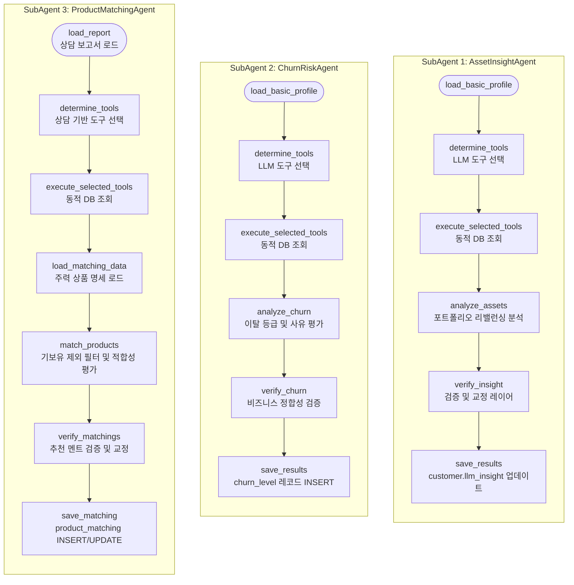

# 🤖 POOM-AI 통합 고객 분석 에이전트 기술 가이드 (MainAgent & SubAgent 1, 2, 3)

본 문서는 `customer-main-agent` 패키지에 구축된 **통합 오케스트레이터 (MainAgent)** 및 하위 세부 분석을 담당하는 **3대 서브 에이전트 (SubAgent 1, 2, 3)**의 아키텍처, 데이터 스키마, 동적 라우팅 조건 및 제어 흐름에 대해 기술합니다.

---

## 📌 1. 아키텍처 및 역할 개요

POOM-AI는 VIP 고객 데이터에 대해 리소스를 효율적으로 분배하고 정밀한 분석을 제공하기 위해 **Main-Sub Agent 구조**와 **LangGraph 기반 상태 제어**를 도입하였습니다.

### 1) 통합 오케스트레이션 및 배치 제어 상세 흐름도

```mermaid
flowchart TD
    %% 스타일 정의
    classDef startEnd fill:#E3F2FD,stroke:#1565C0,stroke-width:2px,color:#0D47A1;
    classDef process fill:#FFF3E0,stroke:#EF6C00,stroke-width:2px,color:#E65100;
    classDef decision fill:#EDE7F6,stroke:#5E35B1,stroke-width:2px,color:#4A148C;
    classDef db fill:#E8F5E9,stroke:#2E7D32,stroke-width:2px,color:#1B5E20;
    classDef error fill:#FFEBEE,stroke:#C62828,stroke-width:2px,color:#B71C1C;
    classDef loopBg fill:#FAFAFA,stroke:#9E9E9E,stroke-dasharray: 5 5;

    %% 1. 진입점 및 대상 고객 선정 단계
    Start([1. main.py 배치 구동]):::startEnd --> CheckCLI{CLI 인자 수동지정<br>--c_ids 존재 여부?}:::decision
    
    CheckCLI -- Yes (수동 지정) --> ManualTarget[수동 c_ids 목록으로 대상 확정<br>※ AI Selector 단계 우회]:::process
    CheckCLI -- No (자동 배치) --> ScanDB[1단계: DB 스캔 후보 VVIP 추출<br>tools.fetch_batch_target_c_ids]:::process
    
    ScanDB --> AISelector{2단계: AI Target Selector<br>gpt-4o-mini 선별}:::decision
    
    %% AI Selector 결정
    AISelector -- 의사결정 반영 (Selected) --> FilteredTargets[최종 분석 대상 고객 목록 확정]:::process
    ManualTarget --> FilteredTargets
    
    %% 2. 고객별 순회 루프 및 예외 격리 (subgraph)
    subgraph MainAgentLoop [고객별 독립 순회 루프 및 강건한 예외 격리]
        direction TB
        FilteredTargets --> LoopStart{각 고객 순회<br>idx = 1 ~ N}:::decision
        
        LoopStart -- 순회 시작 --> TryBlock[Try: 개별 고객 분석 시작]:::process
        
        %% 사전 데이터 수집
        TryBlock --> GatherFacts[4. 사전 데이터 수집<br>- tools.get_customer<br>- tools.get_large_external_transactions<br>- tools.get_recent_consultation_report]:::process
        GatherFacts --> DB_Read[(DB: customer / transaction / report)]:::db
        
        %% 라우팅 의사결정
        DB_Read --> LLMRouter{5. Main Router LLM 의사결정<br>gpt-4o-mini<br>SubAgentRouting 스키마}:::decision
        LLMRouter --> OverrideCLI{CLI 강제 옵션 재정의<br>--sub1 / --sub2 / --sub3?}:::decision
        
        %% 서브에이전트 실행 판단 및 가동
        OverrideCLI --> RouteDecision[최종 라우팅 플래그 확정<br>run_asset_insight / run_churn_risk / run_product_matching]:::process
        
        %% Sub-Agent 1
        RouteDecision --> CheckSub1{run_asset_insight<br>== True?}:::decision
        CheckSub1 -- Yes --> RunSub1[6-1. SubAgent 1 가동<br>AssetInsightAgent]:::process
        RunSub1 --> DB_Insight[(DB: customer.llm_insight)]:::db
        CheckSub1 -- No --> CheckSub2
        RunSub1 --> CheckSub2{run_churn_risk<br>== True?}:::decision
        
        %% Sub-Agent 2
        CheckSub2 -- Yes --> RunSub2[6-2. SubAgent 2 가동<br>ChurnRiskAgent]:::process
        RunSub2 --> DB_Churn[(DB: churn_level)]:::db
        CheckSub2 -- No --> CheckSub3
        RunSub2 --> CheckSub3{run_product_matching<br>== True?}:::decision
        
        %% Sub-Agent 3
        CheckSub3 -- Yes --> RunSub3[6-3. SubAgent 3 가동<br>ProductMatchingAgent]:::process
        RunSub3 --> DB_Matching[(DB: product_matching)]:::db
        CheckSub3 -- No --> LoopEnd
        RunSub3 --> LoopEnd[고객 분석 완료 및 성공 상태 기록]:::process
        
        %% 예외 처리 경로 (독립 격리)
        TryBlock -.->|Exception 발생| CatchBlock[Catch: 오류 로그 기록<br>해당 고객 실패 상태 처리]:::error
        CatchBlock --> LoopEnd
        
        %% 루프 백
        LoopEnd --> LoopNext[다음 고객 인덱스로 이동]:::process
        LoopNext --> LoopStart
    end
    
    style MainAgentLoop fill:#FAFAFA,stroke:#9E9E9E,stroke-dasharray: 5 5;
    
    %% 3. 최종 보고 단계
    LoopStart -- 모든 순회 종료 --> Reporting[7. 최종 배치 분석 결과 취합<br>- 성공/실패 수 통계 보고서 출력]:::process
    Reporting --> End([배치 완료]):::startEnd
```



### 2) 서브 에이전트별 LangGraph 상세 흐름도


### 1) MainAgent: 통합 오케스트레이터 및 라우터
고객의 기본 프로필, 최근 거액 타행 출금 여부, 상담 기록 유무 등의 지표 데이터를 수집한 뒤, LLM 판단 하에 오늘 분석을 실행할 서브 에이전트들을 동적으로 라우팅(True/False)하여 제어합니다.

### 2) SubAgent 1: 자산 리밸런싱 인사이트 에이전트 (`AssetInsightAgent`)
고객의 보유 자산(예금, 투자, 연금, 대출 비중)과 계좌/금융 상품 현황을 분석하여 PB 상담용 자산 포트폴리오 관리 가이드라인을 생성하고 `customer.llm_insight` 컬럼에 보고서 및 적재 일시를 기록합니다.

### 3) SubAgent 2: 이탈 위험 분석 에이전트 (`ChurnRiskAgent`)
고객의 행동 로그(불만 사항 등) 및 상세 거래 내역을 분석하여 자산의 타행 이탈 위험 등급(양호, 주의, 위험)을 계산하고 `churn_level` 테이블에 신규 등록합니다.

### 4) SubAgent 3: 주력 상품 매칭 에이전트 (`ProductMatchingAgent`)
고객의 최근 상담 보고서(`consultation_report`), 가족 관계 및 계좌 잔액 현황 등을 종합 대조하여 본점의 주요 주력 상품과의 적합성(적합, 부적합, 보유 중)을 분석하고 맞춤 추천 멘트를 작성하여 `product_matching` 테이블에 저장합니다.

---

## ⚙️ 2. 데이터 구조 및 스키마 (Schemas & States)

### 1) MainAgent 동적 라우팅 결정 스키마 (`SubAgentRouting`)
LLM 라우터가 분석 대상 고객을 파악한 후 리턴하는 구조화된 판단 모델입니다.
```python
class SubAgentRouting(BaseModel):
    run_asset_insight: bool            # SubAgent 1 구동 여부 (자산 규모 1억 이상 우량 고객 또는 예금 편중 고객 등)
    run_churn_risk: bool               # SubAgent 2 구동 여부 (최근 3개월 내 1천만 원 이상 타행 출금 등 이탈 위험 발생 시)
    run_product_matching: bool         # SubAgent 3 구동 여부 (상담 보고서가 존재하고 신규 상품 매칭이 필요할 때)
    reason_asset_insight: str          # SubAgent 1 구동 혹은 스킵 사유 설명 (구체적 1문장)
    reason_churn_risk: str             # SubAgent 2 구동 혹은 스킵 사유 설명 (구체적 1문장)
    reason_product_matching: str       # SubAgent 3 구동 혹은 스킵 사유 설명 (구체적 1문장)
    reason: str                        # 각 서브 에이전트 선택 여부에 대한 종합 요약 판단 근거 (한 문장)
```

### 2) SubAgent 1 상태 (`Agent1State`)
```python
class Agent1State(TypedDict):
    customer_id: int                            # 대상 고객 ID
    portfolio: Optional[Dict[str, Any]]         # 고객 기본 프로필 및 자산 비중
    tool_selection: Optional[Dict[str, Any]]    # 동적 도구 선정 정보
    customer_accounts: Optional[List[Dict[str, Any]]] # 상세 계좌 유형 및 잔액 목록
    customer_products: Optional[List[Dict[str, Any]]] # 보유 금융 상품 목록
    customer_features: Optional[List[Dict[str, Any]]] # 최근 1개월 고객 정성 특징 메모
    trend_reports: Optional[List[Dict[str, Any]]]     # 거시경제 지표 트렌드 보고서
    asset_insight: Optional[str]                # 생성된 최종 PB용 자문 가이드
    errors: List[str]                           # 에러 로그
```

### 3) SubAgent 2 상태 (`Agent2State`)
```python
class Agent2State(TypedDict):
    customer_id: int                            # 대상 고객 ID
    portfolio: Optional[Dict[str, Any]]         # 고객 기본 프로필 및 자산 비중
    tool_selection: Optional[Dict[str, Any]]    # 동적 도구 선정 정보
    customer_accounts: Optional[List[Dict[str, Any]]] # 상세 계좌 유형 및 잔액 목록
    customer_products: Optional[List[Dict[str, Any]]] # 보유 금융 상품 목록
    customer_features: Optional[List[Dict[str, Any]]] # 최근 1개월 고객 정성 특징 메모
    customer_transactions: Optional[List[Dict[str, Any]]] # 최근 3개월 상세 거래 내역
    churn_grade: Optional[str]                  # 판정된 이탈 위험 등급 (양호, 주의, 위험)
    churn_reason: Optional[str]                 # 80자 이내의 명확한 판정 근거
    errors: List[str]                           # 에러 로그
```

### 4) SubAgent 3 상태 (`Agent3State`)
```python
class Agent3State(TypedDict):
    customer_id: int                            # 대상 고객 ID
    report: Optional[Dict[str, Any]]            # 최근 상담 보고서 원문 정보
    portfolio: Optional[Dict[str, Any]]         # 고객 기본 프로필 및 자산 비중
    tool_selection: Optional[Dict[str, Any]]    # 동적 도구 선정 정보
    customer_relationship: Optional[List[Dict[str, Any]]] # 가족 관계 목록
    customer_products: Optional[List[Dict[str, Any]]] # 보유 금융 상품 목록 (중복 추천 방지용)
    customer_accounts: Optional[List[Dict[str, Any]]] # 상세 계좌 유형 및 잔액 목록
    customer_features: Optional[List[Dict[str, Any]]] # 최근 1개월 고객 정성 특징 메모
    main_products: Optional[List[Dict[str, Any]]]     # 본점 활성 주력 상품 명세 목록
    product_matchings: List[Dict[str, Any]]     # 각 주력 상품별 적합성 평가 결과 목록
    errors: List[str]                           # 에러 로그
```

---

## 🛠️ 3. 데이터 인터페이스 및 도구 재사용 (Tools Reusability)

에이전트는 데이터 결합도를 낮추고 재사용성을 극대화하기 위해 `tool/tools.py`에 구현된 동일한 공통 함수들을 호출하여 데이터를 적재합니다.

| 도구 이름 | 호출 함수 (재사용) | SubAgent 1 | SubAgent 2 | SubAgent 3 |
| :--- | :--- | :---: | :---: | :---: |
| **`customer`** | `get_customer` | O | O | O |
| **`customer_account`** | `get_customer_accounts` | O | O | O |
| **`customer_product`** | `get_customer_active_products` | O | O | O |
| **`customer_information`** | `get_customer_features` (months=1) | O | O | O |
| **`customer_relationship`** | `get_customer_relationship` | - | - | O |
| **`customer_transaction`** | `get_customer_transactions` (months=3) | - | O | - |
| **`trend_llm_report`** | `get_trend_report` | O | - | - |

---

## 🌐 3.5 MCP (Model Context Protocol) 도입 및 데이터 아키텍처 변화

에이전트 시스템의 데이터 결합도를 낮추고 도구(Tools)의 확장성을 보장하기 위해 기존의 직접적인 데이터베이스(DB) 연결 방식을 **MCP (Model Context Protocol)** 기반의 클라이언트-서버 통신 아키텍처로 전면 개편하였습니다.

### 1) 주요 변화 및 아키텍처 비교

| 항목 | MCP 도입 이전 | MCP 도입 이후 |
| :--- | :--- | :--- |
| **데이터 접근 주체** | 에이전트 도구 모듈(`tool/tools.py`)이 DB에 직접 연결 | 에이전트는 MCP 클라이언트로서 서버에 데이터를 요청 |
| **SQL 쿼리 실행 위치** | `tool/tools.py` 내부에서 직접 커서(`get_db_cursor`) 실행 | 별도 원시 DB 계층인 `tool/tools_direct.py`로 쿼리 격리 |
| **에이전트-DB 결합도** | 에이전트 코드와 DB 드라이버(PyMySQL)가 강하게 결합 | 에이전트는 표준 MCP 통신 인터페이스 규격(FastMCP)만 의존 |
| **서버 프로세스** | 별도 프로세스 없음 | Stdio 방식으로 호스팅되는 독립적인 `mcp_server.py` 구동 |

### 2) MCP 연동 및 데이터 직렬화 메커니즘
* **FastMCP 서버 구축 (`mcp_server.py`)**: `tool/tools_direct.py`에 격리된 원시 쿼리 함수들을 `@mcp.tool()` 데코레이터를 사용하여 표준 MCP 도구로 노출합니다.
* **통합 클라이언트 매니저 (`tool/tools.py`)**:
  * 에이전트가 사용하는 `tools.py`는 더 이상 직접 DB를 연결하지 않고, 백그라운드 스레드에서 `mcp_server.py`를 자식 프로세스(Stdio 파이프 통신)로 구동합니다.
  * 내부의 `MCPClientManager` 싱글톤 객체가 비동기(asyncio) 이벤트 루프를 관리하며 에이전트의 동기적 호출을 MCP 메시지 규격으로 래핑하여 송수신합니다.
* **직렬화/역직렬화(Serialization/Deserialization) 보완**:
  * MCP 통신은 JSON 데이터를 표준으로 사용하므로, Python의 특수 타입(`datetime.datetime`, `datetime.date`, `decimal.Decimal`)은 JSON 직렬화에 부합하도록 ISO 8601 문자열 및 float/int로 변환하는 직렬화 로직(`mcp_server.py` 내 `serialize_datetime`)을 거칩니다.
  * 클라이언트 측(`tool/tools.py` 내 `deserialize_datetime`)에서는 이를 다시 기존 Python 데이터 타입으로 역직렬화하여 반환하므로 하위 에이전트 비즈니스 코드에 아무런 부작용 없이 호환성을 유지합니다.
* **Windows Stdio 교착상태(Deadlock) 방지**:
  * Windows 환경에서 표준 입출력(Stdio)을 사용해 자식 프로세스로 MCP 서버를 제어할 때, LangSmith 등의 로깅/추적 모듈이 Stdio 파이프에 노이즈를 섞거나 락을 유발할 수 있습니다.
  * 이를 차단하기 위해 MCP 서버 실행 환경을 복사할 때 `LANGSMITH_TRACING` 및 `LANGCHAIN_TRACING_V2` 환경 변수를 강제로 `false`로 격리하여 교착상태를 원천 차단하였습니다.

---

## 🔄 4. 서브 에이전트별 세부 제어 흐름 (Flow of Control)

### 4.0. MainAgent: 통합 오케스트레이션 및 배치 흐름 상세 설명

[MainAgent](./agent/main_agent.py)는 POOM-AI 분석 파이프라인의 최상위 오케스트레이터 및 라우터 역할을 수행하며, 배치 실행 엔트리포인트인 `run_batch()`와 개별 고객 단위 분석을 수행하는 `run_for_customer()`를 제공합니다.

#### 1) 수동/자동 분석 대상 선별 전략 및 흐름
* **수동 분석 타겟 바이패스 (Bypass Path)**
  - CLI 파라미터로 특정 고객 ID 목록(`--c_ids 1001,1002`)이 입력되는 경우, DB 자동 스캔과 AI Target Selector를 생략하고 입력된 고객 ID들을 즉시 대상자로 확정합니다.
* **1단계: DB 자동 스캔 (`tools.fetch_batch_target_c_ids`)**
  - 분석이 필요한 후보 VVIP 고객군을 6대 SQL 조건에 의해 데이터베이스로부터 1차 추출합니다.
* **2단계: AI Target Selector 정교한 대상 선별 (`batch_target_selector_system.md`)**
  - 1차 수집된 후보군에 대해 `gpt-4o-mini` 모델이 Pydantic 스키마인 `SelectedCustomerList` (`CustomerDecision`)를 준수하여 당일 실행 대상을 재선별합니다.
  - 이를 통해 무분별한 API 호출을 억제하고 금융 자원(API 비용 및 컴퓨팅 파워)을 효율화합니다.
  - **선별 우선순위 기준**:
    1. **오늘 상담 예약 확정 내방 예정 (우선순위 1)**: 당일 현장 PB 상담 지원을 위해 최우선 선별.
    2. **이탈 위험군 집중 케어 (우선순위 2)**: 이탈 위험 [위험] 등급 혹은 최근 3개월 내 타행 거액 이출금이 발생한 우량 고객 우선 선별.
    3. **30일 이내 만기 예정 금융 상품 보유 (우선순위 3)**: 만기 시점 적시 재투자 유치를 위한 선별.
    4. **정보 업데이트 및 주기 만료 대상의 지속적 사후 관리 (우선순위 4)**: 오랫동안 케어가 없었거나 정기 진단이 필요한 고객에 대해 분석 연속성을 유지하도록 고려.
  - **최소 선정 비율 보장 지침**: 전체 배치가 중단 없이 활성화되도록 1차 후보군 중 **최소 10% 이상(후보가 10명 미만인 경우에도 최소 1명 이상)**을 반드시 최종 분석 대상으로 선정하도록 보장. 최우선 순위 대상자만으로 비율이 채워지지 않을 경우 우선순위 4 대상자 중 자산 규모가 큰 우량 고객 순으로 채워 충족시킵니다.

#### 2) 고객별 루프 실행과 강건한 예외 격리 (Try-Catch Isolation)
`run_batch`는 여러 고객을 순차적으로 처리할 때, 개별 고객 수준에서 발생하는 장애가 전체 배치 프로세스를 중단시키지 않도록 강력한 **예외 격리(Fault Isolation)** 방식을 취하고 있습니다.
* **배치 루프 안전망**:
  - `target_customers` 리스트를 루프로 순회할 때, 개별 회차는 `try-except` 블록으로 보호됩니다.
  - 특정 고객 분석 도중 DB 커넥션 유실, 네트워크 레이턴시로 인한 API 타임아웃, 포맷 에러 등이 발생하더라도, 해당 오류 내용을 로그에 기록하고 실패(Failure) 카운트에 가산한 후, 루프는 중단 없이 바로 **다음 고객 ID로 즉시 이행**합니다.
* **단일 고객 내 에이전트 단위 격리**:
  - [run_for_customer](./agent/main_agent.py#L65) 내에서도 각 단계별(데이터 수집, 라우팅 결정, 개별 서브에이전트 실행)로 독자적인 `try-except` 블록이 샌드박스처럼 구성되어 있습니다.
  - 예를 들어, SubAgent 1(`AssetInsightAgent`) 구동 중 에러가 발생해도, SubAgent 2(`ChurnRiskAgent`)와 SubAgent 3(`ProductMatchingAgent`)는 **자신들의 흐름을 온전히 완수하고 결과를 각각의 DB 테이블에 안전하게 반영**합니다.

#### 3) Main Router의 동적 라우팅 및 의사결정 프로세스
* **사전 데이터 수집 (Fact Gathering)**
  - 라우팅 결정 전, 다음 핵심 도구(Fact)들을 호출합니다:
    - [get_customer](./tool/tools.py): 고객 프로필, 투자 성향 및 자산 비중 정보
    - [get_large_external_transactions](./tool/tools.py): 최근 3개월 내 1,000만 원 이상의 타행 거액 이출금 송금/출금 내역
    - [get_recent_consultation_report](./tool/tools.py): 최근 작성된 대면 상담 기록지 존재 여부
* **동적 라우팅 알고리즘 (`main_agent_router_system.md`)**
  - 수집된 데이터 팩트를 LLM에 주입하여 Pydantic 모델인 `SubAgentRouting` 형태로 의사결정을 획득합니다:
    - **`run_asset_insight` (SubAgent 1)**: 다음 중 하나 이상 부합 시 활성화
      - *고객 정보 업데이트 후 AI 분석 미수행* (`update_time` > `analysis_time` 또는 분석 기록 없음)
      - *마지막 방문(상담) 이력이 30일 이상 경과(혹은 없음)* (`consultation_memo` 기준)
      - *기존 우량 고객 자산 조건* (순자산 및 총자산이 1억 원 이상인 VVIP 또는 예적금 비중이 80% 이상으로 편중된 경우)
    - **`run_churn_risk` (SubAgent 2)**: 다음 중 하나 이상 부합 시 활성화
      - *최근 3개월 내 타행 거액 이출금(1천만 원 이상) 발생* (W 거래)
      - *이탈 위험 수준이 '위험'인 고객* (가장 최근 `churn_level` 등급 평가가 '위험'인 경우)
      - *기존 리스크 조건* (순자산 대비 부채 비율이 리스크 임계치를 상회하는 경우)
    - **`run_product_matching` (SubAgent 3)**: 상담 보고서 존재 여부가 반드시 **있음 (True)** 인 상태를 전제로, 다음 중 하나 이상 부합 시 활성화 (보고서가 **없음 (False)**인 경우는 다른 조건과 관계없이 **무조건 False 강제**)
      - *오늘 상담이 예정된 고객* (당일 `pb_schedule` 중 분류가 '상담' 예약)
      - *만기 예정 상품을 보유한 고객* (30일 이내에 만기가 임박한 상품 보유)
* **CLI 강제 옵션 재정의 (Override Mechanics)**
  - 유저가 CLI 파라미터(`--sub1`, `--sub2`, `--sub3`)를 직접 설정하여 호출한 경우, LLM 라우터의 `True/False` 의사결정을 무시하고 즉시 `True`로 오버라이딩합니다.
  - 이 경우, 사유 필드는 자동 생성된 사유 대신 `"[CLI 강제 적용]..."` 으로 덮어씌워져 이력 추적성을 보장합니다.

#### 4) 결과 집계 및 통계 리포팅
* 모든 대상 고객에 대한 순회가 정상 종료되면, 성공 고객 수와 실패 고객 수, 그리고 예외 발생 상세 이력을 종합하여 배치 최종 분석 통계 보고서를 로거로 출력하고 안전하게 전체 배치를 마칩니다.

### 4.1. SubAgent 1: 자산 분석 흐름
1. `load_basic_profile`: 고객 기본 자산 및 성향 조회.
2. `determine_tools`: LLM을 통해 수집할 정보 도구 결정 (`ToolSelection1` 맵 생성).
3. `execute_selected_tools`: 선택된 도구를 공통 호출하여 상태에 바인딩.
4. `analyze_assets`: 데이터를 바인딩하여 3인칭 존댓말 가이드라인 리포트 생성.
5. `verify_insight`: **[검증 및 교정 레이어]** LLM 품질 심사역을 호출하여 고객의 투자 성향 및 대출 비중 등 비즈니스적 타당성을 검증 및 교정하고, 최종적으로 3인칭 교정, 마크다운 소거, 150자 이내 자르기 및 끝맺음 온점 강제 추가를 수행합니다.
6. `save_results`: `customer.llm_insight` 컬럼에 최종 저장 및 `analysis_time`을 현재 시각(`NOW()`)으로 업데이트.

### 4.2. SubAgent 2: 이탈 위험 분석 흐름
1. `load_basic_profile`: 고객 기본 프로필 조회.
2. `determine_tools`: LLM을 통해 수집할 데이터 도구 결정 (`ToolSelection2` 맵 생성).
3. `execute_selected_tools`: 선택된 도구를 공통 호출하여 상태에 바인딩 (이때 `customer_features`는 1달 이내, `customer_transactions`는 3달 이내로 자동 한정).
4. `analyze_churn`: 최근 1개월 특징 메모 및 3개월 거래 내역을 종합 대조하여 1차 이탈 등급 및 근거 판정.
5. `verify_churn`: **[검증 및 교정 레이어]** LLM 이탈 검증관을 구동하여 1차 판정 결과가 정량적 이탈 임계치 팩트(최근 7일 내 누적 30% 이상 혹은 단일 1억 이상 유출 시 '위험' 격상 등)와 비즈니스 논리적으로 합치하는지 심사 및 교정하고, 80자 이내 경어체 포맷을 보장합니다.
6. `save_results`: 최종 검증 완료된 결과를 `churn_level` 테이블에 `INSERT`합니다.

### 4.3. SubAgent 3: 주력 금융 상품 추천 흐름
1. `load_report`: 최근 상담 이력(`consultation_report`) 로드.
2. `determine_tools`: 상담 본문 내용을 분석하여 수집이 필요한 DB 도구 동적 결정 (`ToolSelection3` 맵 생성).
3. `execute_selected_tools`: 결정된 도구들(`customer`, `customer_account`, `customer_product`, `customer_information`, `customer_relationship`)을 호출하여 데이터 로드.
4. `load_matching_data`: 본점 주력 금융 상품 목록(`main_products`)을 로드하고, `customer` 도구가 스킵되었을 경우를 대비해 프로필 데이터 유효성을 검증/강제 로드하여 보완.
5. `match_products`: 이미 보유 중인 상품은 제외 판정(2순위 보유 중 처리)하며, 수집된 프로필/특징/가족관계를 기반으로 적합 금융 상품 분석 진행.
6. `verify_matchings`: **[추천 사유 및 판단 검증 레이어]** LLM 추천 품질 심사역을 호출하여 고객의 투자 성향(안정형 고객에 대한 고위험 상품 추천 부적합 처리) 및 중복 가입 여부를 팩트 데이터와 비교하여 비즈니스 적합성(`is_suitable` 판단 값 및 `reason` 문장 정합성)을 검증 및 교정하고, 3문장 이내 정리를 보장합니다.
7. `save_matching`: 적합성 및 맞춤 멘트를 `product_matching` 테이블에 `INSERT/UPDATE` 처리.

---

## 🏷️ 5. LangSmith 추적 및 에이전트 식별자 (LangSmith Tracing)

각 에이전트의 실행 흐름과 입력 메타데이터를 명확히 모니터링하기 위해 LangSmith 추적을 제공합니다. `@traceable` 데코레이터와 실행 설정(`config`)을 통해 각 스팬(Span)에 에이전트 식별을 위한 고유의 `name`과 `tags`를 명시적으로 부여합니다.

### 1) 통합 오케스트레이터 및 배치 수집 추적
- **`MainAgent.run_batch`**:
  - **스팬 이름**: `MainAgent.run_batch`
  - **태그**: `["MainAgent"]`
- **`MainAgent.run_for_customer`**:
  - **스팬 이름**: `MainAgent.run_for_customer`
  - **태그**: `["MainAgent"]`
- **`fetch_batch_target_c_ids`** (배치 타겟 데이터 스캔):
  - **스팬 이름**: `fetch_batch_target_c_ids`
  - **태그**: `["tool"]` (자동 선별 사유 및 대상 매핑 정보 로깅)

### 2) 3대 서브 에이전트 추적
각 서브 에이전트의 실행 진입점(`run` 메서드)에는 `@traceable` 데코레이터를 지정하여 하위 흐름(LangGraph 포함)을 하나의 논리적 체인으로 추적하며, LangGraph 호출 시에도 고유 이름을 부여합니다.
- **`AssetInsightAgent`** (SubAgent 1):
  - **스팬 이름**: `AssetInsightAgent`
  - **태그**: `["AssetInsightAgent"]`
- **`ChurnRiskAgent`** (SubAgent 2):
  - **스팬 이름**: `ChurnRiskAgent`
  - **태그**: `["ChurnRiskAgent"]`
- **`ProductMatchingAgent`** (SubAgent 3):
  - **스팬 이름**: `ProductMatchingAgent`
  - **태그**: `["ProductMatchingAgent"]`

---

## 📝 6. 프롬프트 고도화 및 Few-Shot 적용 (Prompt Engineering & Few-Shot)

모든 시스템 프롬프트에 금융 비즈니스 로직 고도화 및 입출력 데이터 규격의 엄격성 보장을 위한 **Few-Shot-Prompting**을 전면 적용하고, LangChain 이스케이프 호환성 처리를 완료했습니다.

### 1) 프롬프트별 고도화 핵심 사항
- **자산 분석 (`asset_analysis_system.md`)**:
  - 금 시세 상승기, 기준금리 인하기, 부동산 회복기 등 거시 경제 지표 연계 자산 가이드를 구체화했습니다.
  - **공백 포함 150자 이내**의 마크다운 서식 없는 순수 텍스트 Few-Shot 2종을 포함하여 PB 상담 멘트용 3인칭 경어체 준수도를 극대화했습니다.
- **상품 매칭 (`product_matching_system.md`)**:
  - 투자 성향별 위험도 대조(초과 시 부적합 `is_suitable = 0`), 가구원 라이프스테이지(자녀 유학, 배우자 은퇴), 계좌 보통 예금 잔액 묶기 규칙을 반영했습니다.
  - 4가지 매칭 시나리오(적합, 부적합, 보유 중)를 포함하는 **JSON Few-Shot 예시**를 탑재하여 중복 추천 배제(`is_suitable = 2`) 및 추천 근거 일관성을 보장했습니다.
- **이탈 위험 분석 (`churn_risk_system.md`)**:
  - 자산 대비 누적 타행 송금(순자산 30% 이상), 단일 초대형 자금 유출(1억 원 이상 위험, 1천만 원 이상 주의) 등 정량적 판정 한계치를 구체화했습니다.
  - VARCHAR(100) 제약을 우회하기 위해 **공백 포함 80자 이내의 한 문장** 경어체 JSON Few-Shot 예시 3종(주의, 위험, 양호)을 연동했습니다.
- **통합 라우터 (`main_agent_router_system.md`)**:
  - 이탈 위험 시에도 포트폴리오를 제안하여 자금을 방어(Retention)하도록 **자산 분석과 이탈 위험 분석이 동시 가동**되도록 비즈니스 지침을 보강하고 JSON Few-Shot 예시를 추가했습니다.
- **배치 타겟 셀렉터 (`batch_target_selector_system.md`)**:
  - 1차 스캔 후보군 중 **최소 10% 이상(소수의 경우 최소 1명 이상)의 고객은 반드시 최종 분석 대상**으로 선정하도록 보장 비율 지침을 도입하고 JSON Few-Shot 예시를 설계했습니다.

### 2) LangChain 파싱을 위한 이스케이프 처리
- System Prompt 내에 포함된 JSON 예시의 중괄호(`{`, `}`)가 LangChain `ChatPromptTemplate` 포맷팅 과정에서 변수로 오인식되어 발생하는 에러(`INVALID_PROMPT_INPUT`)를 방지하기 위해, 모든 프롬프트 파일의 JSON 중괄호를 `{{` 및 `}}` 형태로 **더블 컬리 브레이스 이스케이프(Double Curly Braces Escaping)** 처리했습니다.
