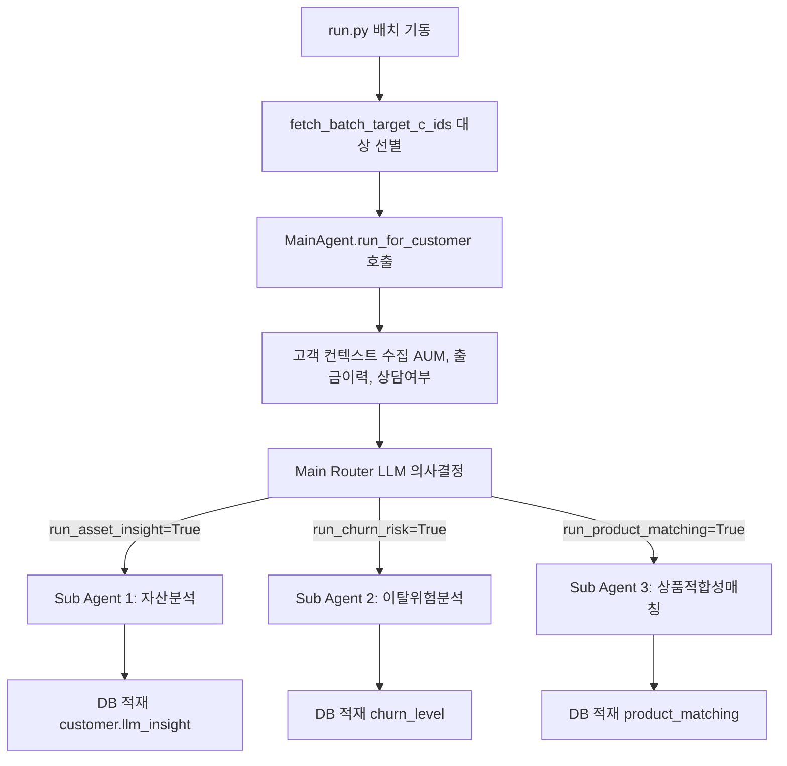

# 🤖 POOM-AI 차세대 통합 고객분석 에이전트 (Main Agent) 아키텍처 가이드

본 문서는 `POOM-AI\agent\customer-main-agent` 패키지 내 통합 메인 에이전트 및 하위 에이전트의 구조, 기능, 데이터 흐름, 그리고 환경 설정 정보에 대해 상세히 기술합니다.

---

## 📌 1. 아키텍처 개요 (Overview)

통합 고객분석 에이전트(`MainAgent`)는 PB(Private Banker)가 관리하는 수많은 VIP 고객 정보를 정밀 분석하기 위해 고안된 **차세대 LLM 기반 오케스트레이터(Orchestrator)**입니다. 

기존의 단순 순차 배치 실행 구조와 달리, 메인 라우터 에이전트가 고객의 자산 정보, 거액 출금 거래 기록, 최근 상담 보고서 존재 여부 등의 컨텍스트를 인지하여 **실제 분석이 필요한 서브 에이전트들만 선별적으로 호출(Dynamic Routing)**하는 리소스 최적화 및 스마트 구동 방식을 채택하고 있습니다.



---

## 📂 2. 폴더 및 파일 구조

```
POOM-AI/agent/customer-main-agent/
│
├── agent/                          # 핵심 에이전트 로직 폴더
│   ├── __init__.py                 # 패키지 임포트 정의
│   ├── main_agent.py               # 라우팅 및 오케스트레이션 담당 메인 에이전트
│   ├── asset_insight_agent.py      # [Sub 1] 자산 포트폴리오 분석 및 리밸런싱 지표 생성
│   ├── churn_risk_agent.py         # [Sub 2] 거액 이체 및 행동 로그 분석 기반 이탈 등급 판정
│   └── product_matching_agent.py   # [Sub 3] 최근 상담 내용 기반 추천 금융 상품 매칭
│
├── prompt/                         # 에이전트 구동용 프롬프트 마크다운 (.md) 템플릿
│   ├── main_agent_router_system.md # 라우터 판단 기준 정의
│   ├── main_agent_router_user.md   # 고객 데이터가 바인딩되는 유저 템플릿
│   ├── asset_analysis_system.md ...
│   └── product_matching_system.md ...
│
├── tool/
│   └── tools.py                    # DB 연동 및 외부 조회 기능을 제공하는 에이전트 툴셋
│
├── db.py                           # MySQL 커넥션 풀을 관리하는 DB 헬퍼
│
├── run.py                          # 배치 스케줄링 및 수동 구동 CLI 인터페이스
└── explain.md                      # [현재 파일] 메인 에이전트 설명 문서
```

---

## ⚙️ 3. 주요 구성 요소별 기능 및 흐름

### 3.1. CLI 실행기 (`run.py`)
* **목적**: 매일 실행될 배치 작업 또는 특정 고객(c_id) 지정을 통한 수동 구동용 엔트리포인트입니다.
* **대상 고객 자동 선별 조건 (`fetch_batch_target_c_ids`)**:
  1. 총자산이 1억 원 이상인 우량 고객 중 최신 AI 분석 결과(`llm_insight`)가 비어 있는 고객
  2. 최근 7일 내에 타행으로 1,000만 원 이상의 거액 출금(`ct_type = 'W'`) 거래가 감지된 고객
  3. 30일 이내에 예적금 상품 만기가 도래하는 고객
  4. 오늘 상담 예약이 확정되어 지점을 내방하는 고객

### 3.2. 메인 에이전트 및 라우터 (`agent/main_agent.py`)
* **역할**: 고객의 실시간 정보를 받아 LangChain `with_structured_output` 및 GPT-4o-mini 모델을 사용해 실행할 하위 에이전트를 동적으로 판별합니다.
* **구동 결정 데이터 스키마 (`SubAgentRouting`)**:
  * `run_asset_insight` (Sub Agent 1)
  * `run_churn_risk` (Sub Agent 2)
  * `run_product_matching` (Sub Agent 3)
  * `reason` (판단 근거 설명 문장)

### 3.3. 서브 에이전트 구조
1. **자산 리밸런싱 인사이트 에이전트 (`AssetInsightAgent`)**
   * 자산 분포(예금, 투자, 연금, 대출 비율)를 도출하여 현재 포트폴리오의 건강 상태 및 리밸런싱 지침을 수립합니다.
   * 최종 분석 보고서는 `customer` 테이블의 `llm_insight` 필드에 적재됩니다.
2. **이탈 위험 분석 에이전트 (`ChurnRiskAgent`)**
   * 타행으로 빠져나간 거액 거래 이체액, 부채 부담 등을 계산하여 고객의 이탈 등급(`양호`, `주의`, `위험`) 및 명확한 근거 사유를 정의합니다.
   * 결과는 `churn_level` 테이블에 추가 이력 데이터로 삽입됩니다.
3. **주력 상품 적합성 평가 에이전트 (`ProductMatchingAgent`)**
   * 은행의 현시점 주력 판매 상품 리스트와 고객의 최근 상담 보고서(`consultation_report`), 투자 성향을 비교하여 가입 추천 적합성(1: 적합, 0: 부적합) 및 맞춤형 가입 제안 사유를 도출합니다.
   * 결과는 `product_matching` 테이블에 적재됩니다.

---

## 🛠️ 4. 외부 인터페이스 및 데이터 툴셋 (`tool/tools.py`)

에이전트가 데이터베이스에서 정보를 수집하고 결과를 반영할 때 사용하는 전용 SQL 데이터 헬퍼 기능 목록입니다.

* `get_portfolio_weight(customer_id)`: 고객의 예금/투자/대출 자산 분포 조회
* `get_large_external_transactions(customer_id, threshold_amount)`: 타행 대형 유출 거래 필터링
* `get_recent_consultation_report(customer_id)`: 가장 최근 상담 보고서 정보 통합 파싱
* `get_customer_features(customer_id, months)`: 3개월 내 추출된 정성적 고객 특징 정보 수집
* `get_main_products()`: 판매 유도 대상 주력 상품 스펙 로드
* `save_asset_insight(...)` / `save_churn_level(...)` / `save_product_matching(...)`: 에이전트들의 최종 추론 결과 반영 업데이트 쿼리

---

## 🚀 5. 주요 데이터 흐름 및 실행 시퀀스

1. **배치 시작**: `python -m customer-main-agent.run` 구동
2. **고객 선정**: DB 쿼리를 통해 오늘 분석이 긴급한 타겟 고객 리스트 수집
3. **루프 순회**: 개별 고객마다 아래 단계 반복
   * **Fact Gathering**: `tools.py`를 통해 고객 프로필, 거액 이체, 상담 기록, 자산 정보를 수집
   * **LLM Routing**: 수집된 데이터를 바탕으로 LLM 라우터가 분석 대상 에이전트(Sub Agent 1, 2, 3)를 `True`/`False`로 마크
   * **SubAgent Execution**: 활성화된 하위 에이전트를 독립적으로 구동
   * **DB Persistence**: 각 서브 에이전트가 `tools.py` 내 적재 함수를 통해 데이터베이스 테이블(`customer`, `churn_level`, `product_matching`)에 즉각 데이터 쓰기 완료
4. **완료 보고**: 전체 프로세스 요약(성공/실패 고객 카운트) 로깅 후 종료

---

## 💻 6. Windows 환경 전용 안전장치 (Environment Safety Guard)

서버 및 배치 프로세스가 Windows 운영체제에서 백그라운드로 작동될 때 발생할 수 있는 여러 호환성 오류를 방지하기 위해 다음과 같은 설계가 내장되어 있습니다.

1. **콘솔 출력 유니코드 오류 방지 (`PYTHONUTF8`)**:
   * Windows 명령 프롬프트(CMD/PowerShell)의 기본 로케일 인코딩(CP949) 특성상 이모지(`🤖`, `🧩` 등) 출력 시 프로그램이 중단되는 문제가 있습니다.
   * 이에 대응하여 메인 실행 루프 및 subprocess 기동 시 **`PYTHONUTF8=1` 환경변수 주입** 및 **`errors='replace'`** 디코딩 처리를 강제하여 한글 및 이모지가 인코딩 예외 없이 정상 출력되도록 설계되었습니다.
2. **데이터 결측 처리**:
   * 데이터 조회 쿼리 중 일부 값이 비어있는 경우(Null)에도 에이전트 프롬프트 변환 로직이 안정적으로 넘어가도록 딕셔너리 예외 방어 처리가 기본 수립되어 있습니다.
