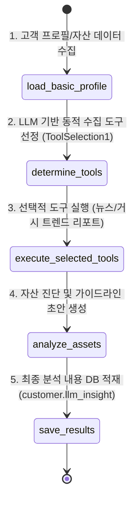
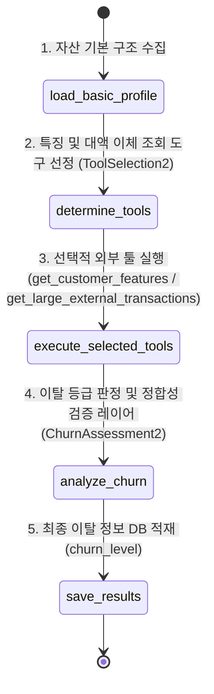
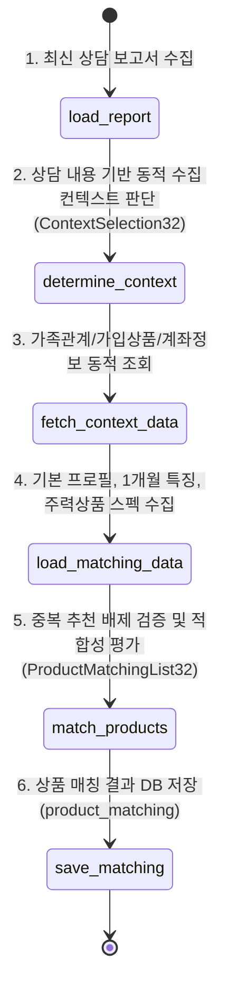

# 🤖 POOM-AI 차세대 통합 고객분석 에이전트 (Main Agent) 심층 기술 가이드

본 문서는 [POOM-AI\agent\customer-main-agent](file:///c:/Users/user/working_directory/poom/POOM-AI/agent/customer-main-agent) 패키지에 구축된 통합 메인 에이전트 및 하위 에이전트들의 아키텍처, 데이터 스키마, 제어 흐름, 기능 명세 및 운영 시 고려사항에 대해 아주 상세하게 기술합니다.

---

## 📌 1. 아키텍처 및 설계 사상

`MainAgent`는 PB(Private Banker)의 자문 업무를 보조하기 위해 대규모 고객 데이터베이스와 실시간 경제 트렌드를 분석하는 **LLM 오케스트레이터(Orchestrator)**입니다. 

### 💡 핵심 설계 패턴: Dynamic Routing (동적 라우팅)
모든 고객에게 모든 에이전트(자산 분석, 이탈 위험 평가, 상품 매칭 등)를 일괄 구동하는 기존의 순차/배치 방식은 불필요한 LLM API 호출 비용을 발생시키고 응답 속도를 저하시킵니다. 
POOM-AI는 이를 극복하기 위해 **메인 라우터 에이전트가 고객의 기본 정보(총자산, 부채, 거액 출금 이력, 최근 상담서 존재 여부 등)를 파악한 뒤, 실시간 컨텍스트에 따라 필요한 서브 에이전트만 선택적으로 기동**하는 스마트 라우팅 설계를 채택하였습니다.

```mermaid
flowchart TD
    %% CLI 기동 및 대상 선정
    Start([run.py 배치/수동 실행]) --> FetchTargets[fetch_batch_target_c_ids\n4가지 조건 자동 스캔]
    FetchTargets --> ForEachCustomer{대상 고객 루프 순회}
    
    %% MainAgent 진입
    ForEachCustomer -- 고객 ID 전달 --> InitMainAgent[MainAgent.run_for_customer]
    InitMainAgent --> FactGathering[Fact Gathering\nDB에서 포트폴리오, 거액출금, 상담여부 조회]
    FactGathering --> LLMRouting[LLM Main Router\nmain_agent_router_system.md]
    
    %% Dynamic Routing 의사결정
    LLMRouting -- SubAgentRouting\nStructured Output --> Decision{Dynamic Routing\n의사결정 결과}
    
    %% Sub Agent 1: 자산분석 (LangGraph)
    Decision -- run_asset_insight=True --> Sub1[Sub Agent 1: 자산 분석\nAssetInsightAgent]
    Sub1 --> Sub1Graph[LangGraph 파이프라인\n1. load_basic_profile\n2. determine_tools\n3. execute_selected_tools\n4. analyze_assets\n5. save_results]
    Sub1Graph -- DB 적재 --> SaveSub1[(customer.llm_insight)]
    
    %% Sub Agent 2: 이탈위험분석 (LangGraph)
    Decision -- run_churn_risk=True --> Sub2[Sub Agent 2: 이탈 위험 분석\nChurnRiskAgent]
    Sub2 --> Sub2Graph[LangGraph 파이프라인\n1. load_basic_profile\n2. determine_tools\n3. execute_selected_tools\n4. analyze_churn (등급검증)\n5. save_results]
    Sub2Graph -- DB 적재 --> SaveSub2[(churn_level)]
    
    %% Sub Agent 3: 상품 적합성 매칭 (LangGraph)
    Decision -- run_product_matching=True --> Sub3[Sub Agent 3: 상품 적합성 평가\nProductMatchingAgent]
    Sub3 --> Sub3Graph[LangGraph 파이프라인\n1. load_report\n2. determine_context\n3. fetch_context_data\n4. load_matching_data\n5. match_products (기보유배제)\n6. save_matching]
    Sub3Graph -- DB 적재 --> SaveSub3[(product_matching)]
    
    %% 루프 제어
    SaveSub1 --> CheckLoop
    SaveSub2 --> CheckLoop
    SaveSub3 --> CheckLoop
    Decision -- Skip 판단 시 --> CheckLoop{모든 분석 완료\n& DB 반영 확인}
    
    CheckLoop -- 다음 고객 존재 --> ForEachCustomer
    CheckLoop -- 완료 --> End([전체 배치 결과 출력 및 종료])
```

---

## 📂 2. 폴더 및 파일 세부 구조

본 패키지는 기능에 따라 실행부, 코어 에이전트부, 데이터베이스/도구부, 프롬프트 템플릿부로 명확하게 계층화되어 있습니다.

```
POOM-AI/agent/customer-main-agent/
│
├── run.py                          # 배치 스케줄러 및 수동 CLI 실행 엔트리포인트
├── db.py                           # MySQL Connection Pool 및 환경 설정 로더
├── explain.md                      # [본 문서] 아키텍처 및 기능 상세 설명서
│
├── agent/                          # 에이전트 코어 비즈니스 로직
│   ├── __init__.py                 # 외부 임포트 정의 및 MainAgent 노출
│   ├── main_agent.py               # Dynamic Router 및 서브 에이전트 실행 오케스트레이터
│   ├── asset_insight_agent.py      # [SubAgent 1] 자산 포트폴리오 분석 및 리밸런싱 지침 생성
│   ├── churn_risk_agent.py         # [SubAgent 2] 거액 이출금 및 로그 기반 이탈 등급 판정
│   └── product_matching_agent.py   # [SubAgent 3] 상담 및 고객 데이터 매칭 기반 주력 상품 제안
│
├── tool/                           # 데이터 수집 및 데이터베이스 CRUD 인터페이스
│   └── tools.py                    # 에이전트가 사용하는 표준 SQL 쿼리 헬퍼 함수 정의
│
└── prompt/                         # 에이전트 성격과 행동 규칙을 제어하는 마크다운 (.md) 프롬프트 템플릿
    ├── main_agent_router_system.md           # 메인 라우터 시스템 지침
    ├── main_agent_router_user.md             # 메인 라우터 유저 바인딩 템플릿
    ├── asset_insight_determine_tools_system.md# SubAgent 1 도구 판단 시스템 지침
    ├── asset_insight_determine_tools_user.md  # SubAgent 1 도구 판단 유저 데이터
    ├── asset_analysis_system.md              # SubAgent 1 최종 자산 분석 시스템 지침
    ├── asset_analysis_user.md                # SubAgent 1 최종 자산 분석 유저 데이터
    ├── churn_risk_determine_tools_system.md   # SubAgent 2 도구 판단 시스템 지침
    ├── churn_risk_determine_tools_user.md     # SubAgent 2 도구 판단 유저 데이터
    ├── churn_risk_system.md                  # SubAgent 2 최종 이탈 판정 시스템 지침
    ├── churn_risk_user.md                    # SubAgent 2 최종 이탈 판정 유저 데이터
    ├── product_matching_determine_context_system.md # SubAgent 3 도구 판단 시스템 지침
    ├── product_matching_determine_context_user.md   # SubAgent 3 도구 판단 유저 데이터
    ├── product_matching_system.md            # SubAgent 3 최종 상품 매칭 시스템 지침
    └── product_matching_user.md              # SubAgent 3 최종 상품 매칭 유저 데이터
```

---

## 💾 3. 관련 데이터베이스 테이블 스키마 정보

에이전트가 정상적으로 구동되고 데이터를 적재하기 위해 활용하는 핵심 테이블 구조입니다.

### 1) `customer` (고객 프로필 및 메인 자산)
* **주요 컬럼**:
  * `c_id` (INT, PK): 고객 고유 식별 번호
  * `name` (VARCHAR): 고객명
  * `total_assets` (DECIMAL): 총자산 (선정 쿼리 조건: 1억 원 기준)
  * `deposit` (DECIMAL): 예금 금액
  * `investment` (DECIMAL): 투자 자산 금액
  * `pension` (DECIMAL): 연금 자산 금액
  * `loan` (DECIMAL): 대출/부채 금액
  * `net_worth` (DECIMAL): 순자산 (`total_assets - loan` 계산 기반)
  * `tendency` (VARCHAR): 투자 성향 (안정형, 안정추구형, 위험중립형, 적극투자형, 공격투자형)
  * `grade` (VARCHAR): 고객 관리 등급 (VVIP, VIP, 우량 등)
  * `llm_insight` (TEXT): **[SubAgent 1 결과 적재]** PB 자문용 자산 리밸런싱 포트폴리오 분석 결과 텍스트

### 2) `customer_transaction` (고객 계좌 거래 내역)
* **주요 컬럼**:
  * `c_id` (INT): 고객 고유 식별 번호
  * `amount` (DECIMAL): 거래 금액 (선정 쿼리 조건: 1,000만 원 기준)
  * `opp_bank_name` (VARCHAR): 상대 은행명 (조건: '품' 은행이 아닌 타행으로의 이체)
  * `briefs` (VARCHAR): 거래 적요 (송금 사유 등)
  * `ct_datetime` (DATETIME): 거래 일시
  * `balance_after` (DECIMAL): 거래 후 잔액
  * `ct_type` (CHAR): 거래 구분 (`W`: 출금/이체, `D`: 입금)

### 3) `consultation_report` & `consultation_memo` (PB 상담 결과 리포트)
* **주요 컬럼**:
  * `cr_id` (INT, PK): 상담 보고서 ID
  * `cm_id` (INT): 상담 메모 매핑 ID
  * `key_contents` (TEXT): 핵심 상담 내용
  * `special_notes` (TEXT): 특이사항 및 추가 상담 계획
  * `follow_up_actions` (TEXT): 향후 조치 사항
  * `summary` (TEXT): 상담 내용 요약
  * `consult_date` (DATE): 상담 수행 일자

### 4) `customer_information` (고객 행동/정성적 피처 기록)
* **주요 컬럼**:
  * `c_id` (INT): 고객 고유 식별 번호
  * `category` (VARCHAR): 특징 카테고리 (예: 고객성향, 가족, 라이프스타일 등)
  * `contents` (VARCHAR): 구체적인 텍스트 내용
  * `created_date` (DATETIME): 등록일

### 5) `product` (주력 판매 대상 금융 상품 리스트)
* **주요 컬럼**:
  * `pd_id` (INT, PK): 상품 고유 ID
  * `name` (VARCHAR): 상품명
  * `explanation` (TEXT): 상품 구조 설명
  * `type` (VARCHAR): 상품 종류 (예금, 적금, 펀드, 채권 등)
  * `features` (TEXT): 상품의 특장점
  * `target_customer` (TEXT): 가입 권장 대상 고객층 설명
  * `expected_return` (DECIMAL): 기대 수익률 (%)
  * `return_type` (VARCHAR): 단리/복리, 확정/변동 유형
  * `is_main` (TINYINT): **본점 선정 주력 상품 여부 (`1`인 경우에만 매칭 대상)**

### 6) `churn_level` (고객 이탈 등급 판정 결과)
* **주요 컬럼**:
  * `cl_id` (INT, PK): 이탈 수준 식별 ID
  * `c_id` (INT): 고객 고유 식별 번호
  * `grade` (VARCHAR): **[SubAgent 2 결과 적재]** 이탈 위험 수준 (`양호`, `주의`, `위험`)
  * `reason` (VARCHAR(100)): **[SubAgent 2 결과 적재]** 판정 사유 (글자 수 제약 80자 권장, 최대 100자 강제 제한)
  * `created_date` (DATETIME): 등록일

### 7) `product_matching` (상품 추천 적합성 결과)
* **주요 컬럼**:
  * `pm_id` (INT, PK): 상품 매칭 식별 ID
  * `pd_id` (INT): 상품 고유 ID
  * `c_id` (INT): 고객 고유 식별 번호
  * `is_suitable` (TINYINT): **[SubAgent 3 결과 적재]** 적합 여부 (`1`: 적합, `0`: 부적합, `2`: 기보유 배제)
  * `reason` (TEXT): **[SubAgent 3 결과 적재]** PB가 상담 시 사용할 맞춤 추천 및 배제 사유 멘트
  * `created_date` (DATETIME): 등록일

---

## ⚙️ 4. 구성 요소별 기능 및 흐름 상세 설명

### 4.1. CLI 실행엔진 및 배치 관리자 ([run.py](file:///c:/Users/user/working_directory/poom/POOM-AI/agent/customer-main-agent/run.py))
* **기능**: 매일 정해진 스케줄러에 의해 무인 가동되거나, CLI Argument를 통해 특정 고객들을 수동 진단하는 통합 배치 처리기입니다.
* **대상 고객 자동 스캔 필터 쿼리 (`fetch_batch_target_c_ids`)**:
  에이전트는 불필요한 전체 스캔을 하지 않고 아래 4가지 비즈니스 조건 중 하나 이상에 해당하는 VIP 고객만 추출합니다.
  1. **AUM 진단 대상**: 총자산(total_assets)이 1억 원 이상인 우량 고객 중 최신 AI 분석 결과(`llm_insight`)가 없거나 만료된 고객.
  2. **자금 이탈 위험군 감지**: 최근 7일 내에 타행으로 1,000만 원 이상의 거액 출금 거래(`opp_bank_name != '품'`, `ct_type = 'W'`, `amount >= 10,000,000`)가 찍힌 고객.
  3. **금융 상품 만기 도래**: 30일 이내에 예금/적금 금융 상품의 만기가 도래하여 자금 이동 및 재유치가 시급한 고객.
  4. **당일 지점 내방 예정**: 오늘 날짜로 상담 예약이 확정되어 PB 상담 전에 맞춤형 분석 보고서를 즉시 준비해야 하는 고객.
* **CLI 커맨드 활용 예시**:
  ```powershell
  # 1. 자동 감지된 분석 대상 고객들에 대해 배치 작업 실행 (기본 모드)
  python -m POOM-AI.agent.customer-main-agent.run

  # 2. 특정 고객 ID(예: 1001, 1005번)를 지정하여 즉시 수동 분석 분석 실행
  python -m POOM-AI.agent.customer-main-agent.run --c_ids 1001,1005
  ```

---

### 4.2. 통합 메인 라우터 에이전트 ([agent/main_agent.py](file:///c:/Users/user/working_directory/poom/POOM-AI/agent/customer-main-agent/agent/main_agent.py))
* **기능**: 고객의 실시간 현황을 단 한 번 스캔한 뒤, GPT-4o-mini의 `with_structured_output` 기술을 사용해 해당 고객의 컨텍스트에 맞춰 구동할 서브 에이전트를 동적으로 맵핑합니다.
* **라우팅 입력 템플릿 ([prompt/main_agent_router_user.md](file:///c:/Users/user/working_directory/poom/POOM-AI/agent/customer-main-agent/prompt/main_agent_router_user.md))**:
  - 고객 프로필 및 자산 배분 비중 데이터
  - 최근 7일간 타행 거액 이출금 거래 목록 요약 문자열
  - 신규 상담 보고서의 존재 유무 (`True`/`False`)
* **라우팅 결과 스키마 및 가이드라인 (`SubAgentRouting`)**:
  * `run_asset_insight` (`bool`): 자산이 우량이거나 자산 구성 비중이 한쪽으로 극단적으로 쏠린 경우 `True`.
  * `run_churn_risk` (`bool`): 최근 7일 내 1,000만 원 이상 타행 출금이 있거나 부채 비율이 심상치 않은 경우 `True`.
  * `run_product_matching` (`bool`): **[강제 제약]** 최근 상담 보고서 존재 여부가 `False`인 경우 상담 피드백 기반 추천을 수행할 수 없으므로 무조건 `False`로 배제해야 함.
  * `reason` (`str`): 라우팅 판단 근거.

---

### 4.3. [SubAgent 1] 자산 리밸런싱 인사이트 에이전트 ([agent/asset_insight_agent.py](file:///c:/Users/user/working_directory/poom/POOM-AI/agent/customer-main-agent/agent/asset_insight_agent.py))
고객의 보유 자산 포트폴리오(예금, 투자, 연금, 대출 비율)를 분석하고, 거시 경제 지표 및 뉴스를 반영하여 PB용 포트폴리오 자문 리포트를 발행합니다. 본 에이전트는 **LangGraph** 파이프라인으로 구성되어 있습니다.



* **주요 노드 구현**:
  1. `load_basic_profile`: [tools.py](file:///c:/Users/user/working_directory/poom/POOM-AI/agent/customer-main-agent/tool/tools.py)의 `get_portfolio_weight` 함수를 호출하여 고객 자산 상태를 가져옵니다.
  2. `determine_tools`: GPT-4o-mini 모델을 사용하여 `ToolSelection1` 구조체 형식으로 도구 수집 결정을 도출합니다.
     * `call_search_today_news`: 적극형 투자 성향이거나 투자 비중이 높은 경우 `True`로 라우팅되어 뉴스 기사를 수집합니다. (검색 키워드도 `news_keyword`에 동적으로 설정)
     * `call_get_trend_report`: 연금, 투자, 대출 자산이 포트폴리오에 존재하는 경우 거시 트렌드 보고서 조회를 위해 `True`로 설정합니다.
  3. `execute_selected_tools`: 결정된 도구를 호출합니다. 뉴스는 당일 기사가 없을 시 최근 10개 뉴스를 조회하는 Fallback 로직을 내장하고 있습니다.
  4. `analyze_assets`: 수집된 모든 자산, 트렌드, 뉴스 정보를 조합하여 [prompt/asset_analysis_system.md](file:///c:/Users/user/working_directory/poom/POOM-AI/agent/customer-main-agent/prompt/asset_analysis_system.md) 프롬프트에 바인딩하고, PB의 관점에서 품격 있는 한국어 경어체로 리포트를 도출합니다.
  5. `save_results`: `tools.save_asset_insight`를 통해 `customer` 테이블의 `llm_insight` 필드에 리포트를 최종 업데이트합니다.

---

### 4.4. [SubAgent 2] 이탈 위험 분석 에이전트 ([agent/churn_risk_agent.py](file:///c:/Users/user/working_directory/poom/POOM-AI/agent/customer-main-agent/agent/churn_risk_agent.py))
고객의 이상 행동(거액 출금, 정성적 고객 특징 정보 내 불만 사항 등)을 종합적으로 대조하여 자산 유실 및 이탈 위험 등급을 계산합니다. **LangGraph** 파이프라인으로 구성되어 있습니다.



* **이탈 수준 판정 규칙**:
  * **위험 (High)**: 최근 3개월 이내에 고객 특징 기록에 '금리 불만', '서비스 해지', '타행 이체 비교' 등의 이탈 징후 단어가 수집되었고, 동시에 타행으로의 거액 송금(출금) 거래가 지속 발생한 경우.
  * **주의 (Medium)**: 거액 타행 이체 이력이 반복 감지되거나 특징 메모에 타사 관심 징후가 보이지만, 실제 거액 유출이나 탈퇴 상담 기록은 관찰되지 않는 과도기적 단계.
  * **양호 (Low)**: 별도의 위험 행동 특이 특징 메모가 없으며 대규모 자금 유출 건이 관측되지 않은 상태.
* **글자 수 강제 제한 및 데이터 검증 레이어 (Verification Layer)**:
  * DB 테이블 `churn_reason`은 크기가 `VARCHAR(100)`으로 설계되어 있습니다. 이 때문에 LLM이 판정 사유를 길게 작성하면 DB 적재 시 오류가 발생하게 됩니다.
  * 이에 대비하여 `analyze_churn` 노드에서는 Pydantic `ChurnAssessment2`에 80자 이내의 한 문장 작성을 강제하고 있으며, 최종 코어 단계에서 **영문 등급(`Low`/`Medium`/`High`)을 한글(`양호`/`주의`/`위험`)로 맵핑**하고, **최종 사유 문자열이 100자를 초과할 경우 뒷부분을 강제로 자르고 생략 기호(`...`)를 붙여** DB 쓰기 실패를 방지하는 철저한 오류 방어 장치를 설계했습니다.

---

### 4.5. [SubAgent 3] 주력 금융 상품 적합성 평가 에이전트 ([agent/product_matching_agent.py](file:///c:/Users/user/working_directory/poom/POOM-AI/agent/customer-main-agent/agent/product_matching_agent.py))
가장 최근 상담 기록을 기준으로 본점의 주요 '주력 상품' 스펙과 비교하여 적합성을 평가하고 맞춤 제안 근거를 도출합니다. **LangGraph** 파이프라인으로 구성되어 있습니다.



* **도구 판단 및 dynamic 데이터 조회 노드**:
  1. `load_report`: `tools.get_recent_consultation_report`를 활용하여 최근 상담 전문을 로드합니다.
  2. `determine_context`: 상담 기록 내용을 요약 분석하여, 해당 상담 맥락에 가장 유용한 개인화된 세부 변수를 조회할지 결정합니다. (`ContextSelection32` 활용)
     * `call_get_customer_relationship` (가족 관계): 상담 내용에 가족, 증여, 자녀 진로, 상속 등의 연계 상담 키워드가 포착되면 `True`.
     * `call_get_customer_active_products` (기 가입 상품): 고객의 보유 계좌 연계 및 상품 포트폴리오 확인이 필요한 경우 `True`.
     * `call_get_customer_accounts` (계좌 잔액 정보): 여유 자금 유치 및 가입 조건 조회가 필요한 경우 `True`.
  3. `fetch_context_data`: 위에서 선택된 추가 조회를 수행하여 상태(State)를 완성합니다.
  4. `load_matching_data`: 매칭에 필요한 기본 고객의 투자성향, 1개월 특징, 그리고 본점 주력 상품(`is_main=1`) 정보를 로드합니다.
* **기 보유 상품 중복 추천 배제 및 매칭 알고리즘**:
  * **보유 중 필터링**: 에이전트는 추천 대상을 평가하기 전, `active_products` 리스트와 본점 주력 상품 목록을 교차 분석하여 **이미 가입된 상품을 식별**합니다.
  * 이미 보유하고 있는 금융 상품인 경우, LLM 호출을 건너뛰고 **`is_suitable` = 2 (보유 중)**로 즉각 강제 세팅하며, 추천 사유는 *'고객님이 이미 가입하고 보유 중이신 상품이므로 추천에서 제외합니다.'*로 고정 적용합니다.
  * 신규 평가 상품들에 대해서만 LLM을 호출하여 `is_suitable` = 1 (적합) 또는 0 (부적합)을 정의하고, PB가 직접 고객 대면 시 유려하게 사용할 수 있는 맞춤형 스피치용 사유를 구성합니다.

---

## 🛠️ 5. 외부 데이터 인터페이스 인터페이스 명세 ([tool/tools.py](file:///c:/Users/user/working_directory/poom/POOM-AI/agent/customer-main-agent/tool/tools.py))

하위 에이전트와 데이터베이스 간 결합도를 낮추기 위해 표준 CRUD 및 비즈니스 쿼리를 분리 구현한 전용 데이터 수집 툴셋입니다.

| 함수명 | 입력 매개변수 | 반환 데이터 구조 및 설명 |
| :--- | :--- | :--- |
| `get_portfolio_weight` | `customer_id: int` | `dict` - 고객 자산 상태(예금, 투자, 연금, 대출, 투자성향, 관리등급 등) 조회 |
| `search_today_news` | `date_str: str`, `keyword: str` | `list[dict]` - 지정 날짜/키워드 일치 뉴스 검색. 결측 시 최신 뉴스 10개 Fallback 반환 |
| `get_trend_report` | 없음 | `list[dict]` - 금값(당일), 기준금리/부동산(당월 최신) 경제 동향 보고서 조회 |
| `get_customer_features`| `customer_id: int`, `months: int`| `list[dict]` - 지정 개월 수 내 축적된 정성적 행동 로그 특징 수집 |
| `get_large_external_transactions` | `customer_id: int`, `threshold_amount: float` | `list[dict]` - 특정 금액 임계치 이상으로 타행 송금된 거액 출금 기록 목록 필터링 |
| `save_asset_insight` | `customer_id: int`, `insight: str` | `bool` - 고객 정보 테이블 내 `llm_insight` 컬럼 업데이트 성공 여부 반환 |
| `save_churn_level` | `customer_id: int`, `grade: str`, `reason: str` | `bool` - `churn_level` 테이블에 이탈 진단 로그 추가 성공 여부 반환 |
| `get_recent_consultation_report` | `customer_id: int` | `dict` - 최근 상담 메모 및 상담 보고서의 내용을 취합 및 개행 포맷터 적용 후 반환 |
| `get_main_products` | 없음 | `list[dict]` - `product` 테이블 내 마케팅 주력 플래그(`is_main=1`) 상품 조회 |
| `save_product_matching`| `product_id: int`, `customer_id: int`, `is_suitable: int`, `reason: str` | `bool` - 기존 매칭 데이터를 초기화(DELETE) 후 새로운 추천 데이터 적재(INSERT) |
| `get_customer_relationship` | `customer_id: int` | `list[dict]` - 고객의 등록된 관계인(가족) 및 세부 인포메이션 조회 |
| `get_customer_active_products` | `customer_id: int` | `list[dict]` - 고객이 현재 우리은행에서 가입하여 유지 중인 금융 상품 목록 로드 |
| `get_customer_accounts` | `customer_id: int` | `list[dict]` - 고객이 보유 중인 세부 예금/투자 계좌 종류와 잔액 리스트 조회 |

---

## 🔒 6. 데이터베이스 헬퍼 및 시스템 구성 ([db.py](file:///c:/Users/user/working_directory/poom/POOM-AI/agent/customer-main-agent/db.py))

* **연결 최적화 및 안정성**:
  * `db.py`는 단일 커넥션 누수를 방지하기 위해 Python의 `@contextmanager` 데코레이터를 이용한 커넥션 풀링 안전 제어 구조를 지원합니다.
  * `get_db_connection()` 컨텍스트 매니저는 실행 성공 시 자동 `commit()`, 내부 쿼리 예외 발생 시 즉각 `rollback()`을 실행한 뒤 최종적으로 `close()`가 항상 호출되도록 설계되어 있습니다.
* **로컬 환경 및 프로덕션 환경 감지 (.env)**:
  * 배치 구동의 특징을 반영하여 실행 경로가 다르더라도 최상위 프로젝트 폴더에 위치한 `.env` 파일을 자동으로 추적해 설정 정보를 로드합니다.
    ```python
    current_dir = os.path.dirname(os.path.abspath(__file__))
    root_env_path = os.path.abspath(os.path.join(current_dir, "..", "..", "..", ".env"))
    ```
* **LangSmith 추적성 연동 자동화**:
  * 운영 중 AI의 생각 논리 흐름을 투명하게 디버깅하기 위해 환경변수에 LangSmith 설정 정보가 인지될 경우, 동적으로 `LANGCHAIN_TRACING_V2` 변수를 주입 활성화하여 LangSmith에 대시보드 로깅 세션을 동시 형성합니다.

---

## 💻 7. Windows 및 운영 환경 인코딩/안전장치 (Safety Guard)

가장 빈번하게 배치 관리자를 중단시킬 수 있는 런타임 잠재적 예외들을 차단하기 위해 아래와 같은 방어 코드가 기 구축되어 있습니다.

> [!IMPORTANT]
> **Windows 시스템 콘솔 인코딩 방어**
> Windows CMD 및 PowerShell 환경은 기본 로케일 인코딩 방식이 949(EUC-KR 계열)로 되어 있어, LLM 결과 텍스트나 이모지(`🤖`, `📊`, `✔`)를 콘솔에 표준 출력할 때 높은 확률로 `UnicodeEncodeError`를 일으키며 프로그램이 뻗어버릴 수 있습니다.
> 
> 이를 예방하기 위해 [run.py](file:///c:/Users/user/working_directory/poom/POOM-AI/agent/customer-main-agent/run.py)는 메인 진입점에서 **`sys.stdout.reconfigure(encoding='utf-8')`**를 강제 호출하여 운영체제의 기본 인코딩과 관계없이 UTF-8 스트림 출력 안정성을 완벽히 보장합니다.

> [!WARNING]
> **Null 데이터 방어 (Data Nullability Guard)**
> 은행 실데이터의 특성상 고객의 가족 관계 정보가 없거나, 타행 대액 이출금 이력이 없거나, 대출금액이 0원(Null)인 경우가 다수 존재합니다.
> 에이전트 내 데이터 파싱 지점마다 `coalesce` 처리 혹은 `dict.get("key")`와 같은 Nullable 대체 로직 및 문자열 결합 Fallback(`"감지된 타행 거액 이출금 내역 없음."`, `"[참고] 수집 제외"`)을 적용하여 프롬프트 포맷팅 도중 런타임 오류가 나는 현상을 완벽히 차단했습니다.
