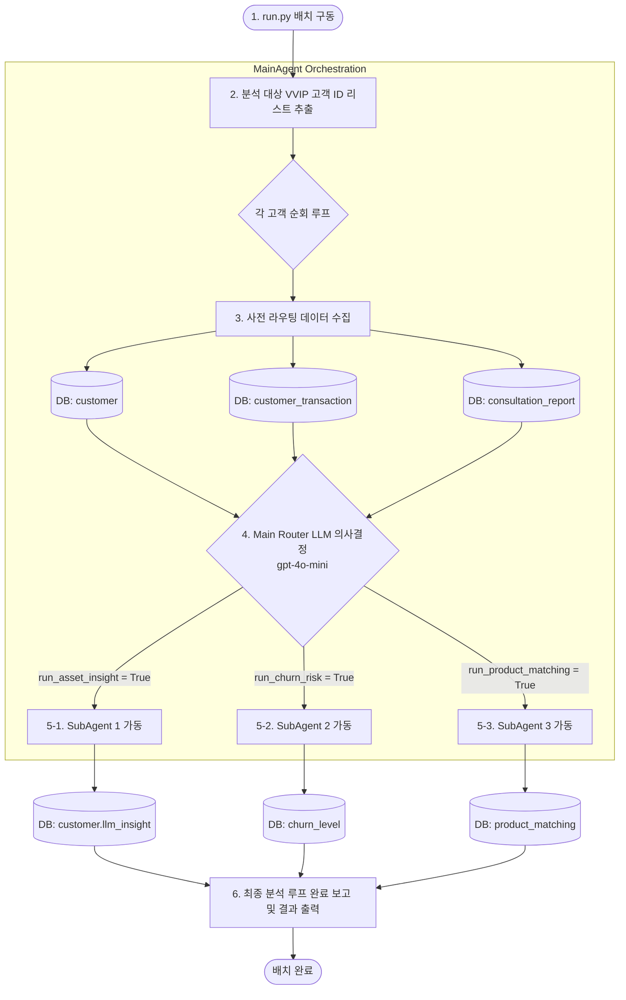
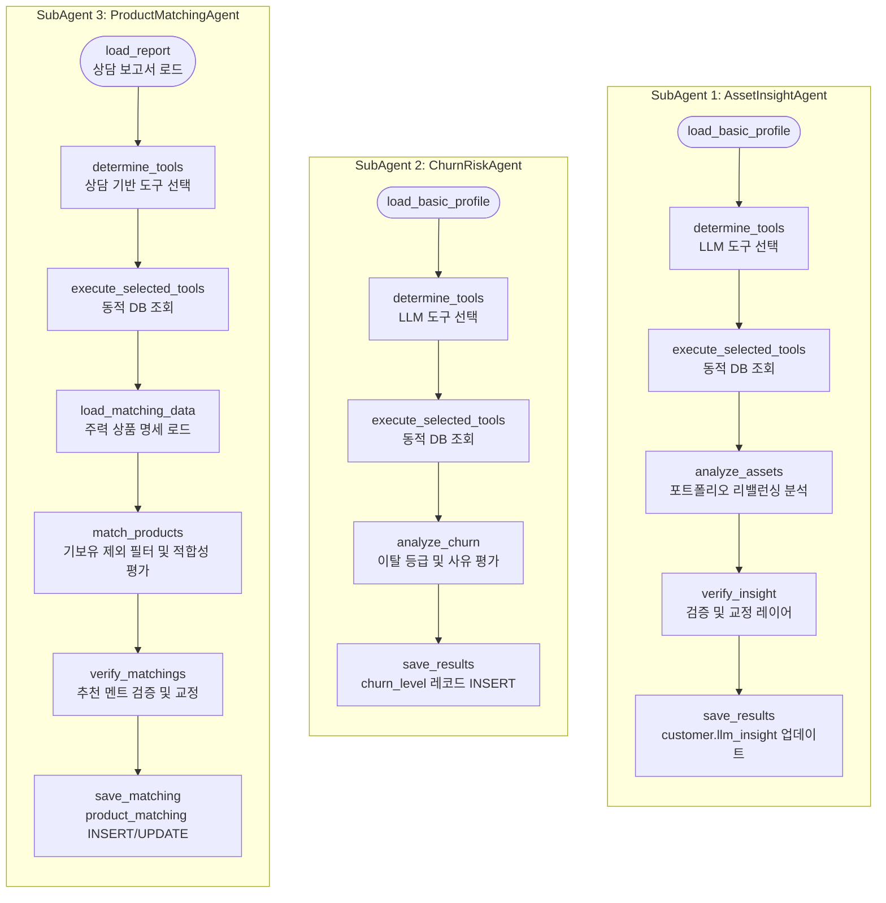

# 🤖 POOM-AI 통합 고객 분석 에이전트 기술 가이드 (MainAgent & SubAgent 1, 2, 3)

본 문서는 `customer-main-agent` 패키지에 구축된 **통합 오케스트레이터 (MainAgent)** 및 하위 세부 분석을 담당하는 **3대 서브 에이전트 (SubAgent 1, 2, 3)**의 아키텍처, 데이터 스키마, 동적 라우팅 조건 및 제어 흐름에 대해 기술합니다.

---

## 📌 1. 아키텍처 및 역할 개요

POOM-AI는 VIP 고객 데이터에 대해 리소스를 효율적으로 분배하고 정밀한 분석을 제공하기 위해 **Main-Sub Agent 구조**와 **LangGraph 기반 상태 제어**를 도입하였습니다.

### 1) 통합 오케스트레이션 및 라우팅 흐름도


### 2) 서브 에이전트별 LangGraph 상세 흐름도


### 1) MainAgent: 통합 오케스트레이터 및 라우터
고객의 기본 프로필, 최근 거액 타행 출금 여부, 상담 기록 유무 등의 지표 데이터를 수집한 뒤, LLM 판단 하에 오늘 분석을 실행할 서브 에이전트들을 동적으로 라우팅(True/False)하여 제어합니다.

### 2) SubAgent 1: 자산 리밸런싱 인사이트 에이전트 (`AssetInsightAgent`)
고객의 보유 자산(예금, 투자, 연금, 대출 비중)과 계좌/금융 상품 현황을 분석하여 PB 상담용 자산 포트폴리오 관리 가이드라인을 생성하고 `customer.llm_insight` 컬럼에 보고서 및 적재 일시를 기록합니다.

### 3) SubAgent 2: 이탈 위험 분석 에이전트 (`ChurnRiskAgent`)
고객의 행동 로그(불만 사항 등) 및 상세 거래 내역을 분석하여 자산의 타행 이탈 위험 등급(양호, 주의, 위험)을 계산하고 `churn_level` 테이블에 신규 등록합니다.

### 4) SubAgent 3: 주력 상품 매칭 에이전트 (`ProductMatchingAgent`)
고객의 최근 상담 보고서(`consultation_report`), 가족 관계 및 계좌 잔액 현황 등을 종합 대조하여 본점의 주요 주력 상품과의 적합성(적합, 부적합, 보유 중)을 분석하고 맞춤 추천 멘트를 작성하여 `product_matching` 테이블에 저장합니다.

---

## ⚙️ 2. 데이터 구조 및 스키마 (Schemas & States)

### 1) MainAgent 동적 라우팅 결정 스키마 (`SubAgentRouting`)
LLM 라우터가 분석 대상 고객을 파악한 후 리턴하는 구조화된 판단 모델입니다.
```python
class SubAgentRouting(BaseModel):
    run_asset_insight: bool       # SubAgent 1 구동 여부 (자산 규모 1억 이상 우량 고객 또는 예금 편중 고객 등)
    run_churn_risk: bool          # SubAgent 2 구동 여부 (최근 7일 내 1천만 원 이상 타행 출금 등 이탈 위험 발생 시)
    run_product_matching: bool    # SubAgent 3 구동 여부 (상담 보고서가 존재하고 신규 상품 매칭이 필요할 때)
    reason: str                   # 각 서브 에이전트 선택/배제 여부에 대한 구체적인 분석적 근거 (한 문장)
```

### 2) SubAgent 1 상태 (`Agent1State`)
```python
class Agent1State(TypedDict):
    customer_id: int                            # 대상 고객 ID
    portfolio: Optional[Dict[str, Any]]         # 고객 기본 프로필 및 자산 비중
    tool_selection: Optional[Dict[str, Any]]    # 동적 도구 선정 정보
    customer_accounts: Optional[List[Dict[str, Any]]] # 상세 계좌 유형 및 잔액 목록
    customer_products: Optional[List[Dict[str, Any]]] # 보유 금융 상품 목록
    customer_features: Optional[List[Dict[str, Any]]] # 최근 1개월 고객 정성 특징 메모
    trend_reports: Optional[List[Dict[str, Any]]]     # 거시경제 지표 트렌드 보고서
    asset_insight: Optional[str]                # 생성된 최종 PB용 자문 가이드
    errors: List[str]                           # 에러 로그
```

### 3) SubAgent 2 상태 (`Agent2State`)
```python
class Agent2State(TypedDict):
    customer_id: int                            # 대상 고객 ID
    portfolio: Optional[Dict[str, Any]]         # 고객 기본 프로필 및 자산 비중
    tool_selection: Optional[Dict[str, Any]]    # 동적 도구 선정 정보
    customer_accounts: Optional[List[Dict[str, Any]]] # 상세 계좌 유형 및 잔액 목록
    customer_products: Optional[List[Dict[str, Any]]] # 보유 금융 상품 목록
    customer_features: Optional[List[Dict[str, Any]]] # 최근 1개월 고객 정성 특징 메모
    customer_transactions: Optional[List[Dict[str, Any]]] # 최근 3개월 상세 거래 내역
    churn_grade: Optional[str]                  # 판정된 이탈 위험 등급 (양호, 주의, 위험)
    churn_reason: Optional[str]                 # 80자 이내의 명확한 판정 근거
    errors: List[str]                           # 에러 로그
```

### 4) SubAgent 3 상태 (`Agent3State`)
```python
class Agent3State(TypedDict):
    customer_id: int                            # 대상 고객 ID
    report: Optional[Dict[str, Any]]            # 최근 상담 보고서 원문 정보
    portfolio: Optional[Dict[str, Any]]         # 고객 기본 프로필 및 자산 비중
    tool_selection: Optional[Dict[str, Any]]    # 동적 도구 선정 정보
    customer_relationship: Optional[List[Dict[str, Any]]] # 가족 관계 목록
    customer_products: Optional[List[Dict[str, Any]]] # 보유 금융 상품 목록 (중복 추천 방지용)
    customer_accounts: Optional[List[Dict[str, Any]]] # 상세 계좌 유형 및 잔액 목록
    customer_features: Optional[List[Dict[str, Any]]] # 최근 1개월 고객 정성 특징 메모
    main_products: Optional[List[Dict[str, Any]]]     # 본점 활성 주력 상품 명세 목록
    product_matchings: List[Dict[str, Any]]     # 각 주력 상품별 적합성 평가 결과 목록
    errors: List[str]                           # 에러 로그
```

---

## 🛠️ 3. 데이터 인터페이스 및 도구 재사용 (Tools Reusability)

에이전트는 데이터 결합도를 낮추고 재사용성을 극대화하기 위해 `tool/tools.py`에 구현된 동일한 공통 함수들을 호출하여 데이터를 적재합니다.

| 도구 이름 | 호출 함수 (재사용) | SubAgent 1 | SubAgent 2 | SubAgent 3 |
| :--- | :--- | :---: | :---: | :---: |
| **`customer`** | `get_portfolio_weight` | O | O | O |
| **`customer_account`** | `get_customer_accounts` | O | O | O |
| **`customer_product`** | `get_customer_active_products` | O | O | O |
| **`customer_information`** | `get_customer_features` (months=1) | O | O | O |
| **`customer_relationship`** | `get_customer_relationship` | - | - | O |
| **`customer_transaction`** | `get_customer_transactions` (months=3) | - | O | - |
| **`trend_llm_report`** | `get_trend_report` | O | - | - |

---

## 🔄 4. 서브 에이전트별 세부 제어 흐름 (Flow of Control)

### 4.0. MainAgent: 통합 오케스트레이션 및 배치 흐름
`MainAgent`는 단일 고객 분석을 가동하는 `run_for_customer(customer_id)`와 전체 배치 분석을 일괄 제어하는 `run_batch(specified_c_ids)` 엔트리 포인트를 제공합니다.

1. **VVIP 대상 자동 스캔 (run_batch)**:
   - 특정 고객 ID 목록(`specified_c_ids`)이 전달되지 않은 경우, `tools.fetch_batch_target_c_ids`를 호출하여 분석이 시급한 VIP 타겟들을 자동으로 스캔합니다.
2. **사전 라우팅 정보 수집 (run_for_customer)**:
   - `tools.get_portfolio_weight`를 통한 고객 자산 데이터 조회.
   - `tools.get_large_external_transactions`를 통해 최근 7일 내 1천만 원 이상 타행 송금 이출금 내역 조회.
   - `tools.get_recent_consultation_report`를 통해 최근 상담 보고서 존재 여부 조회.
3. **동적 라우팅 결정 (Main Router)**:
   - 프롬프트 템플릿(`main_agent_router_system.md`, `main_agent_router_user.md`)에 위 수집된 지표를 주입하고 `gpt-4o-mini` 구조화된 출력을 활용하여 `SubAgentRouting` 결정.
   - **배제 조건 규칙**: 상담 보고서가 존재하지 않는 경우 (`has_consultation_report` = False) SubAgent 3은 무조건 배제(`run_product_matching` = False)되도록 프롬프트 가이드라인을 강제합니다.
4. **서브 에이전트 구동 및 통계 기록**:
   - 결정된 플래그(`True`)에 매칭되는 서브 에이전트들의 독립 샌드박스 실행 루프를 시작하고 결과를 리포팅합니다.
   - 각 고객별 서브 태스크 성공 여부를 판별하여 최종 배치 보고서에 완료 통계(총 대상, 성공, 실패 수)를 기록합니다.

### 4.1. SubAgent 1: 자산 분석 흐름
1. `load_basic_profile`: 고객 기본 자산 및 성향 조회.
2. `determine_tools`: LLM을 통해 수집할 정보 도구 결정 (`ToolSelection1` 맵 생성).
3. `execute_selected_tools`: 선택된 도구를 공통 호출하여 상태에 바인딩.
4. `analyze_assets`: 데이터를 바인딩하여 3인칭 존댓말 가이드라인 리포트 생성.
5. `verify_insight`: **[검증 및 교정 레이어]** 마크다운 기호 소거, 2인칭 교정("고객님" -> "고객"), 3문장 이내 절삭 및 끝맺음 온점 강제 추가.
6. `save_results`: `customer.llm_insight` 컬럼에 최종 저장 및 `analysis_time`을 현재 시각(`NOW()`)으로 업데이트.

### 4.2. SubAgent 2: 이탈 위험 분석 흐름
1. `load_basic_profile`: 고객 기본 프로필 조회.
2. `determine_tools`: LLM을 통해 수집할 데이터 도구 결정 (`ToolSelection2` 맵 생성).
3. `execute_selected_tools`: 선택된 도구를 공통 호출하여 상태에 바인딩 (이때 `customer_features`는 1달 이내, `customer_transactions`는 3달 이내로 자동 한정).
4. `analyze_churn`: 최근 1개월 특징 메모 및 3개월 거래 내역을 종합 대조하여 이탈 등급(`양호`/`주의`/`위험`) 및 근거 판정.
5. `save_results`: **[글자 수 검증 레이어 포함]** 등급을 데이터 규격에 부합하게 변환(양호/주의/위험)하고 사유가 100자를 넘어가면 잘라낸 뒤 생략 기호(`...`)를 덧붙여 `churn_level` 테이블에 `INSERT`.

### 4.3. SubAgent 3: 주력 금융 상품 추천 흐름
1. `load_report`: 최근 상담 이력(`consultation_report`) 로드.
2. `determine_tools`: 상담 본문 내용을 분석하여 수집이 필요한 DB 도구 동적 결정 (`ToolSelection3` 맵 생성).
3. `execute_selected_tools`: 결정된 도구들(`customer`, `customer_account`, `customer_product`, `customer_information`, `customer_relationship`)을 호출하여 데이터 로드.
4. `load_matching_data`: 본점 주력 금융 상품 목록(`main_products`)을 로드하고, `customer` 도구가 스킵되었을 경우를 대비해 프로필 데이터 유효성을 검증/강제 로드하여 보완.
5. `match_products`: 이미 보유 중인 상품은 제외 판정(2순위 보유 중 처리)하며, 수집된 프로필/특징/가족관계를 기반으로 적합 금융 상품 분석 진행.
6. `verify_matchings`: **[추천 사유 검증 레이어]** 추천 멘트 사유(`reason`) 내 마크다운 기호 제거, 호칭 및 인칭을 3인칭 객관어("고객님" -> "고객")로 일괄 교정 및 가독성을 높이기 위해 문장 수 제한(3문장 이내 절삭).
7. `save_matching`: 적합성 및 맞춤 멘트를 `product_matching` 테이블에 `INSERT/UPDATE` 처리.

---

## 🏷️ 5. LangSmith 추적 및 에이전트 식별자 (LangSmith Tracing)

각 에이전트의 실행 흐름과 입력 메타데이터를 명확히 모니터링하기 위해 LangSmith 추적을 제공합니다. `@traceable` 데코레이터와 실행 설정(`config`)을 통해 각 스팬(Span)에 에이전트 식별을 위한 고유의 `name`과 `tags`를 명시적으로 부여합니다.

### 1) 통합 오케스트레이터 및 배치 수집 추적
- **`MainAgent.run_batch`**:
  - **스팬 이름**: `MainAgent.run_batch`
  - **태그**: `["MainAgent"]`
- **`MainAgent.run_for_customer`**:
  - **스팬 이름**: `MainAgent.run_for_customer`
  - **태그**: `["MainAgent"]`
- **`fetch_batch_target_c_ids`** (배치 타겟 데이터 스캔):
  - **스팬 이름**: `fetch_batch_target_c_ids`
  - **태그**: `["tool"]` (자동 선별 사유 및 대상 매핑 정보 로깅)

### 2) 3대 서브 에이전트 추적
각 서브 에이전트의 실행 진입점(`run` 메서드)에는 `@traceable` 데코레이터를 지정하여 하위 흐름(LangGraph 포함)을 하나의 논리적 체인으로 추적하며, LangGraph 호출 시에도 고유 이름을 부여합니다.
- **`AssetInsightAgent`** (SubAgent 1):
  - **스팬 이름**: `AssetInsightAgent`
  - **태그**: `["AssetInsightAgent"]`
- **`ChurnRiskAgent`** (SubAgent 2):
  - **스팬 이름**: `ChurnRiskAgent`
  - **태그**: `["ChurnRiskAgent"]`
- **`ProductMatchingAgent`** (SubAgent 3):
  - **스팬 이름**: `ProductMatchingAgent`
  - **태그**: `["ProductMatchingAgent"]`
