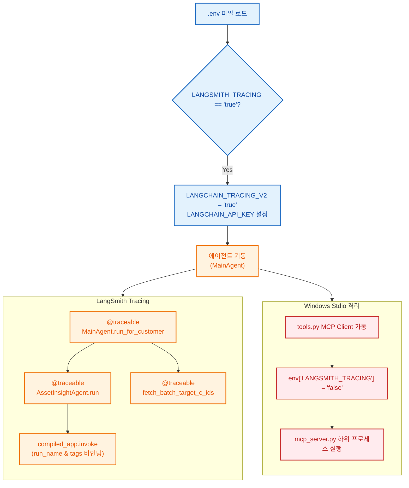

# 🏷️ POOM-AI LangSmith 적용 가이드 (LangSmith Explanation & Best Practices)

이 가이드는 LLM 에이전트 애플리케이션의 디버깅, 모니터링 및 분석을 돕는 **LangSmith**의 개념과, POOM-AI의 `customer-main-agent` 패키지에 이 기술이 어떻게 설계되어 동작하는지 설명합니다. LangSmith를 처음 접하는 개발자도 쉽게 이해할 수 있도록 기초적인 개념부터 실제 코드 예시까지 매우 자세히 다룹니다.

---

## 💡 1. LangSmith란 무엇인가요?

**LangSmith**는 LLM(대형 언어 모델) 애플리케이션 개발을 위한 **LLMOps(LLM Operations) 플랫폼**입니다. 

기존의 일반적인 백엔드 코드는 정해진 비즈니스 로직에 따라 예측 가능한 결과를 내지만, LLM 애플리케이션은 **입출력이 자유롭고(비정형 데이터), LLM 내부의 상태 변화나 토큰 사용량을 직관적으로 파악하기 어렵습니다.**

LangSmith는 다음과 같은 핵심 질문에 답을 줄 수 있습니다:
1. *LLM에 최종적으로 주입된 프롬프트 템플릿의 완성본은 어떤 모습인가?*
2. *체인/에이전트 안에서 어떤 단계(Node)에서 시간이 오래 걸렸거나 에러가 났는가?*
3. *이번 호출에서 총 몇 개의 토큰을 소모했고 비용은 얼마나 발생했는가?*
4. *LangGraph의 복잡한 조건부 루프가 의도한 순서대로 실행되었는가?*

---

## 🔑 2. LangSmith의 핵심 개념

* **Run (실행)**: 프롬프트 호출, LLM 실행, 도구 호출 등 개별 단위의 실행 이벤트입니다.
* **Trace (추적)**: 여러 개의 Run이 모여 이루는 하나의 전체 요청 흐름입니다. 예를 들어, `MainAgent` 가동 후 `SubAgent`들이 돌고 최종 결과를 DB에 쓰기까지의 전 과정을 하나의 Trace로 봅니다.
* **Span (스팬)**: Trace 내에서 시작 시간과 종료 시간이 있는 각각의 작업 세부 단계입니다.
* **Project (프로젝트)**: 관련 있는 Trace들을 묶어 관리하는 대시보드 격리 단위입니다.
* **Tags (태그)**: 실행 이력을 검색하거나 필터링하기 위해 부여하는 메타데이터 식별자입니다.

---

## 🛠️ 3. POOM-AI에서의 LangSmith 구현 메커니즘

POOM-AI 프로젝트는 아래의 흐름을 통해 에이전트의 작동 흐름을 실시간으로 추적합니다.



---

## ⚙️ 4. 환경 변수(Environment Variables) 상세 분석

LangSmith(및 LangChain)는 코드 내부에 별도의 로깅/전송 코드를 삽입하지 않더라도, 시스템 환경 변수(OS Environment Variables)를 바탕으로 백그라운드에서 실행 이력을 실시간 수집하도록 설계(Zero-Code Configuration)되어 있습니다.

[db.py](./db.py#L40-L48)는 이 연동의 첫 관문으로, 사용자가 설정한 로컬 변수를 시스템이 요구하는 표준 변수로 변환 및 로드합니다.

```python
# db.py
# LangSmith 추적 활성화 환경변수 매핑 처리
if os.getenv("LANGSMITH_TRACING") == "true":
    os.environ["LANGCHAIN_TRACING_V2"] = "true"
if os.getenv("LANGSMITH_API_KEY"):
    os.environ["LANGCHAIN_API_KEY"] = os.getenv("LANGSMITH_API_KEY")
if os.getenv("LANGSMITH_ENDPOINT"):
    os.environ["LANGCHAIN_ENDPOINT"] = os.getenv("LANGSMITH_ENDPOINT")
if os.getenv("LANGSMITH_PROJECT"):
    os.environ["LANGCHAIN_PROJECT"] = os.getenv("LANGSMITH_PROJECT").strip('"\'')
```

### 각 환경 변수의 역할과 원리

1. **`LANGCHAIN_TRACING_V2`** (`true`/`false`)
   * **역할**: LangChain/LangSmith SDK의 **전역 모니터링 활성화 스위치**입니다.
   * **원리**: 이 값이 `"true"`로 감지되면 SDK 내부의 `Client`가 실행 흐름을 가로채는 후크(Hook)를 작동시키고, 비동기 큐를 통해 로그 데이터를 수집하기 시작합니다.
2. **`LANGCHAIN_API_KEY`**
   * **역할**: 수집된 로그 데이터를 안전하게 전송할 LangSmith 클라우드/보안 계정의 **인증 토큰(API Key)**입니다.
   * **원리**: HTTPS API 요청 헤더의 `x-api-key`에 실려 전송되며, 올바르지 않은 키가 세팅되면 로깅 에러가 콘솔에 남을 수 있습니다.
3. **`LANGCHAIN_ENDPOINT`**
   * **역할**: 로그를 적재할 **수집 서버 주소(API Endpoint)**입니다.
   * **원리**: 기본값은 글로벌 클라우드 서비스 주소(`https://api.smith.langchain.com`)이며, 사설 VPC에 세팅한 온프레미스 수집 서버가 있을 경우 해당 도메인을 기입합니다.
4. **`LANGCHAIN_PROJECT`**
   * **역할**: 여러 개의 프로젝트(개발, 스테이징, 상용 등) 중 로그가 분류되어 들어갈 **대시보드상의 워크스페이스 명칭**입니다.
   * **원리**: 해당 명이 존재하지 않는 경우 자동으로 신규 프로젝트를 생성하고, 값이 제공되지 않으면 `"default"` 프로젝트 공간으로 통합됩니다.

---

## 🏷️ 5. `@traceable` 데코레이터 상세 분석

`@traceable`은 LangSmith에서 제공하는 가장 핵심적인 파이썬 데코레이터(Decorator)입니다. 데코레이터가 붙은 대상 함수는 **내부적으로 프록시(Proxy) 구조와 파이썬 컨텍스트 매니저(`try-finally`)로 감싸져** 동작하게 됩니다.

### `@traceable`이 동작하는 내부 원리

함수가 실행되는 시점에 `@traceable`은 다음 액션을 자동으로 대행합니다:
1. **입력 데이터 캡처**: 함수가 인자로 받은 매개변수(`customer_id` 등)를 JSON 형태로 추출하여 로깅 큐에 저장합니다.
2. **타이머 작동**: 함수 진입 시점과 반환(Return)되는 시점의 시간을 나노초 단위로 측정하여 전체 실행 시간(Latency)을 기록합니다.
3. **예외 감지**: 함수 내부에서 에러가 던져지면, `try-except` 구조로 에러의 종류(Exception Type)와 콜스택(Traceback)을 캐치하여 LangSmith 대시보드에 **빨간색 경고등(Error Run)**을 표시하고, 에러를 부모 함수로 다시 전달합니다.
4. **반환값 캐치**: 실행 성공 시 리턴값을 기록합니다.

### 주요 매개변수(Parameter) 설명과 코드 적용 예시

```python
@traceable(
    name="CustomerMain-Agent", 
    run_type="chain", 
    tags=["MainAgent"]
)
```

1. **`name`** (이름)
   * **설명**: LangSmith 대시보드 트리 뷰에 표시될 **스팬의 식별명**입니다. 생략 시 파이썬 함수명(`run_for_customer`)이 그대로 표시되지만, 비즈니스 영역을 명확히 하고자 커스텀 이름을 부여할 때 씁니다.
   * **예시**: `CustomerMain-Agent`
2. **`run_type`** (실행 타입)
   * **설명**: 스팬의 역할군을 정의합니다. 대시보드에서 렌더링되는 아이콘과 가시성 필터링의 기준이 됩니다.
   * **주요 타입**:
     * `chain`: 여러 비즈니스 단계가 합쳐진 워크플로우를 대표할 때 씁니다.
     * `tool`: 데이터베이스 조회나 연산 등 외부 리소스와 상호작용하는 유틸리티에 부여합니다.
     * `llm`: 순수 LLM 호출 영역에 부여됩니다 (LangChain의 `ChatOpenAI` 객체 등은 자체적으로 `llm` 타입을 달고 LangSmith에 올라갑니다).
   * **예시**: `MainAgent`와 서브 에이전트의 전체 루프는 `run_type="chain"`으로 설정하고, 배치 타겟을 조회하는 함수([fetch_batch_target_c_ids](./tool/tools.py#L174-L176))는 `run_type="tool"`로 설정하여 의미를 분리했습니다.
3. **`tags`** (태그)
   * **설명**: 대시보드 검색기에서 특정 범주의 실행만 모아보기 위해 지정하는 인덱스 태그 배열입니다.
   * **예시**: `["AssetInsightAgent"]`, `["MainAgent"]` 등 각 역할군별 태그를 기입하여 필터링을 돕습니다.

---

## 🗺️ 6. LangGraph의 세부 추적 메커니즘 (`config` 설정)

POOM-AI의 서브 에이전트들은 단순한 일련의 코드 실행이 아닌, LangGraph를 활용한 상태 기반 노드 전이 흐름을 따릅니다.

```python
# AssetInsightAgent.run의 실제 적용
final_state = self.app.invoke(
    initial_state,
    config={"run_name": "AssetInsightAgent", "tags": ["asset_insight_agent"]}
)
```

### 작동 방식
* LangGraph 컴파일러에 의해 빌드된 `self.app`은 내부에 수많은 노드(`load_basic_profile`, `determine_tools` 등)를 순회합니다.
* 이때 LangChain 생태계의 공통 설정 딕셔너리인 `config` 객체를 주입하게 되며, `run_name`을 지정하면 해당 LangGraph 전체의 실행 루트 노드 이름이 `"AssetInsightAgent"`로 예쁘게 브랜딩됩니다.
* 하위의 각 개별 Node 함수들은 별도로 `@traceable`을 덕지덕지 붙이지 않더라도, LangGraph 런타임이 주입된 `config`를 상속받아 자식 스팬(Child Span)으로 자동 정렬하고, 태그(`tags`)들을 동시 상속 처리합니다.

---

## 🔒 7. Windows Stdio/MCP 환경에서의 교착상태(Deadlock) 격리 방침

> [!WARNING]
> **Windows OS 환경에서의 핵심 교착 상태 메커니즘**
> 
> POOM-AI의 `tools.py`는 데이터베이스에 직접 쿼리를 날리지 않고, 별도의 자식 프로세스인 `mcp_server.py`를 실행하여 통신합니다. 이 통신 매개체는 프로세스의 **표준 입출력 파이프(stdin/stdout)**입니다.
> 
> 만약 자식 프로세스에도 `LANGSMITH_TRACING="true"` 환경 변수가 전달되면, 자식 프로세스가 가동될 때 LangSmith 모듈이 로딩되면서 모듈 내부 초기화 정보나 네트워크 접속 디버깅 이력 등을 표준 출력(`stdout`)으로 무단 인쇄할 수 있습니다.
> 이로 인해 부모 프로세스인 MCP Client는 JSON 메시지가 와야 할 통신 채널에 엉뚱한 텍스트 데이터가 섞여 들어와 **영구 대기 상태(Deadlock/Hang)**에 걸리게 됩니다.

이 치명적인 문제를 방지하기 위해 [MCPClientManager._start_client](./tool/tools.py#L71-L85) 내부에서는 자식의 환경 변수를 완전 격리 차단합니다.

```python
# tools.py
async def _start_client(self):
    ...
    # 부모 프로세스의 환경 변수를 그대로 복사
    env = os.environ.copy()
    
    # 자식 MCP 서버가 구동될 환경 변수에서만 LangSmith 추적을 강제 차단합니다.
    env["LANGSMITH_TRACING"] = "false"
    env["LANGCHAIN_TRACING_V2"] = "false"
    
    # 격리된 env 환경을 주입하여 기동
    server_params = StdioServerParameters(
        command=sys.executable,
        args=[mcp_server_path],
        env=env
    )
    ...
```

이 구조 덕분에 메인 비즈니스 계층인 에이전트와 LLM의 프롬프트 호출 이력은 LangSmith를 통해 완벽히 투명하게 모니터링되면서도, Windows 운영체제 환경의 Stdio 자식 프로세스 간 통신은 중단이나 지연 현상 없이 안정적으로 유지될 수 있습니다.
