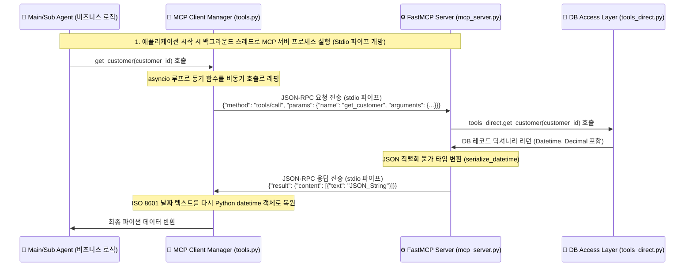

# 🌐 POOM-AI MCP (Model Context Protocol) 도입 및 설계 가이드

이 가이드는 POOM-AI의 `customer-main-agent`에 적용된 **MCP (Model Context Protocol)** 아키텍처를 처음 접하는 개발자도 쉽게 이해할 수 있도록 동작 원리부터 세부 코드 구현까지 상세하게 기술합니다.

---

## 💡 1. MCP (Model Context Protocol) 란 무엇인가요?

**MCP(Model Context Protocol)**는 AI 에이전트(또는 LLM)가 로컬 개발 환경의 도구(파일 시스템, 데이터베이스, 터미널 등)나 웹 브라우저, 외부 API 서비스와 안전하고 일관된 표준 방식으로 통신하기 위해 제정된 **오픈소스 프로토콜**입니다.

### 🔌 비유로 이해하기 (USB 표준 규격)
* 과거에는 스마트폰 제조사마다 다른 충전 단자를 썼지만, 지금은 **USB Type-C** 하나로 파일 전송부터 전원 충전까지 통일되었습니다.
* MCP도 마찬가지입니다. 과거에는 AI 에이전트 서비스마다 DB 접속 모듈을 각자 개발해야 했으나, 이제는 **표준 MCP 서버** 하나만 띄워두면 어떤 AI 에이전트(Claude Desktop, Cursor IDE, LangChain 에이전트 등)도 변경 없이 그대로 갖다 붙일 수 있게 통일되었습니다.

---

## 🏗️ 2. POOM-AI가 MCP를 도입한 이유 (아키텍처적 장점)

기존에는 AI 에이전트 코드([main_agent.py](./agent/main_agent.py))가 DB 드라이버(PyMySQL)를 직접 잡고 SQL 쿼리를 실행하는 강한 결합(Tight Coupling) 상태였습니다. MCP를 도입함으로써 다음과 같은 아키텍처적 변화를 이뤄냈습니다:

1. **데이터 접근 계층의 완전 격리 (Loose Coupling)**:
   * 에이전트는 DB 접속 정보(Host, Port, PW 등)를 알 필요가 없습니다. 단지 표준 인터페이스인 MCP 서버로 필요한 데이터를 청구할 뿐입니다.
2. **도구의 재사용성(Reusability) 극대화**:
   * 구축해 둔 `mcp_server.py`는 현재의 배치 에이전트뿐만 아니라 차후 별도의 챗봇 웹 애플리케이션이나 협업 에이전트 프레임워크에서도 표준 클라이언트를 통해 즉시 호출할 수 있습니다.
3. **직렬화 및 규격 관리 일원화**:
   * MySQL에서 호출된 특수 자료형(`Decimal`, `Datetime`) 등을 클라이언트로 주고받기 편하게 JSON 규격에 맞춰 변환하는 가공 로직을 MCP 서버 계층에서 집중적으로 처리합니다.

---

## 📂 3. 전체 파일 트리 및 파일별 역할 상세 설명

이 프로젝트 패키지 구조가 어떻게 짜여 있고, 개별 파일들이 어떤 고유 역할을 가지는지 총정리한 내역입니다.

```
customer-main-agent/
│
├── main.py                     # [진입점] 프로그램 배치 실행 및 사용자 CLI 인자 해석기
├── mcp_server.py               # [서버] DB 쿼리를 감싸 표준 MCP API로 제공하는 FastMCP 서버
├── db.py                       # [공통] DB 접속 컨텍스트 및 LangSmith 환경 변수 매핑 처리
│
├── agent/                      # [에이전트 계층] AI 비즈니스 논리가 담긴 핵심 폴더
│   ├── main_agent.py           # - 통합 오케스트레이터 및 LLM 라우터 (서브 에이전트 제어)
│   ├── asset_insight_agent.py  # - SubAgent 1: 자산 포트폴리오 리밸런싱 인사이트 분석 (LangGraph)
│   ├── churn_risk_agent.py     # - SubAgent 2: 이탈 위험 수준 등급 판정 (LangGraph)
│   └── product_matching_agent.py # - SubAgent 3: 주력 상품 적합성 평가 및 추천 (LangGraph)
│
└── tool/                       # [데이터 도구 계층] DB 연결 및 프로토콜 변환 폴더
    ├── tools.py                # - MCP 클라이언트. 서버를 하위 프로세스로 구동하고 호출 대행
    └── tools_direct.py         # - 실제 MySQL 데이터베이스에 접속해 SQL 쿼리를 날리는 모듈
```

---

## 💻 4. 핵심 파일별 구조 및 코드 분석

각 파일이 대략 어떤 형태의 코드로 설계되어 상호작용하는지 보여주는 핵심 코드 조각입니다.

### 1) 진입 파일: `main.py`
프로그램을 실행하고 CLI 명령 파라미터를 파싱하는 최상단 시작점입니다.
```python
# main.py
import argparse
from agent.main_agent import MainAgent

if __name__ == "__main__":
    parser = argparse.ArgumentParser(description="POOM-AI Batch Customer Agent")
    parser.add_argument("--c_ids", type=str, help="Comma separated customer IDs")
    args = parser.parse_args()

    # 지휘자 에이전트 인스턴스화 및 배치 실행
    agent = MainAgent()
    c_ids_list = [int(x.strip()) for x in args.c_ids.split(",")] if args.c_ids else None
    agent.run_batch(specified_c_ids=c_ids_list)
```

### 2) 지휘자 에이전트: `agent/main_agent.py`
의사결정을 내리고 서브 에이전트를 조율하는 비즈니스 브레인입니다. 데이터가 필요할 때 `tools` 모듈을 사용합니다.
```python
# agent/main_agent.py
from tool import tools  # 데이터 수집용 추상 인터페이스 임포트
from agent.asset_insight_agent import AssetInsightAgent

class MainAgent:
    def __init__(self):
        self.sub1 = AssetInsightAgent()

    def run_for_customer(self, customer_id: int):
        # tools.py를 통해 간접적으로 고객 기본 프로필 조회 (MCP 채널을 탐)
        portfolio = tools.get_customer(customer_id)
        
        # LLM을 활용한 라우팅 판단 후, 특정 서브 에이전트 구동
        self.sub1.run(customer_id)
```

### 3) MCP 클라이언트 매니저: `tool/tools.py`
배그라운드에 `mcp_server.py`를 파이프 프로세스로 실행시키고, 에이전트가 함수를 실행하면 JSON-RPC 패킷으로 파이프에 직렬화해 전달하는 어댑터입니다.
```python
# tool/tools.py
import subprocess, sys, json
from mcp import stdio_client

class MCPClientManager:
    def __init__(self):
        # 백그라운드 스레드에서 mcp_server.py를 하위 프로세스로 실행
        # Windows Stdio Deadlock을 피하기 위해 환경변수에서 LangSmith를 비활성화합니다.
        env = os.environ.copy()
        env["LANGSMITH_TRACING"] = "false"
        
        # Stdio 통신을 개방하며 자식 프로세스 구동
        self.client_context = stdio_client(
            StdioServerParameters(command=sys.executable, args=["mcp_server.py"], env=env)
        )
        # ... 통신용 Session 획득

    def call_tool(self, name: str, arguments: dict):
        # 동기 호출을 JSON-RPC 비동기 패킷으로 변환하여 송수신
        return self.session.call_tool(name, arguments)

# 글로벌 싱글톤 인스턴스를 통해 에이전트에 노출
_mcp_manager = MCPClientManager()

def get_customer(customer_id: int):
    # 에이전트는 마치 일반 파이썬 함수를 호출하듯 사용함
    return _mcp_manager.call_tool("get_customer", {"customer_id": customer_id})
```

### 4) MCP 서버: `mcp_server.py`
자식 프로세스 단독으로 실행되는 독자적 데몬입니다. 클라이언트가 파이프로 보낸 JSON-RPC 요청을 받아서 데이터베이스 계층(`tools_direct.py`)을 수행하고, 결과를 JSON 문자열로 바꿔 보냅니다.
```python
# mcp_server.py
from mcp.server.fastmcp import FastMCP
from tool import tools_direct

mcp = FastMCP("Poom-Agent-Tools")

@mcp.tool()
def get_customer(customer_id: int) -> str:
    """고객 자산 프로필 정보를 조회합니다."""
    # tools_direct의 원시 DB 접속 함수 호출
    raw_data = tools_direct.get_customer(customer_id)
    return to_mcp_response(raw_data) # Datetime, Decimal 가공 후 JSON 반환

if __name__ == "__main__":
    mcp.run() # Stdio 연결 대기 루프 실행
```

### 5) 원시 DB 접근 계층: `tool/tools_direct.py`
실제 데이터베이스에만 특화되어 SQL을 실행하는 말단 물리 파일입니다.
```python
# tool/tools_direct.py
from db import get_db_cursor

def get_customer(customer_id: int):
    query = "SELECT c_id, name, total_assets FROM customer WHERE c_id = %s"
    with get_db_cursor() as cursor:
        cursor.execute(query, (customer_id,))
        return cursor.fetchone() # 파이썬 기본 Dictionary 반환
```

---

## 🧭 5. POOM-AI의 MCP 아키텍처 통신 흐름



---

## 🖥️ 6. MCP 서버를 UI 대시보드로 확인 및 테스트하는 방법

FastMCP 프레임워크와 MCP SDK는 에이전트를 실행하지 않고도, **등록된 도구들이 잘 동작하는지 웹 브라우저 UI(대시보드) 형태로 제어하고 테스트할 수 있는 개발용 도구(MCP Inspector)**를 지원합니다.

### 1) FastMCP CLI를 사용한 기동
패키지가 가상환경(`.venv`) 내에 성공적으로 설치된 후, 가상환경의 실행 파일 폴더가 터미널 쉘 세션에 아직 업데이트되지 않았을 경우 다음과 같은 방법들을 권장합니다.

```bash
# 방법 A: 가상환경 스크립트 실행 파일 직접 기동 (가장 확실함)
.\.venv\Scripts\fastmcp dev agent\customer-main-agent\mcp_server.py

# 방법 B: CLI 환경이 잘 매핑되어 있는 경우의 표준 명령어
fastmcp dev agent\customer-main-agent\mcp_server.py
```
* **동작**: 백그라운드에서 서버가 켜지며, 자동으로 웹 브라우저에 **MCP Inspector UI**(기본 주소 `http://localhost:5173`)가 열립니다.
* **기능**: 웹 대시보드 화면에서 등록된 모든 도구(`get_customer`, `get_trend_report` 등)의 입력 파라미터를 직접 키보드로 기입하고 **[Run Tool]**을 클릭해 실제 DB의 결과 데이터를 UI 화면에서 편리하게 확인할 수 있습니다.

### 2) NPX (Node Package Runner)를 사용한 기동
만약 환경 문제로 파이썬 CLI 실행 방식에 오류가 지속되는 경우, Node.js 패키지 실행기를 통해 기본 Inspector를 직접 기동할 수 있습니다.

```bash
# npx를 이용해 python mcp_server.py 도구를 UI 테스터로 바인딩
npx @modelcontextprotocol/inspector python agent\customer-main-agent\mcp_server.py
```
* **동작**: 위 명령어 실행 즉시 임시 서버 포트가 열리며 웹 테스터 UI 주소가 터미널에 표시됩니다.
