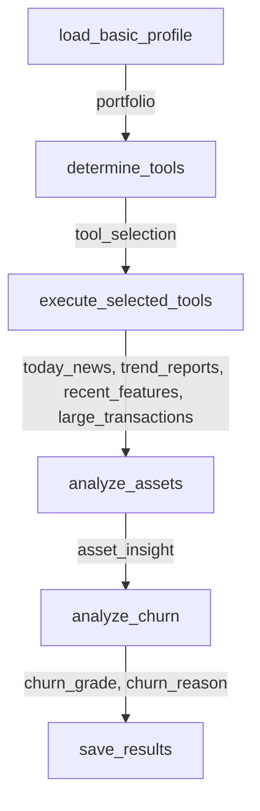
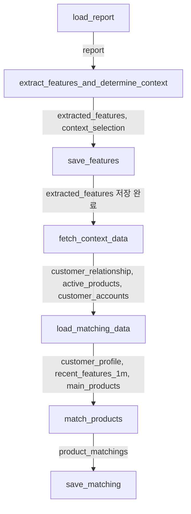

# 🤖 POOM-AI 고객관리 AI 에이전트 상세 가이드

본 문서(`explain.md`)는 POOM-AI 프로젝트에 구현된 **고객관리 AI 에이전트**의 아키텍처, 데이터 흐름, 핵심 기능, 그리고 사용된 도구(Tools)와 디버깅/추적 시스템에 대해 단계별로 설명합니다.

---

## 📌 1. 에이전트 개요 (Overview)

POOM-AI의 고객관리 시스템은 크게 **두 개의 개별 에이전트(Agent)**로 분리되어 구현되어 있습니다. 이 에이전트들은 독립적으로 동작하며, 최신 LLM(GPT-4o-mini)과 상태 관리 프레임워크인 **LangGraph**, 그리고 **LangChain**을 사용하여 복잡한 비즈니스 로직을 체계적인 워크플로우로 실행합니다.

```mermaid
graph TD
    subgraph "1. 고객 정보 분석기 (info_agent.py)"
        Node1_1[load_basic_profile] -->|AI 도구 결정 판단| Node1_2[determine_tools]
        Node1_2 -->|판단된 도구 실행| Node1_3[execute_selected_tools]
        Node1_3 -->|맞춤형 자산 분석| Node1_4[analyze_assets]
        Node1_4 -->|이탈 위험 평가| Node1_5[analyze_churn]
        Node1_5 -->|결과 저장| Node1_6[save_results]
    end

    subgraph "2. 고객 특징 분석기 (feature_agent.py)"
        Node2_1[load_report] -->|특징 분류 추출 & 판단| Node2_2[extract_features_and_determine_context]
        Node2_2 -->|특징 DB 저장| Node2_3[save_features]
        Node2_3 -->|동적 맥락 데이터 조회| Node2_4[fetch_context_data]
        Node2_4 -->|매칭 데이터 로드| Node2_5[load_matching_data]
        Node2_5 -->|상품 적합성 평가| Node2_6[match_products]
        Node2_6 -->|매칭 결과 저장| Node2_7[save_matching]
    end
```



---

## 🛠️ 2. 데이터베이스 & 에이전트 도구 (Database & Tools)

에이전트가 데이터베이스(MySQL)와 상호작용하고 외부 정보를 수집할 수 있도록 도와주는 전용 도구(Python 함수)들입니다.

| 도구명 (Tool) | 매핑 테이블 | 주요 기능 및 역할 |
| :--- | :--- | :--- |
| **`get_portfolio_weight`** | `customer` | 특정 고객의 자산 금액(예금, 투자, 연금, 대출, 순자산 등) 및 성향 조회 |
| **`search_today_news`** | `trend_news` | 당일 발표된 경제/금융 뉴스 수집 (없을 시 최근 뉴스 10개로 대체) |
| **`get_trend_report`** | `trend_llm_report` | 거시경제 지표(금값, 기준금리, 부동산) 분석 완료된 최근 보고서 조회 |
| **`get_customer_features`** | `customer_information` | 최근 특정 기간(1개월 또는 3개월) 동안 기록된 고객 특징 메모 조회 |
| **`get_large_external_transactions`** | `customer_transaction` | 이탈 분석을 위해 타행으로 송금된 1천만 원 이상의 거액 출금 거래 조회 |
| **`get_recent_consultation_report`** | `consultation_report` | 상담 메모(`consultation_memo`)와 조인하여 가장 최근 등록된 상담 보고서 조회 |
| **`get_main_products`** | `product` | 본점에서 추천하는 주요 상품 목록(`is_main = 1`) 조회 |
| **`save_asset_insight`** | `customer` | 생성된 자산 관리 분석 리포트를 `customer.llm_insight` 컬럼에 저장 |
| **`save_churn_level`** | `churn_level` | 이탈 위험 등급 및 사유를 테이블에 신규 등록 (`INSERT`) |
| **`save_customer_feature`** | `customer_information` | 상담에서 추출한 특징을 카테고리별로 등록 (`INSERT`) |
| **`save_product_matching`** | `product_matching` | 주력 상품 적합성 분석 결과를 중복 제거 후 저장 (`UPSERT` 형태) |

---

## 🕵️‍♂️ 3. 서브 에이전트별 세부 설명 및 노드별 데이터 흐름

### 3.1. Sub Agent 1: 고객 정보 분석기 (Customer Info Agent)
* **역할**: 초고액 자산가(VIP 고객)들을 위한 맞춤형 자산 관리 포트폴리오를 진단하고, 고객의 금융 데이터 변화를 분석하여 이탈 위험(Churn Risk) 수준을 평가합니다.

#### 🔄 LangGraph 노드별 데이터 흐름 및 사용 데이터



| 노드명 | 입력 데이터 (Input / Read) | 출력 데이터 (Output / Write) | 수행 역할 및 로직 |
| :--- | :--- | :--- | :--- |
| **`load_basic_profile`** | **State**: `customer_id`<br>**DB**: `customer` 테이블 | **State**: `portfolio`<br>**DB**: 없음 | 특정 고객의 자산 금액(예금, 투자, 연금, 대출, 순자산 등) 및 투자 성향, 등급을 DB에서 최초로 조회하여 State에 로드합니다. |
| **`determine_tools`** | **State**: `portfolio`<br>**DB**: 없음 | **State**: `tool_selection`<br>**DB**: 없음 | LLM(GPT-4o-mini)을 사용하여 고객의 자산 분배 비율(순자산 대비 각 비중)을 분석하고, 심층 분석에 추가로 활용할 4가지 데이터 수집 여부 및 세부 옵션(키워드, 조회 임계값 등)을 판단합니다. |
| **`execute_selected_tools`** | **State**: `customer_id`, `tool_selection`<br>**DB**: 필요에 따라 조건부 조회 | **State**: `today_news`, `trend_reports`, `recent_features`, `large_transactions`<br>**DB**: 없음 | `tool_selection`에서 결정된 도구만 선별 가동합니다:<br>- **뉴스**: `trend_news` 테이블 조회<br>- **지표**: `trend_llm_report` (금값은 금일 보고서, 금리/부동산은 이번 달 최신 보고서) 조회<br>- **특징**: `customer_information` (최근 3개월 기록) 조회<br>- **거액 거래**: `customer_transaction` (타행 송금, W 타입, 설정된 금액 임계값 이상) 조회 |
| **`analyze_assets`** | **State**: `portfolio`, `today_news`, `trend_reports`<br>**DB**: 없음 | **State**: `asset_insight`<br>**DB**: 없음 | **프롬프트**: `asset_analysis_system.md`, `asset_analysis_user.md`<br>고객 포트폴리오 비중, 맞춤 시장 뉴스, 거시 경제 트렌드를 조합하여 개인화된 리밸런싱 및 부채 진단 인사이트를 작성합니다 (합쇼체 어투, 3문장 이내). |
| **`analyze_churn`** | **State**: `portfolio`, `recent_features`, `large_transactions`<br>**DB**: 없음 | **State**: `churn_grade`, `churn_reason`<br>**DB**: 없음 | **프롬프트**: `churn_risk_system.md`, `churn_risk_user.md`<br>고객의 최근 3개월간 성향/상담 특징과 타행 거액 유출 거래 내역을 연계 분석하여 이탈 위험 등급(양호, 주의, 위험)과 판정 사유를 Pydantic 구조화 출력으로 도출합니다. |
| **`save_results`** | **State**: `customer_id`, `asset_insight`, `churn_grade`, `churn_reason`<br>**DB**: 저장 및 업데이트 | **State**: 없음<br>**DB**: `customer`, `churn_level` 테이블 저장 | 최종 결과를 DB에 영구 저장합니다:<br>- `customer` 테이블의 `llm_insight` 컬럼에 자산 분석 결과를 업데이트합니다.<br>- `churn_level` 테이블에 이탈 등급과 판정 사유를 새로운 행으로 추가(`INSERT`)합니다. |

---

### 3.2. Sub Agent 2: 고객 특징 분석기 (Customer Feature Agent)
* **역할**: 새로 등록된 상담 보고서 원문에서 고객의 핵심 라이프스타일이나 금융 관심사를 카테고리별로 자동 분류하여 기록하고, 이를 기반으로 은행의 주력 금융 상품과의 적합성(Matching)을 평가합니다.

#### 🔄 LangGraph 노드별 데이터 흐름 및 사용 데이터



| 노드명 | 입력 데이터 (Input / Read) | 출력 데이터 (Output / Write) | 수행 역할 및 로직 |
| :--- | :--- | :--- | :--- |
| **`load_report`** | **State**: `customer_id`<br>**DB**: `consultation_report`, `consultation_memo` 조인 조회 | **State**: `report`<br>**DB**: 없음 | 특정 고객의 최신 상담 기록 기반으로 작성된 원문 텍스트 보고서(`content`)와 작성 일자, 작성자 ID를 조회하여 로드합니다. |
| **`extract_features_and_determine_context`** | **State**: `report`<br>**DB**: 없음 | **State**: `extracted_features`, `context_selection`<br>**DB**: 없음 | LLM(GPT-4o-mini)을 2단계로 가동합니다:<br>1. **특징 추출**: `feature_extraction_system.md`를 통해 상담 원문에서 핵심 프로필 키워드 추출 (카테고리: 관계, 성향, 상품, 기호, 건강, 기타).<br>2. **맥락 도구 결정**: 상담 도중 상품 추천 정밀화에 필요한 DB 정보(가족 관계, 보유 중인 상품, 계좌 잔액)를 가져올지 의사결정. |
| **`save_features`** | **State**: `customer_id`, `extracted_features`<br>**DB**: 없음 | **State**: 없음<br>**DB**: `customer_information` 테이블 저장 | 추출해 낸 카테고리별 고객 특징 목록을 `customer_information` 테이블에 새로운 행으로 순차적으로 추가(`INSERT`)합니다. |
| **`fetch_context_data`** | **State**: `customer_id`, `context_selection`<br>**DB**: 필요에 따라 조건부 조회 | **State**: `customer_relationship`, `active_products`, `customer_accounts`<br>**DB**: 없음 | `context_selection`에서 참(True)으로 결정된 맥락 도구들만 호출하여 정보 조회:<br>- **가족 관계**: `customer_relationship` 테이블<br>- **보유 상품**: `customer_product` & `product` 조인 테이블<br>- **계좌 잔액**: `customer_account` 테이블 |
| **`load_matching_data`** | **State**: `customer_id`<br>**DB**: `customer`, `customer_information`, `product` 테이블 | **State**: `customer_profile`, `recent_features_1m`, `main_products`<br>**DB**: 없음 | 상품 추천 및 적합성 평가의 대조군으로 쓰일 데이터를 로드합니다:<br>- **프로필**: 고객 자산 및 기본 정보<br>- **최근 특징**: 최근 1개월 이내의 특징 정보 (`customer_information` 조회)<br>- **주력 상품**: 은행 주력 상품 목록 (`product` 테이블에서 `is_main = 1` 조건 조회) |
| **`match_products`** | **State**: `customer_profile`, `recent_features_1m`, `main_products`, `customer_relationship` (선택), `active_products` (선택), `customer_accounts` (선택)<br>**DB**: 없음 | **State**: `product_matchings`<br>**DB**: 없음 | **프롬프트**: `product_matching_system.md`, `product_matching_user.md`<br>수집된 모든 맥락 데이터를 대조하여 각 주력 상품별 적합 여부(1 또는 0)와 개별화된 PB 상담용 멘트를 생성합니다.<br>- **중복 방지**: `active_products`가 제공된 경우 이미 가입한 상품은 자동으로 부적합(0) 판정.<br>- **시나리오 추천**: 자녀 관련 이야기 등 `customer_relationship`을 연계해 맞춤 시나리오 제안. |
| **`save_matching`** | **State**: `customer_id`, `product_matchings`<br>**DB**: 저장 및 업데이트 | **State**: 없음<br>**DB**: `product_matching` 테이블 저장 (`UPSERT`) | 추천 결과를 `product_matching` 테이블에 저장합니다. 동일 고객 및 주력 상품에 대해 불필요하게 행이 계속 누적되지 않도록, 기존 매칭 레코드를 **선 삭제(Delete) 후 입력(Insert)** 방식으로 동작(UPSERT 효과)시킵니다. |

---

## 🔍 4. LangSmith를 통한 에이전트 추적 및 디버깅

에이전트 내부의 노드 흐름과 LLM 호출 결과, 토큰 사용량 및 입력/출력 맵을 추적하기 위해 **LangSmith**가 통합되었습니다.

### 4.1. 환경 변수 설정 (`.env`)
`.env` 파일에 다음 환경 변수들이 선언되어 동작을 제어합니다:
```env
LANGSMITH_TRACING=true
LANGSMITH_ENDPOINT=https://apac.api.smith.langchain.com
LANGSMITH_API_KEY=lsv2_pt_...
LANGSMITH_PROJECT="poom-customer_agent"
```

### 4.2. 동작 메커니즘
에이전트가 실행될 때, `load_dotenv` 이후 `.env`에 정의된 `LANGSMITH_` 접두사의 변수들이 LangChain 표준 프레임워크 변수(`LANGCHAIN_TRACING_V2`, `LANGCHAIN_API_KEY`, `LANGCHAIN_ENDPOINT`, `LANGCHAIN_PROJECT`)로 자동 매핑되어 `os.environ`에 등록됩니다.

이를 통해 별도의 하드코딩 없이 LangGraph 및 ChatOpenAI의 전체 실행 흐름이 LangSmith 프로젝트(**`poom-customer_agent`**)로 실시간 전송됩니다.

---

## 🚀 5. 에이전트 실행 방법

구현된 에이전트 모듈은 명령줄 인터페이스(CLI)를 통해 손쉽게 실행할 수 있습니다.

### 5.1. 가상 환경 활성화 및 실행 경로
모든 명령어는 프로젝트의 루트 폴더(`C:\Users\jongh\Working_Directory\poom\POOM-AI`)에서 실행해야 원활한 모듈 임포트가 가능합니다.

### 5.2. 실행 명령어 (Runners)

각 에이전트는 서로 완벽히 분리된 진입점(Runner) 스크립트를 가집니다.

* **고객 정보 분석기 (Agent 1) 전체 고객 실행**:
  ```powershell
  agent/customer/.venv/Scripts/python -m agent.customer.run_info
  ```

* **고객 정보 분석기 (Agent 1) 특정 고객만 실행**:
  ```powershell
  agent/customer/.venv/Scripts/python -m agent.customer.run_info --c_id 1001,1002
  ```

* **고객 특징 분석기 (Agent 2) 전체 고객 실행**:
  ```powershell
  agent/customer/.venv/Scripts/python -m agent.customer.run_feature
  ```

* **고객 특징 분석기 (Agent 2) 특정 고객만 실행**:
  ```powershell
  agent/customer/.venv/Scripts/python -m agent.customer.run_feature --c_id 1001,1002
  ```

---

## 🎯 6. 핵심 요약 및 차별점

1. **상태 기반 오케스트레이션**: 단순히 API를 순차적으로 부르는 것이 아닌 **LangGraph**를 도입하여 중간 상태(`AgentState`)를 보존하고 오류가 발생했을 때 예외 처리를 유연하게 관리할 수 있도록 설계되었습니다.
2. **구조화된 출력(Structured Output) 활용**: LLM의 임의 답변으로 인한 파싱 오류를 차단하기 위해 Pydantic 모델을 정의하고 `llm.with_structured_output()` 기능을 사용하여 항상 일관되고 명확한 JSON 스키마를 리턴받습니다.
3. **가독성 있는 출력 제안**: 복잡한 마크다운 기호들을 걷어내고 한눈에 파악하기 쉬운 **일반 텍스트 형식의 3문장 이내 요약**을 지원하여 시스템 가독성을 대폭 향상했습니다.
4. **글로벌 LLM 모델 원클릭 변경**: 각 실행 스크립트(`run_info.py`, `run_feature.py`) 및 에이전트 클래스 정의부 상단의 `DEFAULT_MODEL` 설정을 통해 호출되는 모든 LLM 모델을 중앙에서 제어할 수 있습니다.
5. **독립형 모듈화 설계 (Main Agent 제거)**: 스케줄러(Cron) 및 DB 트리거(Event)의 성격에 맞춰 불필요한 라우팅용 Main Agent 레이어를 과감히 걷어냈습니다. 이를 통해 코드 복잡도가 줄어들었으며, 비용(토큰)과 속도면에서 최적화된 독립 실행형 에이전트가 완성되었습니다.
6. **LangSmith 통합 완료**: APAC 리전 엔드포인트를 타겟팅하여 두 에이전트의 노드 동작 상태와 동적 툴 스킵(Skip)/실행(Run) 여부를 시각적으로 완벽하게 트레이싱할 수 있습니다.
