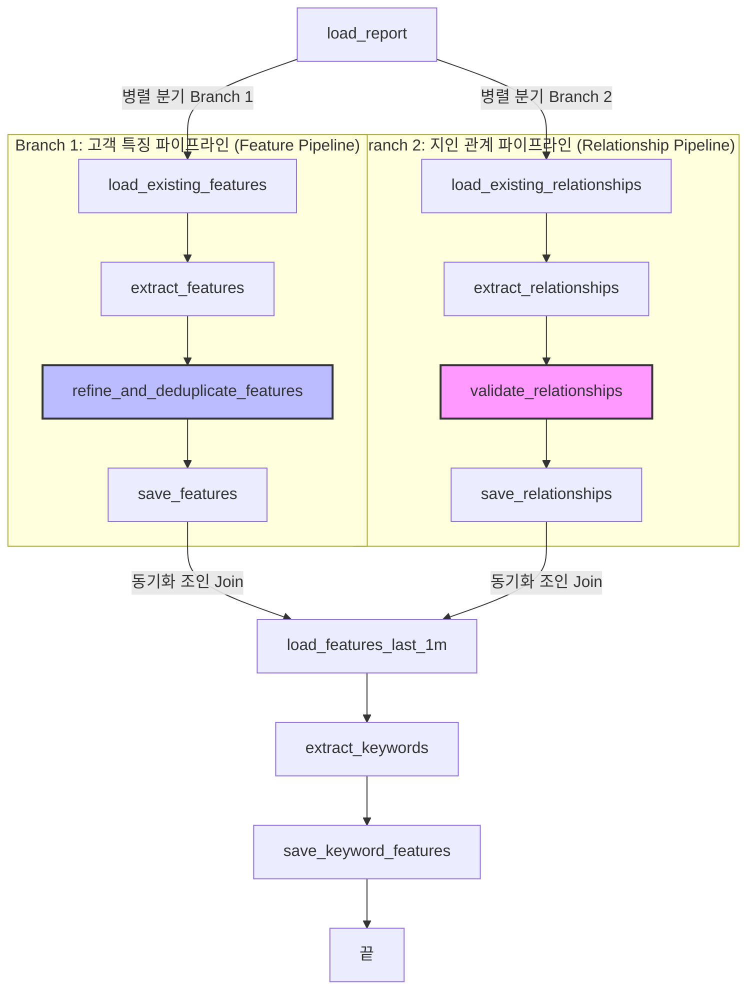

# 🤖 POOM-AI 고객관리 특징 및 지인관계 AI 에이전트 상세 가이드

본 문서(`explain.md`)는 `POOM-AI/agent/customer` 디렉토리에 구현된 **고객 특징 및 지인 관계 분석 AI 에이전트 (Customer Feature Agent)**의 아키텍처, 데이터 흐름, 핵심 기능, 사용된 데이터베이스 도구(Tools), 그리고 디버깅 및 추적 시스템에 대해 상세히 기술합니다.

---

## 📌 1. 에이전트 개요 (Overview)

고객 특징 및 지인 관계 분석 에이전트는 고객의 최신 상담 기록 원문으로부터 핵심 고객 특징(라이프스타일, 투자 성향 등)과 지인 관계 정보(가족, 동료 등)를 추출하고 정제하여 데이터베이스에 반영하는 **상태 기반 오케스트레이션 에이전트**입니다.

이 에이전트는 최신 LLM(기본값: `gpt-4o-mini`)과 상태 관리 프레임워크인 **LangGraph**, 그리고 **LangChain**을 사용하여 동작의 일관성을 유지하며, 자가 검증(Validation) 및 중복 제거(Refinement) 로직을 거쳐 안전하게 DB 적재 작업을 수행합니다.

---

## 🔄 2. LangGraph 워크플로우 & 데이터 흐름

에이전트는 특징 분석 파이프라인과 지인 관계 분석 파이프라인이 병렬적으로 처리되도록 설계되었습니다. `load_report` 노드 이후 두 갈래로 나뉘어 병렬 실행(Branching)되며, 데이터베이스 반영이 모두 끝난 지점에서 동기화 조인(Joining)되어 최종 키워드 추출 작업을 수행합니다.


```mermaid
graph TD
    Node1[load_report] -->|병렬 분기 Branch 1| Node2[load_existing_features]
    Node1 -->|병렬 분기 Branch 2| Node3[load_existing_relationships]

    subgraph "Branch 1: 고객 특징 파이프라인 (Feature Pipeline)"
        Node2 --> Node4[extract_features]
        Node4 --> Node5[refine_and_deduplicate_features]
        Node5 --> Node6[save_features]
    end

    subgraph "Branch 2: 지인 관계 파이프라인 (Relationship Pipeline)"
        Node3 --> Node7[extract_relationships]
        Node7 --> Node8[validate_relationships]
        Node8 --> Node9[save_relationships]
    end

    Node6 -->|동기화 조인 Join| Node10[load_features_last_1m]
    Node9 -->|동기화 조인 Join| Node10

    Node10 --> Node11[extract_keywords]
    Node11 --> Node12[save_keyword_features]
    Node12 --> END[끝]
    
    style Node8 fill:#f9f,stroke:#333,stroke-width:2px
    style Node5 fill:#bbf,stroke:#333,stroke-width:2px
```

### 🔄 노드별 역할 및 입출력 상세

| 단계 | 노드명 (Node) | 입력 데이터 (Input) | 출력 데이터 (Output) | 주요 로직 및 수행 작업 |
| :--- | :--- | :--- | :--- | :--- |
| 1 | **`load_report`** | `customer_id` | `report` | 고객의 가장 최근 상담 보고서 원문과 상세 메타데이터를 조회하여 상태에 로드합니다. |
| 2 | **`load_existing_features`** | `customer_id` | `existing_features` | 정교한 중복 대조를 위해 최근 12개월간 적재된 기존 고객 특징 리스트를 로드합니다. |
| 3 | **`load_existing_relationships`**| `customer_id` | `existing_relationships`| 고객의 기존 지인 관계 정보 목록을 DB에서 모두 불러옵니다. |
| 4 | **`extract_features`** | `report` | `extracted_features` | LLM을 활용하여 상담 보고서 원문에서 6대 카테고리(`관계`, `성향`, `상품`, `기호`, `건강`, `기타`)에 매핑되는 원시 특징들을 추출합니다. |
| 5 | **`refine_and_deduplicate_features`**| `extracted_features`, `existing_features`| `refined_decisions` | 1차 추출된 특징 후보군과 기존 특징들을 LLM으로 대조 분석하여 **`ADD`(신규 추가)**, **`UPDATE`(기존 수정)**, **`SKIP`(중복 생략)** 의사결정을 도출합니다. |
| 6 | **`save_features`** | `refined_decisions` | 없음 (DB 기록) | 이전 노드의 결정에 따라 `customer_information` 테이블에 새로운 행을 추가하거나 기존 행을 업데이트하고, 중복 건은 생략 처리합니다. |
| 7 | **`extract_relationships`** | `report` | `extracted_relationships` | 상담 본문에서 지인 및 가족과의 관계 유형, 상세 내용, 생년월일, 직업, 배우자 여부, 결혼기념일 정보를 정교하게 추출합니다. **상담 기준일(Reference Date)을 바탕으로 '3일 후', '일주일 후'와 같은 상대 날짜 표현도 YYYY-MM-DD 형식으로 정확하게 변환**합니다. |
| 8 | **`validate_relationships`** | `report`, `extracted_relationships`| `validated_relationships`| **[검증 노드]** 1차 추출된 지인 정보가 원문에 실제로 존재하는지 대조 검증하고, 허구 정보(환각)를 걸러냅니다. 날짜 형식이 상담 기준일 대비 일관성 있게 계산되었는지 검증하고 교정하며, DB 스키마 제한(50자)에 맞춰 필드를 보정합니다. |
| 9 | **`save_relationships`** | `validated_relationships`, `existing_relationships`| 없음 (DB 기록) | 검증된 지인 관계 중 신규 관계는 새로 등록(`INSERT`)합니다. 기존 관계가 이미 존재하면 LLM 정제 및 중복 제거 처리(`refine_merged_relationship_info`)를 호출하여 **기존 내용과 새로운 내용 중 의미가 겹치는 부분들을 자연스럽게 정제 및 병합**한 후 `information`을 업데이트하고, Demographic 정보(`birthday`, `job` 등)를 병합 갱신합니다. |
| 10 | **`load_features_last_1m`** | `customer_id` | `features_last_1m` | 최근 1개월 이내에 생성된 고객 특징들을 DB에서 선별 조회합니다. |
| 11 | **`extract_keywords`** | `features_last_1m` | `keyword_features_str` | 최근 특징 텍스트들을 종합하여 워드클라우드 시각화용 대표 키워드 리스트(5~8개)를 도출하고 콤마로 연결된 문자열을 만듭니다. |
| 12 | **`save_keyword_features`** | `keyword_features_str` | 없음 (DB 기록) | 추출된 핵심 키워드 문자열을 `customer` 테이블의 `features` 컬럼에 최종 업데이트합니다. |

---

## 🛠️ 3. 데이터베이스 & 에이전트 도구 (Database & Tools)

에이전트가 데이터베이스(MySQL)와 상호작용하기 위해 사용하는 전용 도구(Python 함수) 정의입니다. ([tools.py](tools.py)에 구현됨)

| 도구명 (Tool Function) | 대상 테이블 | 주요 기능 및 SQL 동작 |
| :--- | :--- | :--- |
| **`get_recent_consultation_report`** | `consultation_report` | 특정 고객의 최신 상담 기록 원문 텍스트를 조회합니다. |
| **`get_customer_features`** | `customer_information` | 분석 이력 대조를 위해 특정 기간(월 단위) 동안 기록된 특징 메모를 조회합니다. |
| **`save_customer_feature`** | `customer_information` | 새로 정제된 특징 요약을 `customer_information`에 추가합니다 (`INSERT`). |
| **`update_customer_feature`** | `customer_information` | 기존 특징의 요약 설명을 수정하고 갱신일을 업데이트합니다 (`UPDATE`). |
| **`get_customer_relationships_all`** | `customer_relationship` | 대상 고객에 연동된 모든 지인 관계 데이터 행(cr_id, 관계명, 본문, 생년월일, 직업, 배우자 여부, 결혼기념일)을 조회합니다. |
| **`save_customer_relationship`** | `customer_relationship` | 신규 지인 관계 데이터를 입력합니다 (`INSERT`). |
| **`update_customer_relationship`** | `customer_relationship` | 기존 지인 관계에 대해 본문 및 생년월일, 직업 등의 정보를 병합하여 갱신합니다 (`UPDATE`). |
| **`save_customer_keyword_features`** | `customer` | 워드클라우드용 키워드 문자열을 `customer.features` 컬럼에 덮어씁니다 (`UPDATE`). |

---

## 🕵️‍♂️ 4. LangSmith 연동 및 추적

에이전트 내부의 노드 흐름과 LLM 호출 결과, 토큰 사용량 및 입력/출력 맵을 추적하기 위해 **LangSmith**가 완전하게 연동되어 있습니다.

### 4.1. 환경 변수 설정
프로젝트 루트 폴더(`.env`)에 정의된 다음 변수들을 통해 LangChain 표준 트레이싱 모듈과 연동됩니다:
```env
LANGSMITH_TRACING=true
LANGSMITH_ENDPOINT=https://apac.api.smith.langchain.com
LANGSMITH_API_KEY=your_langsmith_api_key
LANGSMITH_PROJECT="poom-customer_agent"
```
실행 시 에이전트는 해당 설정값들을 자동으로 감지하여 모든 체인 및 그래프 실행 흐름을 LangSmith 프로젝트로 안전하게 실시간 전송합니다.

---

## 🚀 5. 에이전트 실행 방법

에이전트 모듈은 가상 환경 활성화 상태에서 명령줄 인터페이스(CLI)를 통해 구동됩니다.

### 5.1. 사전 구성 (가상 환경 활성화)
프로젝트의 루트 폴더(POOM-AI)에서 파이썬 명령을 호출합니다.

### 5.2. 실행 명령어 (Runners)

* **전체 고객에 대한 분석 실행**:
  ```powershell
  .venv/Scripts/python -m agent.customer.main
  ```

* **특정 고객(예: 1001번, 1002번)만 수동 지정하여 실행**:
  ```powershell
  .venv/Scripts/python -m agent.customer.main --c_id 1001,1002
  ```

* **사용할 LLM 모델명을 변경하여 실행** (기본값: `gpt-4o-mini`):
  ```powershell
  .venv/Scripts/python -m agent.customer.main --c_id 1001 --model gpt-4o
  ```
