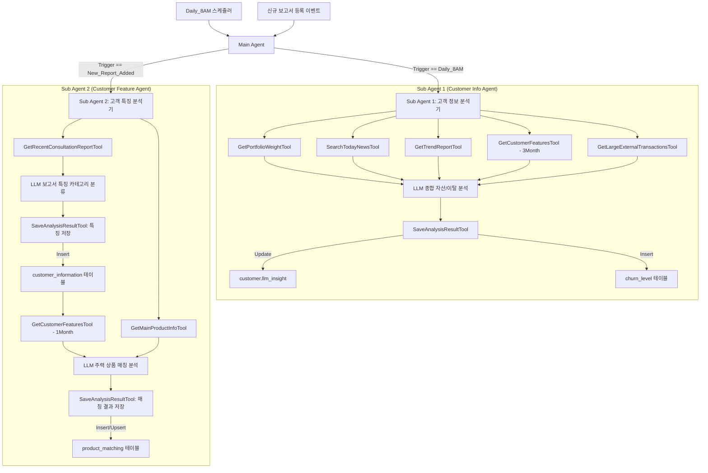

# 고객관리 AI Agent 구상 (최신화)

본 문서는 `sql/poom_schema_info.csv`에 정의된 실제 데이터베이스 스키마를 바탕으로 **고객관리 AI Agent**의 기능, 필요한 데이터 매핑, Tool 정의, 그리고 Agent 구조를 최신화한 기획 및 설계서입니다.

---

## 1. DB 스키마 매핑 정의

기존 구상안의 데이터 항목들을 실제 MySQL 테이블 및 컬럼과 아래와 같이 매핑합니다.

| 기존 데이터 항목 | 매핑 테이블 | 주요 활용 컬럼 | 설명 및 데이터 처리 기준 |
| :--- | :--- | :--- | :--- |
| **포트폴리오 비중** | `customer` | `deposit`, `investment`, `pension`, `loan`, `net_worth`, `total_assets` | 자산 비중 계산 (예: 예금/총자산, 투자/총자산 등) |
| **뉴스 아카이브** | `trend_news` | `title`, `body`, `category`, `published_at`, `source` | 기존 Elastic Search 대신 MySQL 내 뉴스 테이블을 조회 |
| **경제지표 아카이브** | `trend_llm_report` | `type` ('gold', 'baserate', 'realestate' 등), `content`, `created_at` | 금값, 기준금리, 부동산지수 등 트렌드 분석 보고서 |
| **상담 보고서 내용** | `consultation_report` | `content` (구조화 보고서 내용) | **[피드백 반영]** 원시 메모(`consultation_memo`)에서 데이터를 가져오지 않고, 요약 및 구조화가 완료된 **`consultation_report` 테이블에서 보고서 본문(`content`)을 가져옵니다.** (특정 고객 매핑을 위해 DB 내부적으로 `consultation_memo`와 `cm_id` 기준 조인만 수행) |
| **고객 특징** | `customer_information` | `ci_id`, `category`, `contents`, `created_date` | 보고서 분석 후 분류 결과 저장 및 1/3개월 조건 조회 |
| **고객 기본 정보** | `customer` | `c_id`, `name`, `birthday`, `job`, `gender`, `tendency`, `grade` | 성향, 직업, 등급 등 프로필 정보 |
| **타행 거액 거래 이력** | `customer_transaction` | `amount`, `opp_bank_name`, `ct_type`, `ct_datetime` | `opp_bank_name`이 타행이고 `amount`가 고액(예: 1천만원 이상)인 출금 거래 감지 |
| **주력 상품 정보** | `product` | `pd_id`, `name`, `explanation`, `features`, `target_customer`, `is_main` | `is_main = 1`인 본점 주력 상품 정보 조회 |
| **상품 매칭 결과** | `product_matching` | `pd_id`, `c_id`, `is_suitable`, `reason` | 주력 상품 적합성 분석 결과 저장 |
| **이탈 위험 수준** | `churn_level` | `c_id`, `grade` (위험 등급), `reason` | 최근 3개월 특징 및 타행 거래 기반 분석 결과 저장 |
| **자산 분석 결과** | `customer` | `llm_insight` (text) | 자산 보유 비중 및 경제 트렌드 기반 종합 분석 결과 저장 |

---

## 2. Agent별 분석 및 처리 모델

### 2.1. 고객 정보 분석 (Customer Info Agent)
* **목적**: 자산 보유 현황에 따른 인사이트를 도출하고, 이탈 위험 수준을 평가합니다.
* **동작 상세**:
  1. **자산 보유 현황 분석**:
     - **Input**:
       - `customer` 테이블의 자산 비중 (`deposit`, `investment`, `pension`, `loan`, `net_worth`, `total_assets`)
       - `trend_news` 테이블의 오늘 날짜 기준 관련 뉴스 아카이브
       - `trend_llm_report` 테이블의 최근 주요 경제 지표(금값, 기준금리, 부동산) LLM 보고서
     - **Output**: 자산 보유 비중과 매크로 경제 트렌드를 융합한 개인화 자산 인사이트 도출 ➡️ `customer.llm_insight` 컬럼에 저장
  2. **이탈 위험 수준 분석**:
     - **Input**:
       - `customer_information` 테이블의 최근 3개월 치 고객 특징 (`category`, `contents`)
       - `customer_transaction` 테이블의 최근 타행 거액 이체 내역 (`opp_bank_name`이 외부 은행이며, 대형 금액 출금인 건)
     - **Output**: 이탈 위험 등급(High/Medium/Low 등)과 상세 근거 도출 ➡️ `churn_level` 테이블에 새로운 레코드 생성 (`insert`)

### 2.2. 고객 특징 분석 (Customer Feature Agent)
* **목적**: 신규 등록된 상담 보고서에서 특징을 카테고리별로 자동 분류하여 저장하고, 이를 바탕으로 주력 상품 적합성을 평가합니다.
* **동작 상세**:
  1. **보고서 기반 고객 특징 추출**:
     - **Input**: `consultation_report` 테이블에서 특정 고객의 가장 최근 상담 보고서 텍스트 (`content`)
     - **Output**: 사전에 정의된 6대 카테고리(`관계`, `성향`, `상품`, `기호`, `건강`, `기타`)로 분류된 특징 ➡️ `customer_information` 테이블에 저장 (`category`, `contents` 컬럼 활용)
  2. **주력 상품 매칭 현황**:
     - **Input**:
       - `customer_information` 테이블의 최근 1개월 치 특징 리스트
       - `customer` 테이블의 기본 정보 및 투자 성향 (`tendency`)
       - `product` 테이블의 주력 상품 정보 (`is_main = 1`인 상품의 상품명, 설명, 특징, 타겟 고객군)
     - **Output**: 각 주력 상품별 적합(1)/부적합(0) 여부와 명확한 추천 사유 도출 ➡️ `product_matching` 테이블에 저장 (`insert` 또는 `upsert`)

---

## 3. Tool 정의 (MySQL 스키마 반영)

### 3.1. GetPortfolioWeightTool
* **기능**: `customer` 테이블에서 특정 고객의 자산 컬럼들을 조회하여 포트폴리오 비중을 계산하기 위한 데이터를 가져옵니다.
* **SQL 예시**: `SELECT deposit, investment, pension, loan, net_worth, total_assets FROM customer WHERE c_id = :customer_id`
* **Input**: `customer_id` (`int`)
* **Output**: 자산 종류별 금액 및 총자산 정보 객체

### 3.2. SearchTodayNewsTool
* **기능**: `trend_news` 테이블에서 오늘 또는 특정 일자의 경제/금융 뉴스를 카테고리 및 키워드별로 검색합니다.
* **SQL 예시**: `SELECT title, body, source, published_at FROM trend_news WHERE DATE(published_at) = :date`
* **Input**: `date` (`str`), `keyword` (`str`, Optional)
* **Output**: 관련 뉴스 기사 리스트

### 3.3. GetTrendReportTool
* **기능**: `trend_llm_report` 테이블에서 특정 지표 트렌드 분석 보고서 중 가장 최근의 완료된 보고서를 조회합니다.
* **SQL 예시**: `SELECT type, content, created_at FROM trend_llm_report WHERE status = 'COMPLETED' ORDER BY created_at DESC LIMIT 3`
* **Input**: None (또는 `report_type`)
* **Output**: 금값/기준금리/부동산 등 지표별 LLM 레포트 내용

### 3.4. GetCustomerFeaturesTool
* **기능**: `customer_information` 테이블에서 특정 고객의 추출된 특징(카테고리 및 내용)을 최근 기간 조건(1개월 또는 3개월)에 맞추어 조회합니다.
* **SQL 예시**: `SELECT category, contents, created_date FROM customer_information WHERE c_id = :customer_id AND created_date >= DATE_SUB(NOW(), INTERVAL :months MONTH)`
* **Input**: `customer_id` (`int`), `months` (`int`, 1 또는 3)
* **Output**: 카테고리별 특징 내용 목록

### 3.5. GetRecentConsultationReportTool
* **기능**: `consultation_report` 테이블에서 특정 고객에게 가장 최근에 등록된 상담 보고서 본문 내용(`content`)을 조회합니다.
* **SQL 예시** (고객 ID 매핑을 위해 내부적으로 `consultation_memo` 테이블과 ID 조인만 적용):
  ```sql
  SELECT r.cr_id, r.content, m.consult_date 
  FROM consultation_report r
  JOIN consultation_memo m ON r.cm_id = m.cm_id
  WHERE m.c_id = :customer_id
  ORDER BY m.consult_date DESC
  LIMIT 1
  ```
* **Input**: `customer_id` (`int`)
* **Output**: 상담 보고서 본문 내용 및 등록 정보

### 3.6. GetMainProductInfoTool
* **기능**: `product` 테이블에서 본점 주력 상품으로 지정된 활성 상품 목록을 상세 정보(설명, 타겟 고객, 기대수익률 등)와 함께 가져옵니다.
* **SQL 예시**: `SELECT pd_id, name, explanation, features, target_customer, expected_return FROM product WHERE is_main = 1`
* **Input**: None
* **Output**: 주력 상품 목록 객체

### 3.7. GetLargeExternalTransactionsTool
* **기능**: `customer_transaction` 테이블에서 외부 은행으로 대액 출금된 거래를 조회하여 이탈 위험 분석에 활용합니다.
* **SQL 예시**: `SELECT amount, opp_bank_name, briefs, ct_datetime FROM customer_transaction WHERE c_id = :customer_id AND opp_bank_name != '품' AND ct_type = 'O' AND amount >= :threshold_amount`
* **Input**: `customer_id` (`int`), `threshold_amount` (`decimal`, 기본값 10,000,000)
* **Output**: 타행 대액 출금 이력 리스트

### 3.8. SaveAnalysisResultTool
* **기능**: Agent가 도출한 최종 분석 결과들을 목적에 맞춰 각 MySQL 테이블에 올바르게 저장 및 반영합니다.
* **Input / Output 세부 흐름**:
  1. **자산 분석 결과 저장**:
     - `UPDATE customer SET llm_insight = :insight WHERE c_id = :customer_id`
  2. **이탈 위험도 저장**:
     - `INSERT INTO churn_level (c_id, grade, reason, created_date) VALUES (:customer_id, :grade, :reason, NOW())`
  3. **보고서 분석 특징 저장**:
     - `INSERT INTO customer_information (c_id, category, contents, created_date) VALUES (:customer_id, :category, :contents, NOW())`
  4. **주력 상품 적합성 평가 저장**:
     - `INSERT INTO product_matching (pd_id, c_id, is_suitable, reason, created_date) VALUES (:product_id, :customer_id, :is_suitable, :reason, NOW())` (또는 중복 방지를 위한 `UPSERT`)

---

## 4. Agent 구조 및 연동 파이프라인

