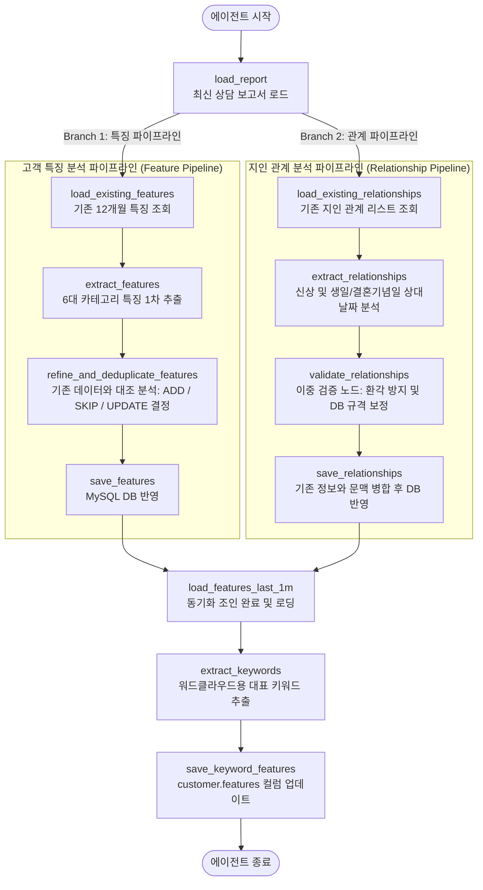

# POOM Premium 자산관리 고객 특징 및 지인 관계 분석 에이전트 설명서 (explain.md)

본 문서는 **POOM (품)** 금융 플랫폼의 WM(Wealth Management) 비즈니스 강화를 위한 **고객 특징 및 지인 관계 분석 AI 에이전트 (Customer Feature Agent)**의 설계 사양서입니다. 

처음 이 모듈을 접하는 개발자도 전체 아키텍처, 데이터 흐름, 핵심 제어 노드 및 데이터베이스 보안 가드레일을 완전히 이해할 수 있도록 쉽게 풀어서 설명합니다.

---

## 1. 에이전트 개요 (Agent Overview)

PB(Private Banker)가 작성한 최신 고객 상담 보고서 원문으로부터 **고객 특징(라이프스타일, 투자 성향, 관심사 등)**과 **지인 및 가족 관계(관계 유형, 생년월일, 직업, 배우자 여부, 결혼기념일 등)**를 지능적으로 분석하여 데이터베이스에 구조화 포맷으로 자동 적재하는 역할을 담당합니다.

### 핵심 설계 지향점
- **RAG 컨텍스트의 정교화**: 적재된 고객 특징 데이터는 WM 상담 시뮬레이터 에이전트가 고객의 최신 맥락을 파악하고 맞춤형 금융 상품 피칭을 제공하는 원천 정보가 됩니다.
- **지인 관리 연동**: 가족의 기념일 및 직업 정보는 PB의 관계 마케팅(Relationship Marketing) 일정 제안(예: "자녀 생일 안부 안내")으로 즉각 연계됩니다.
- **워드클라우드 제공**: 최근 1달간 적재된 특징을 집약하여 핵심 키워드(5~8개)를 산출해 프론트엔드의 고객 프로필 워드클라우드 시각화용 데이터로 업데이트합니다.

---

## 2. 전체 아키텍처 및 데이터 흐름

에이전트는 상태 기반 제어 프레임워크인 **LangGraph**를 활용하여 병렬 분기(Branching) 및 동기화 조인(Joining) 형태로 설계되었습니다. 특징 분석과 관계 분석을 분리 가동하여 데이터 오염을 예방하고 처리 레이턴시를 최소화합니다.

### LangGraph 워크플로우 흐름도



---

## 3. 세부 상태 노드(Node) 및 로직 가이드

### 3.1. 공통 로드 단계
*   **`load_report`**
    - `consultation_report` 및 `consultation_memo` 테이블을 조인하여 고객의 가장 최근 상담 텍스트와 상담일(`consult_date`)을 로드합니다.
    - 상담 텍스트가 없는 경우 에러를 반환하고 실행을 종료합니다.

### 3.2. 고객 특징 파이프라인 (Branch 1)
*   **`load_existing_features`**
    - 과거 분석 이력과의 정밀 대조를 위해 최근 12개월간 적재되어 있던 고객 특징 리스트를 조회합니다.
*   **`extract_features`** ([prompt/feature_extraction_system.md](./prompt/feature_extraction_system.md))
    - 상담 보고서 원문에서 **6대 카테고리(`관계`, `성향`, `상품`, `기호`, `건강`, `기타`)**에 부합하는 특징 데이터 후보군을 1차 도출합니다.
*   **`refine_and_deduplicate_features`** ([prompt/feature_refinement_system.md](./prompt/feature_refinement_system.md))
    - 신규 추출된 후보군과 로드된 12개월 기존 특징들을 LLM으로 대조 및 정밀 비교하여 아래의 3가지 의사결정을 도출합니다.
      - **`ADD`**: 기존에 없던 완전히 새로운 라이프스타일이나 성향인 경우 신규 등록 결정.
      - **`SKIP`**: 기존에 이미 완벽하게 동일한 내용이 적재되어 있는 경우 중복 제외 결정.
      - **`UPDATE`**: 기존 정보와 일맥상통하나 최신 내용으로 내용 수정이 필요하다고 판단되는 경우 기존 `ci_id`를 수정 대상으로 매핑하여 내용 갱신 결정.
*   **`save_features`**
    - 의사결정 결과에 따라 `customer_information` 테이블에 새로운 행을 추가(`INSERT`)하거나 기존 행을 갱신(`UPDATE`)합니다.

### 3.3. 지인 관계 파이프라인 (Branch 2)
*   **`load_existing_relationships`**
    - 중복 등록을 방지하기 위해 `customer_relationship` 테이블에서 기존 지인 리스트를 전부 조회합니다.
*   **`extract_relationships`** ([prompt/relationship_extraction_system.md](./prompt/relationship_extraction_system.md))
    - 상담 본문에서 지인 및 가족의 이름/관계명, 생년월일, 직업, 배우자 여부, 결혼기념일 등을 구조화하여 추출합니다.
    - **상대 날짜 절대화 (Temporal Anchoring)**: 상담 본문에 "아들 생일이 3일 뒤", "내년 결혼기념일" 등 상대 표현이 있는 경우, 상담일(`consult_date`, 예: `2026-06-01`)을 기준으로 정확하게 산출하여 `2026-06-04` 와 같은 절대 날짜 문자열(`YYYY-MM-DD`)로 변환합니다.
*   **`validate_relationships`** ([prompt/relationship_validation_system.md](./prompt/relationship_validation_system.md))
    - **[환각 방지 예외 처리]**: 1차 추출된 지인 신상 및 상대 날짜 계산 결과가 상담 원문에서 진정 유추 가능한 팩트인지 LLM으로 재검증(Double-check)하여 가상의 인물이 생성되는 현상을 차단합니다. 또한 DB 규격에 맞춰 문자열 길이를 정밀 보정합니다.
*   **`save_relationships`**
    - 새로운 지인은 새로 `INSERT` 합니다.
    - **지식 병합 (Knowledge Merging)** ([prompt/relationship_merge_system.md](./prompt/relationship_merge_system.md)): 이미 존재하는 관계 유형(예: "배우자")에 추가적인 상담 정보가 들어왔을 때, 단순히 글자 뒤에 이어 붙이지 않고 **LLM 병합 로직을 통과시켜 문맥적으로 겹치는 내용을 아름다운 하나의 문장으로 요약 및 병합한 후 `UPDATE`**를 적용합니다.

### 3.4. 워드클라우드 키워드 가공 단계
*   **`load_features_last_1m`**
    - 에이전트 처리가 끝난 직후, 최근 1개월 이내에 최종 DB 적재 완료된 특징 메모 목록을 가져옵니다.
*   **`extract_keywords`** ([prompt/keyword_extraction_system.md](./prompt/keyword_extraction_system.md))
    - 최근 특징 텍스트 데이터를 종합하여 형태소 분석 및 의미 분류를 거쳐, 워드클라우드에 적합한 핵심 키워드 리스트(5~8개)를 산출해 콤마로 연결된 단일 문자열을 도출합니다.
*   **`save_keyword_features`**
    - 콤마 문자열(예: `해외여행,정기예금,테니스,노후대비`)을 `customer` 테이블의 `features` 컬럼에 업데이트합니다.

---

## 4. 데이터베이스 및 전용 도구 (Tools)

에이전트는 데이터베이스(MySQL)와 정밀하게 연동하기 위해 [tools.py](./tools.py)에 구현된 SQLAlchemy/DB Cursor 도구들을 사용합니다.

| 도구 함수 (Python) | 관련 테이블 | SQL 기능 설명 |
| :--- | :--- | :--- |
| `get_recent_consultation_report` | `consultation_report` <br> `consultation_memo` | 해당 고객의 최신 상담 기록 원문 텍스트 및 상담일 조회 |
| `get_customer_features` | `customer_information` | 기간 한정(1개월 또는 12개월)으로 적재된 특징 데이터 목록 조회 |
| `save_customer_feature` | `customer_information` | `category`와 정제 요약 `contents`를 새로운 행으로 추가 (`INSERT`) |
| `update_customer_feature` | `customer_information` | 기존 ci_id의 내용을 수정하고 시간 갱신 (`UPDATE`) |
| `get_customer_relationships_all` | `customer_relationship` | 대상 고객의 등록된 전체 지인 정보 행들 조회 |
| `save_customer_relationship` | `customer_relationship` | 신규 지인 신상(생일, 직업, 배우자 여부 등) 입력 (`INSERT`) |
| `update_customer_relationship` | `customer_relationship` | 기존 지인에 대한 정보와 문맥 병합 갱신 (`UPDATE`) |
| `save_customer_keyword_features` | `customer` | 워드클라우드용 콤마 구분 키워드 문자열 기입 (`UPDATE`) |

---

## 5. 비즈니스 예외 처리 및 가드레일 (Guardrails)

1. **DB 스키마 한계 방어 (VARCHAR Overflow 방지)**
   - `customer_information.contents` 컬럼은 최대 500자 크기이며, `customer_relationship.relationship` 및 `job` 컬럼은 50자 규격입니다.
   - LLM이 창의적이고 상세하게 출력하려다 발생할 수 있는 SQL 크래시를 막기 위해 에이전트 내 데이터 핸들러에서 글자 수를 강제로 Slice(`contents[:497] + "..."`, `relationship[:50]`) 처리합니다.
2. **환각(Hallucination) 검출 검증 노드 (`validate_relationships`)**
   - RAG나 데이터 분석 시 가장 큰 맹점은 LLM이 가상의 지인 이름이나 잘못된 결혼기념일 날짜를 지어내는 것입니다. 에이전트는 1차 추출 후 데이터베이스 적재 전에 전용 검증 노드를 한 단계 배치하여 원문 팩트 기반 검토를 강제 실행합니다.
3. **상대 날짜 계산 유효성 검증**
   - "3일 뒤", "다음 달" 같은 시간 단서가 상담 원문에 있을 때, 상담일 정보가 비어 있는 경우 기준일을 임의로 잡지 않고 `null` 처리를 유도하여 잘못된 기념일이 DB에 주입되는 현상을 방어합니다.

---

## 6. 에이전트 구동 및 CLI 가이드

에이전트는 프로젝트 루트 경로에서 가상 환경 파이썬 인터프리터 및 CLI 명령어로 손쉽게 제어할 수 있습니다.

```powershell
# 1. 전체 고객에 대하여 에이전트 일괄 가동 (일일 배치 용도)
.venv/Scripts/python -m agent.feature.main

# 2. 특정 고객 ID (예: 1번, 2번)만 수동 필터 지정하여 분석 실행
.venv/Scripts/python -m agent.feature.main --c_id 1,2

# 3. 모델명을 상용 고성능 모델(gpt-4o)로 교체하여 실행 (기본값: gpt-4o-mini)
.venv/Scripts/python -m agent.feature.main --c_id 1 --model gpt-4o
```
* LangSmith 트레이싱은 `.env` 파일의 `LANGSMITH_TRACING=true` 설정에 의해 가동 즉시 자동으로 실시간 업로드됩니다.
