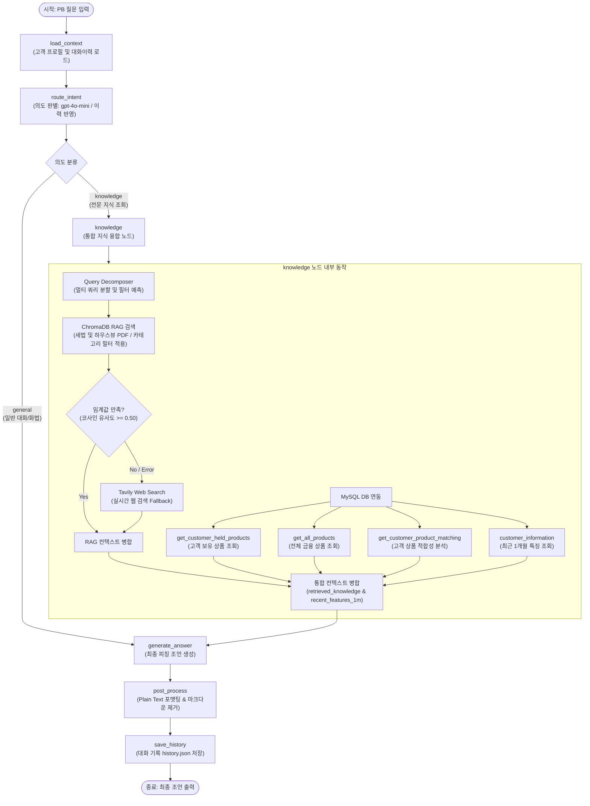
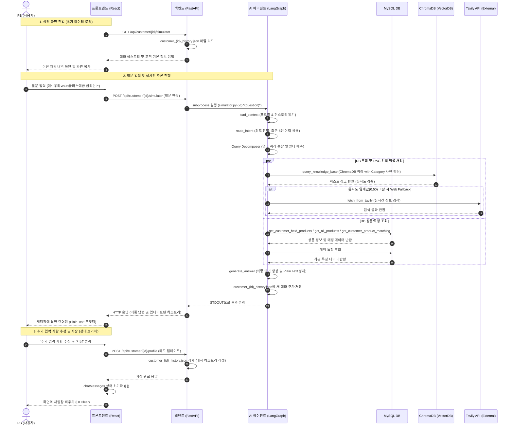

# POOM Premium 자산관리 PB Co-pilot 에이전트 설명서 (explain.md)

본 문서는 우리은행의 프리미엄 자산관리 서비스인 **POOM (품)**의 PB(Private Banker) 상담 지원용 Co-pilot 에이전트의 구조, 기능, 데이터 흐름 및 파일 구성에 대해 상세히 기술합니다.

---

## 1. 에이전트 개요 (Agent Overview)
POOM 자산관리 시뮬레이터 에이전트는 PB가 초고액 자산가 고객을 상담할 때 필요한 세무 지식, 상품 혜택, 시장 전망 정보를 실시간으로 분석하여 **최적의 피칭 시나리오와 상담 화법(스크립트)을 백업해주는 전문 어시스턴트**입니다. 
LangGraph 기반의 상태 기반 아키텍처(State Graph)로 설계되어 있으며, 질문의 의도 분석부터 RAG 기반 행내 지식 검색, 실시간 웹 검색, MySQL DB 연동을 유기적으로 제어합니다.

---

## 2. 에이전트 구조 (Architecture)

에이전트는 상태 기반 제어 프레임워크인 **LangGraph**를 활용하여 단계별 노드(Node)를 거치며 상태 객체(State)를 업데이트하고 최종 답변을 도출합니다.

### 2.1 상태 객체 스키마 (SimulatorState)
상태 객체는 공유되고 누적되는 그래프 상의 핵심 메모리 스키마입니다.
*   `customer_id` (int): 시뮬레이션 대상 고객 식별 ID
*   `question` (str): PB가 입력한 질문 (입력)
*   `context_content` (str): 고객의 기본 프로필 텍스트
*   `history` (list): PB와 에이전트 간의 과거 대화 이력 (최대 10개 턴 유지)
*   `intent` (str): 질문의 의도 판별 결과 (`knowledge` 또는 `general`)
*   `retrieved_knowledge` (str): RAG 검색 또는 Tavily 웹 검색을 통해 확보된 금융/세무 지식
*   `recent_features_1m` (str): MySQL에서 조회된 고객의 최근 1개월 이내 행동/상담 특징 요약
*   `answer` (str): LLM이 최종 생성한 피칭 조언 답변 (출력)
*   `errors` (list): 노드 실행 중 발생한 오류 로그 목록

### 2.2 그래프 노드 및 엣지 구성
에이전트는 4개의 핵심 상태 처리 노드와 1개의 조건부 라우팅 엣지로 구성됩니다. 전체 구조와 노드별 상세 데이터 흐름은 아래와 같습니다.



1.  **`load_context`** (고객 기본 정보 로드)
    *   지정된 `customer_id`에 해당하는 로컬 프로필 파일(예: [customer_1001.md](./data/history/customer_1001.md))을 탐색하여 고객 자산 현황 및 분석 인사이트를 로드합니다.
    *   동시에 해당 고객의 과거 대화 이력(예: [customer_1001_history.json](./data/history/customer_1001_history.json))을 가져와 최대 10턴 이내로 제한해 `history`에 저장합니다.
2.  **`route_intent`** (의도 라우팅)
    *   `gpt-4o-mini` 모델의 구조화된 출력(Structured Output) 기능을 활용하여 PB 질문의 의도를 분석합니다. 대명사 및 지시어 등의 문맥을 파악하기 위해 최근 5턴의 `history`를 프롬프트에 연동하여 판단합니다.
    *   의도는 전문 지식/DB 조회가 필요한 `knowledge`와 단순 일반 상담/화법인 `general` 2가지 범주로 분류됩니다. (분류 프롬프트 명세: [intent_router_system_prompt.md](./prompt/intent_router_system_prompt.md))
3.  **`route_conditional_edge`** (조건부 라우터 엣지)
    *   의도가 `general`인 경우, `knowledge` 노드를 완전히 우회(Skip)하여 즉시 `generate_answer` 노드로 진입합니다.
    *   의도가 `knowledge`인 경우, `knowledge` 노드로 분기합니다.
4.  **`knowledge`** (통합 지식 융합 노드)
    *   의도가 `knowledge`인 경우에 실행되며, 멀티 쿼리 분할(Query Decomposition)과 카테고리 기반 RAG 검색, 그리고 MySQL 상품/특징 정보를 동시에 조회하여 하나의 거대한 컨텍스트로 융합합니다.
5.  **`generate_answer`** (답변 생성 및 후처리)
    *   고객 기본 컨텍스트, 1개월 특징, 통합 지식을 융합하여 프롬프트를 조립하고 `gpt-4o-mini`를 통해 최종 상담 가이드를 생성합니다. (기본 템플릿 명세: [simulator_system_prompt.md](./prompt/simulator_system_prompt.md))
    *   출력물에 마크다운 기호가 노출되지 않도록 시스템 레벨에서 제거하고, 시스템 후처리를 통해 답변 끝에 `[참조 출처: ...]`를 강제로 덧붙입니다.
    *   생성된 답변과 질문을 해당 고객의 대화 이력 파일([customer_*.json](./data/history/))에 영구 저장합니다.

---

## 3. RAG 지식 문서의 분류 및 태깅 체계 (Taxonomy)

행내 RAG에 사용하기 위해 적재된 수많은 자산관리 PDF 지식 문서들은 시스템 배치 엔지니어링 유틸리티([ingest.py](./utils/ingest.py))를 통해 ChromaDB로 적재될 때, **검색 도메인(Asset Category)**과 **대상 고객군(Target Segment)** 메타데이터 태그를 부여받아 물리적으로 분류됩니다.

### 3.1 원천 PDF 문서별 기본 메타데이터 정의
원천 데이터가 위치한 `data/raw_data/` 하위의 개별 가이드북 파일들은 성격에 따라 1차 분류 태깅됩니다.

| PDF 파일명 | 기본 asset_category (도메인) | 기본 target_segment (고객군) | 데이터 성격 (data_lifecycle) |
| :--- | :--- | :--- | :--- |
| `1. 2026년 6월 House View.pdf` | **`매크로`** | **`공통`** | 주기적 변경 리포트 |
| `2025 우리금융 트렌드 보고서1.pdf` | **`매크로`** | **`공통`** | 주기적 변경 리포트 |
| `2025 한국 부자 보고서.pdf` | **`매크로`** | **`공통`** | 주기적 변경 리포트 |
| `2026 대한민국 웰스 리포트_하나금융연구소.pdf` | **`매크로`** | **`공통`** *(텍스트 내용 기반 동적 매핑)* | 주기적 변경 리포트 |
| `2026년 개정세법 해설.pdf` | **`세무`** | **`공통`** *(텍스트 내용 기반 동적 매핑)* | 영속 보관 가이드북 |
| `230919_금융소비자보호법 설명자료_f.pdf` | **`컴플라이언스`** | **`공통`** | 영속 보관 규정집 |

### 3.2 RAG 검색 시 Target Segment 필터링 제외 최적화
*   **배경 및 부작용 방지**:
    - 인제스트 배치 가동 시에는 청크의 본문 내용 분석에 따라 `"영리치"`, `"시니어"`, `"기업인"` 세그먼트 태그가 동적으로 적재되지만, **실제 에이전트의 RAG 검색(ChromaDB 쿼리) 시에는 `target_segment` 필터를 조건에서 완전히 배제**하였습니다.
    - 대다수의 문서 청크가 `"공통"`에 집중되어 있고, LLM의 오분류(예: 고객이 30대라는 이유로 '영리치'로 잘못 매핑하여 '기업인' 세법 혜택 지식을 배제하는 현상)로 인해 알짜 금융 정보가 검색 필터링 때문에 **누락되는 심각한 오류(False Negative)를 원천 차단**하기 위함입니다.
    - 또한, 불필요한 메타데이터 필터 조건을 줄임으로써 RAG 쿼리 매커니즘을 가볍게 단순화하고 검색 성능과 재현율(Recall)을 극대화했습니다.

### 3.3 금융상품(`asset_category="금융상품"`) 도메인의 RAG 검색 우회 설계
*   **배경**: 예적금 이자율 및 가입 조건 등의 금융상품 상세 정보는 변동 주기가 매우 짧습니다. 이를 정적 PDF 파일로 RAG(ChromaDB)에 적재하여 관리하면, 이자율 변경 시마다 문서를 재임베딩해야 하므로 관리 오버헤드가 크고 실시간 데이터 정합성이 깨집니다. 따라서 금융상품 데이터는 **100% MySQL 관계형 데이터베이스**(`product`, `product_matching`)에서 실시간으로 가져와 처리합니다.
*   **아키텍처 및 맹점 방지 예외 처리**:
    - `Query Decomposer`가 질문의 카테고리를 `"금융상품"`으로 예측할 경우, ChromaDB에는 해당 태그의 문서가 존재하지 않아 RAG 검색 유사도는 무조건 통과하지 못합니다.
    - 이에 따라 발생하는 무의미한 RAG 검색 실패 및 Tavily 실시간 웹 검색 API 호출 낭비를 방지하기 위해, 코드 내부적으로 **금융상품 카테고리는 RAG/웹 Fallback 검색을 사전에 생략(Skip)하도록 구현**되어 있습니다.
    - 그 대신 하단의 MySQL DB 수집 단계에서 전체 상품 스펙 및 해당 고객 맞춤 추천 데이터가 정교하게 수집되어 답변 생성의 컨텍스트로 융합 공급됩니다.

---

## 4. 핵심 기능: 멀티 쿼리 분할 및 필터 예측 (Deep Dive)

통합 지식 노드(`knowledge`)에서 수행되는 **멀티 쿼리 분할 및 필터 예측**은 본 에이전트의 핵심 RAG 고도화 장치입니다. 복잡한 자연어 질문을 RAG가 이해하기 좋은 형태의 서브 쿼리로 쪼개고, 타겟 문서의 메타데이터 카테고리(`asset_category`)를 예측하여 검색 효율과 정확도를 향상시킵니다.

### 4.1 작동 이유 (Why)
- **주제 분리**: 하나의 문장 속에 "세법"과 "시장 리포트" 등 성격이 다른 정보가 혼재하면, 하나의 키워드로 임베딩 검색 시 원하는 청크들이 상호 간섭(노이즈)을 일으켜 제대로 된 청크가 누락됩니다.
- **노이즈 완전 차단 (사전 필터링)**: 자산 관리용 PDF 파일은 분량이 많습니다. 30대 신규 창업자의 세법 질문에 매크로 하우스뷰 리포트나 금소법 규정 텍스트가 걸려 올라오면 컨텍스트 창이 낭비되고 엉뚱한 답변이 나올 수 있습니다. 따라서 질문 도메인에 부합하는 카테고리 메타데이터만 미리 걸러서 검색합니다.

### 4.2 1단계: 의도 분할 및 필터 예측 (`QueryDecomposition`)
[simulator.py](./simulator.py) 내 `knowledge_node`에서는 OpenAI의 Structured Output 기능을 통해 PB 질문을 1~3개의 독립적인 `SubQuery` 구조로 반환받습니다.

#### 구조화 데이터 스키마
```python
class SubQuery(BaseModel):
    query: str            # RAG 검색에 유용하게 맥락이 복원/재작성된 검색 키워드
    asset_category: str   # 검색 도메인 ('세무', '매크로', '금융상품', '컴플라이언스', '공통')
```

- **맥락 복원**: PB가 대명사("이거", "그 리포트")로 단축해 물어보더라도, 이전 5턴의 `history`를 읽고 "우리WON플러스예금 세무 공제" 등 명확한 명사 형태로 재작성하여 RAG 검색 성공률을 높입니다.
- **메타데이터 가이드라인** (상세 가이드: [query_decomposer_system_prompt.md](./prompt/query_decomposer_system_prompt.md)):
  - `asset_category` (도메인): 질문의 타겟 핵심 도메인 분야(세무, 매크로 등)를 분석하여 매핑하며 RAG 검색 범위 제한용 필터로 작동합니다.

### 4.3 2단계: 복합 사전 필터링(Pre-filtering) RAG 검색
각각 분할 예측된 `SubQuery`를 기반으로 ChromaDB에 개별 조회를 수행합니다. 이때 벡터 유사도 검색과 동시에 아래와 같은 **사전 필터 조건**(`where` 딕셔너리)을 동적 주입합니다.

```python
# tools.py 내 query_knowledge_base에 탑재된 필터 조립 로직
where_filter = {
    "$and": [
        {"source": {"$ne": "db_product"}},  # MySQL 상품 복제본 제외 (PDF 지식만 탐색)
        {"asset_category": asset_category}  # 예측 도메인 카테고리 일치
    ]
}
```

- **동작**: ChromaDB는 이 필터 조건에 부합하는 문서(예: `asset_category="세무"`)만을 메모리 상에 먼저 필터링한 뒤, 그 대상 안에서 코사인 유사도 검색을 수행합니다. (지식 누락 방지 및 심플화를 위해 target_segment 조건은 완전 배제되었습니다.)
- **유사도 임계값 규격**: 의미론적 신뢰성을 확보하기 위해 **코사인 유사도 점수가 `0.50` 이상**인 청크들만 최종 컨텍스트로 수용합니다.

### 4.4 3단계: RAG 중복 제거 및 실시간 Web Fallback
1. **중복 제거 (Deduplication)**: 여러 개의 서브 쿼리로 RAG를 돌리다 보면 겹치는 청크가 반환될 수 있습니다. 본 에이전트는 공백 문자를 통일하여 문자열을 대조하고, 완벽히 중복되는 청크들을 제거합니다. 또한 최종 문서의 번호(`[1]`, `[2]`)를 가독성 있게 순서대로 재매핑합니다.
2. **실시간 웹 검색 Fallback**: RAG 검색 대상 카테고리(`asset_category`가 `"금융상품"`이 아닌 경우)임에도 ChromaDB RAG 검색 결과가 임계값 `0.50`을 넘는 청크가 단 하나도 없거나 데이터베이스 에러가 발생한 경우, 에이전트는 즉시 **Tavily Search API**를 활용한 실시간 웹 검색 결과로 우회(Fallback)하여 답변 생성에 주입합니다.

#### RAG 검색 흐름 시나리오 예시
```text
[PB 질문]
"30대 의사인 김동우 고객인데, 최근 적극투자형 자산 배분 비중이랑, 이거 예적금 가입할 때 혹시 개인사업자 절세 되는거 있어?"

  ▼ 1. Query Decomposition 수행 (Structured Output)
  - 서브 쿼리 1: {"query": "최근 적극투자형 자산배분 하우스뷰 비중", "asset_category": "매크로"}
  - 서브 쿼리 2: {"query": "의사 개인사업자 예적금 가입 시 절세 혜택", "asset_category": "세무"}

  ▼ 2. 카테고리 필터링 VectorDB 쿼리 실행
  - [RAG 1] '매크로' 리포트 대상 문서에서만 텍스트 검색 -> 유사도 0.68 매칭 청크 검출 (통과)
  - [RAG 2] '세무' 문서 대상 문서에서만 검색 -> 유사도 0.42로 임계값 미달 (기각)

  ▼ 3. Fallback 작동
  - RAG 2가 실패하였으므로 Tavily API를 호출하여 "의사 개인사업자 예적금 절세 혜택" 실시간 검색 수행 -> 정보 수집 성공 (통과)

  ▼ 4. 컨텍스트 병합 및 최종 답변
  - [RAG 1 매크로 지식] + [Tavily 웹 세무 지식] + [MySQL 김동우 고객 보유 금융상품] 융합 -> LLM 전달 -> 최종 조언 생성
```

---

## 5. 시스템 시퀀스 다이어그램 (Sequence Diagram)

프론트엔드 UI, 백엔드 API, AI 에이전트 및 DB가 유기적으로 상호작용하는 대화 라이프사이클 및 대화 이력 초기화 흐름은 다음과 같습니다.



---

## 6. 기타 주요 기능 및 특징 (Key Features)

### 6.1 Tavily API 웹 검색 Fallback
이자율 등 수치 민감도가 높은 질문에 대해 행내 벡터 DB 검색 결과가 유사도 임계값을 넘지 못할 경우, Tavily Search API를 사용하여 실시간 포털 정보를 즉시 주입받습니다. 이는 지식 부재로 인한 모델의 환각(Hallucination) 현상을 원천적으로 차단합니다.

### 6.2 임의 자산 정보 창작(할루시네이션) 방지 지침
고객 프로필 데이터베이스나 대화 맥락에 존재하지 않는 구체적인 예적금 잔액, 가입 상품명, 투자 종목 등을 모델이 임의로 작명하고 수치를 상상하여 피드백하는 현상을 완벽히 규제합니다. 컨텍스트 내에 관련 정보가 존재하지 않는 자산 내역 조회의 경우, 임의의 수치를 창조하지 않고 "제공된 정보에 구체적인 자산 잔액이 존재하지 않아 조회가 불가능하다"는 안내 문구로 정중하게 예외 처리를 유도하도록 시스템 지침을 명문화했습니다.

### 6.3 프롬프트 조건부 정리 (Clean Prompt)
RAG 검색 결과가 없거나, 1개월 특징 조회가 생략(또는 데이터 없음)된 경우 사용자 프롬프트 템플릿 내의 관련 섹션 헤더(`[고객의 최근 1개월 이내 특징 및 메모 (DB)]` 등)를 시스템 레벨에서 제거합니다. 이는 프롬프트의 가독성을 높이고 LLM의 무의미한 텍스트 학습이나 오작동을 방지합니다.

### 6.4 순수 텍스트(Plain Text) 출력 표준화
에이전트는 마크다운 렌더러가 부재한 행내 터미널이나 전용 텍스트 뷰어에 최적화된 결과물을 출력합니다.
*   샵 기호 `#`, 볼드 기호 `**`, 표 구조 기호 `| --- |` 등 **모든 마크다운 문법의 출력을 금지**합니다.
*   대괄호 `[소제목]`와 수동 탭 정렬, 줄바꿈을 활용하여 가독성이 뛰어난 Plain Text 구조를 제공합니다.

### 6.5 LangSmith 추적 (Tracing) 및 디버깅 지원
에이전트 구동 시 타 에이전트와 동일하게 LangSmith 연동을 지원하여 체인 실행 및 LLM 호출 과정을 시각적으로 모니터링할 수 있습니다.
- 환경 변수 `LANGSMITH_TRACING`, `LANGSMITH_API_KEY` 등을 로드하여 표준 `LANGCHAIN_` 환경 변수로 자동 매핑합니다.
- 이를 통해 LangGraph의 실행 단계(State Graph Node 및 Edge 라우팅) 및 개별 ChatOpenAI 호출 단위를 LangSmith 대시보드에서 실시간 추적 및 디버깅할 수 있습니다.

---

## 7. 파일 구성 및 역할 (Files & Modules)

에이전트가 위치한 디렉토리 내부의 구성 파일 정보는 다음과 같습니다.

*   [simulator.py](./simulator.py)
    *   상태 그래프(`StateGraph`) 정의, 노드 구현, 컴파일된 앱 인스턴스화가 포함된 핵심 에이전트 구동 소스 코드입니다.
*   [tools.py](./tools.py)
    *   에이전트가 사용하는 연동 도구 모음입니다. Tavily 실시간 검색 API를 호출하는 `fetch_from_tavily()`, ChromaDB 벡터 쿼리 및 임계값 전처리를 수행하는 `query_knowledge_base()`, 그리고 MySQL에서 실시간 고객 보유 상품 및 적합성 정보 조회 도구들이 정의되어 있습니다.
*   [test_simulator.py](./test_simulator.py)
    *   터미널에서 에이전트와 실시간 대화를 수행하고, 데이터베이스 및 RAG 연동 과정을 디버그 로그(stderr)로 추적할 수 있도록 제작된 대화형 CLI 검증 도구입니다.
*   [utils/ingest.py](./utils/ingest.py)
    *   행내 수집 PDF 가이드 문서 파싱(Text Splitting)을 거쳐 OpenAI 임베딩API를 통해 ChromaDB로 지식을 이관 적재하는 배치 엔지니어링 유틸리티입니다.
*   [prompt/simulator_system_prompt.md](./prompt/simulator_system_prompt.md)
    *   역할 정체성, 4단계 구조화 답변 레이아웃 지침, Plain Text 포맷 제약, 출처 표기 원칙이 고도화되어 정의된 시스템 프롬프트 명세서입니다.
*   [prompt/simulator_user_prompt.md](./prompt/simulator_user_prompt.md)
    *   고객 프로필 정보, DB 특징 메모, RAG 지식이 주입되는 동적 사용자 컨텍스트 템플릿입니다.
*   [prompt/intent_router_system_prompt.md](./prompt/intent_router_system_prompt.md)
    *   PB 질문의 의도(`knowledge`, `general`)를 분류하기 위한 라우터용 시스템 프롬프트입니다.
*   [prompt/query_decomposer_system_prompt.md](./prompt/query_decomposer_system_prompt.md)
    *   복합 질문을 1~3개의 세부 검색용 쿼리로 분할하고 최적의 메타데이터 필터를 예측하는 쿼리 변환기용 시스템 프롬프트입니다.
*   [prompt/assistant_acknowledgment.md](./prompt/assistant_acknowledgment.md)
    *   대화 도입부에서 에이전트의 첫 응답 인트로로 전송되는 어시스턴트 인지 확인용 고정 대화 템플릿입니다.
*   [data/](./data/)
    *   `chroma_db/` : 591개 텍스트 청크 및 임베딩 벡터 데이터가 저장된 데이터베이스 폴더입니다.
    *   `raw_data/` : 원천 지식 PDF 문서들이 보관되는 폴더입니다.
    *   `history/` 하위의 `customer_*.md` / `customer_*_history.json` : 각 고객의 자산 프로필 및 대화 히스토리 파일이 누적되는 공간입니다.
