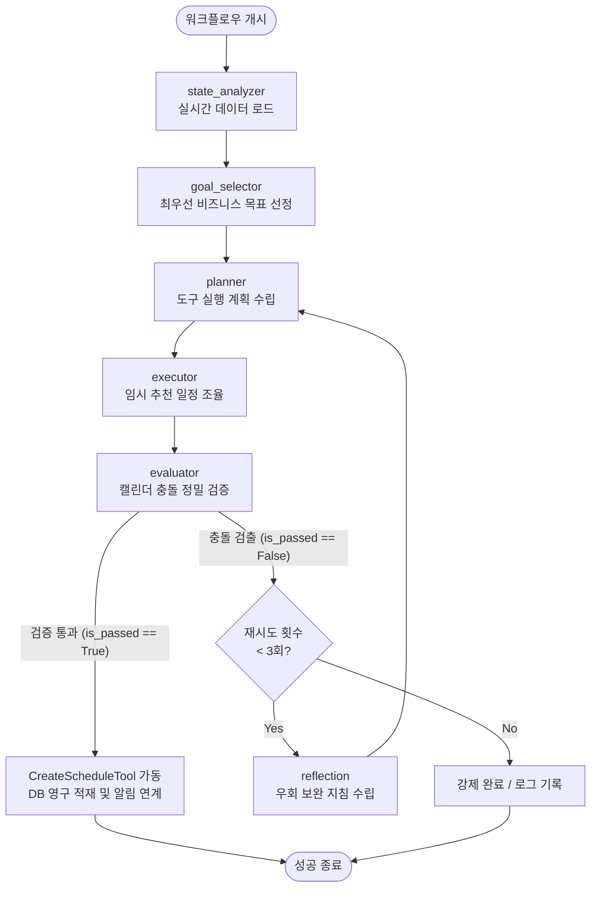

# POOM AI To-Do 에이전트 상세 가이드라인 (`POOM-AI/agent/todo`)

본 문서는 **POOM 금융 플랫폼** 내에서 PB(Private Banker)의 일일 최우선 비즈니스 목표를 설정하고, 개인 맞춤형 추천 일정(AI To-Do)을 생성 및 검증하는 **AI To-Do 에이전트** 모듈에 대한 상세 가이드라인입니다.

처음 이 코드를 접하는 개발자도 전체 아키텍처, 데이터의 흐름, 그리고 구현된 세부 기능 및 가드레일(Guardrails)을 완전하게 이해할 수 있도록 상세히 설명합니다.

---

## 1. 아키텍처 개요 (Overview)

AI To-Do 에이전트는 **LangGraph** 프레임워크를 기반으로 구축된 **상태 머신(State Machine)** 형태의 에이전트입니다. 단순한 단발성 LLM 호출이 아니라, 다음과 같은 유기적인 단계와 검증 루프를 거쳐 일정을 제안합니다.

1. **데이터 수집 (State Analyzer)**: 데이터베이스 연동 도구(Tools)를 가동하여 PB의 스케줄, 담당 고객 자산/이탈 위험 현황, 상품 만기 이벤트, 장기 미상담 고객 현황 등을 실시간으로 수집합니다.
2. **목표 설정 (Goal Selector)**: 수집된 종합적인 비즈니스 컨텍스트를 분석하여 오늘의 최우선 비즈니스 목표를 선정합니다.
3. **태스크 수립 (Planner)**: 결정된 비즈니스 목표를 기반으로 실행할 도구 계획을 수립합니다.
4. **추천일정 매칭 (Executor)**: 오늘 비어 있는 시간대 슬롯을 파악하고, 최우선 고객 및 KPI 기반 업무를 매칭하여 2~5개의 가용 일정을 임시 생성합니다.
5. **캘린더 정밀 검증 (Evaluator)**: 임시 생성된 추천 일정들이 PB의 기존 캘린더 일정과 시간이 겹치는지 엄밀하게 대조합니다.
6. **자가 반성 루프 (Reflection)**: 검증 실패(기존 일정과의 충돌) 시, 원인을 정밀 분석하여 우회 계획을 위한 반성 지침(Guidance)을 Planner에게 수락하고 최대 3회 재시도를 진행합니다.
7. **최종 적재 및 알림**: 검증을 정상 통과하면 DB 적재(`ai_todo` 테이블)를 수행하고 실시간 방문 브리핑 및 AI 알림을 생성합니다.

---

## 2. 폴더 및 파일 구조 (Directory Structure)

```text
POOM-AI/agent/todo/
│
├── dag/
│   └── ai_todo_agent_dag.py     # Airflow 스케줄러 등록용 일일 배치 파이프라인 정의
│
├── graph/
│   ├── __init__.py
│   ├── graph_builder.py         # LangGraph 워크플로우 빌드 및 컴파일 핵심 로직
│   ├── llm.py                   # OpenAI LLM 초기화 및 오프라인 대비 Fallback 엔진 구축
│   └── state.py                 # 워크플로우 진행 상태 관리(AgentState) 클래스 정의
│
├── nodes/
│   ├── __init__.py              # 노드 일괄 내보내기(Export) 정의
│   ├── state_analyzer.py        # 1단계: 실시간 컨텍스트 및 히스토리 데이터 로드 노드
│   ├── goal_selector.py         # 2단계: 일일 최우선 비즈니스 목표 도출 노드
│   ├── planner.py               # 3단계: 도구 실행 동적 계획 수립 노드
│   ├── executor.py              # 4단계: 실시간 일치 분석 및 추천 일정 매칭 노드
│   ├── evaluator.py             # 5단계: 시간 충돌 검증 및 DB 최종 적재 노드
│   └── reflection.py            # 6단계: 일정 충돌 분석 및 보완 지침 피드백 노드
│
├── prompts/
│   ├── __init__.py              # 마크다운 프롬프트를 동적으로 로딩하여 파이썬 변수로 노출
│   ├── goal_system_prompt.md     # Goal Selector용 System Prompt
│   ├── goal_user_prompt.md       # Goal Selector용 User Prompt
│   ├── planner_system_prompt.md   # Planner용 System Prompt
│   ├── planner_user_prompt.md     # Planner용 User Prompt
│   ├── reflection_system_prompt.md# Reflection용 System Prompt
│   └── reflection_user_prompt.md  # Reflection용 User Prompt
│
├── tools/
│   ├── __init__.py
│   ├── db_helper.py             # SQLAlchemy DB 세션 공급 헬퍼
│   ├── calendar_tool.py         # PB의 기존 캘린더 조회 도구
│   ├── customer_tool.py         # 고객 위험/상담이력/만기이벤트/장기미상담 조회 도구
│   ├── kpi_tool.py              # PB 및 지점 KPI 달성도 분석 도구
│   ├── notification_tool.py     # 기생성 알림 조회 도구 (중복 발송 방지용)
│   └── schedule_create_tool.py   # 검증 완료된 To-Do를 DB에 적재하는 도구
│
├── main.py                      # 단일 PB 및 특정 날짜 대상 수동 가동 스크립트 CLI
└── scheduler.py                 # 일일 전체 PB 자동 배치를 위한 데몬 스케줄러 (APSScheduler)
```

---

## 3. 핵심 아키텍처 및 동작 프로세스

### LangGraph 워크플로우 흐름도



### 상태 객체 (`AgentState`) 상세 명세

워크플로우가 흘러가는 동안 메모리 상에서 공유되고 누적되는 상태 정의는 [state.py](graph/state.py) 파일에 구현되어 있습니다.

| 상태 키 | 타입 | 역할 |
| :--- | :--- | :--- |
| `u_id` | `str` | 분석 대상 PB의 유니크 ID |
| `target_date` | `str` | 분석 기준일 (`YYYY-MM-DD`) |
| `context_data` | `Dict[str, Any]` | `StateAnalyzer`가 조회한 캘린더, KPI, 이탈 위험군, 만기 예정 상품, 장기 미상담 목록 및 무시 기록 |
| `current_goal` | `Dict[str, Any]` | `GoalSelector`가 수립한 오늘의 최우선 비즈니스 목표와 선정 근거 |
| `plan_tools` | `List[str]` | `Planner`가 목표 달성을 위해 구성한 동적 실행 계획 (도구 명칭 리스트) |
| `execution_results`| `List[Dict]` | `Executor`가 생성한 임시 추천 일정 후보들 (제목, 메모, 시간대, c_id, 카테고리 포함) |
| `evaluation` | `Dict[str, Any]` | `Evaluator`가 수행한 충돌 여부 검증 결과 및 DB 적재 성공 피드백 |
| `reflection_guidance`| `Optional[str]`| `Reflection` 단계에서 작성된 재계획 시 우회 시간 및 고객 지정 지침 가이드라인 |
| `retry_count` | `int` | 재계획을 시도한 누적 횟수 (최대 3회 제한 가드레일) |

---

## 4. 단계별 노드(Node) 상세 로직

### 1단계. `state_analyzer` ([state_analyzer.py](nodes/state_analyzer.py))
- DB 연결 툴들을 이용해 PB와 연관된 원시 데이터를 병렬 수집합니다.
- **스마트 감쇠 데이터**: 과거에 AI To-Do를 추천해 주었으나 PB가 체크하여 일정으로 등록하지 않고 무시한(즉, `is_checked == False` 상태로 기준일이 지난) 데이터들을 대조하여 '중요도 감쇠 대상 리스트'를 만들어 LLM에 같이 전달합니다. 이를 통해 PB가 원하지 않는 비선호 추천이 반복되는 것을 영리하게 피합니다.
- **중복 방지 필터링**: 이미 미래 캘린더에 일정이 잡혀있는 고객 ID와 최근 7일 이내에 상담 메모(`ConsultationMemo`)를 작성하여 만난 고객 ID 리스트(`scheduled_customers`)를 추출하여 중복 추천을 원천 차단합니다.

### 2단계. `goal_selector` ([goal_selector.py](nodes/goal_selector.py))
- `prompts/goal_system_prompt.md` 및 `goal_user_prompt.md` 템플릿에 맞추어 LLM을 호출합니다.
- PB의 실적 상태(예: AUM 달성도 저조) 및 고액 자산 고객의 이탈 리스크 유무 등을 반영하여 어떤 비즈니스 행위가 가장 시급하고 파급력이 큰지 자율적으로 분석하고 결정합니다.
- 결과값은 `{"goal": "...", "reason": "..."}` 형식의 JSON으로 반환됩니다.

### 3단계. `planner` ([planner.py](nodes/planner.py))
- 최우선 비즈니스 목표와 반성 지침(존재하는 경우)을 고려하여 도구들을 어떻게 연결해 실행할지 시퀀스(`plan_tools`)를 생성합니다.
- 루프의 마무리는 반드시 DB 적재 도구인 `CreateScheduleTool`을 포함하도록 방어적으로 강제 조정됩니다.

### 4단계. `executor` ([executor.py](nodes/executor.py))
- 비즈니스 목표와 수집된 컨텍스트를 최종 융합하여 PB가 바로 수행 가능한 일정 목록(`execution_results`)을 도출합니다.
- **조율 규칙**:
  - **개수 유동성**: 바쁜 날(빈 슬롯 부족)에는 무리하게 꽉 채우지 않고 최소 2개에서 최대 5개까지 유연하게 제안 개수를 조절합니다.
  - **중복 및 쏠림 금지**: 특정 고객 1~2명에게만 추천이 쏠리는 것을 제한하고, 예약 완료 고객군을 완전히 배제합니다.
  - **카테고리 분배**: `'상담 일정 제안'`, `'신규 상품 분석'`, `'KPI 기반'` 세 가지 카테고리를 균형 있게 배치합니다.
  - **중요도 순서 정렬**: 중요성과 시급성이 높은 비즈니스 액션을 JSON 배열의 0번 인덱스(가장 앞쪽)에 배치하여 PB가 먼저 보도록 합니다.
  - **실명 바인딩**: LLM이 반환한 텍스트 상의 임시 명칭을 데이터베이스 실명 정보와 매칭하여 `{고객명} 고객({c_id}) {추천명}`의 직관적인 시인성 형태로 치환합니다.

### 5단계. `evaluator` ([evaluator.py](nodes/evaluator.py))
- 임시 생성된 추천 일정들이 DB 내 `pb_schedule`의 실제 확보 일정 시간대(오전 9시 ~ 오후 6시 사이)와 1분이라도 겹치는지 엄밀하게 수학적으로 판별합니다.
- **검증 통과 시**: 
  1. 중복 표출 및 데이터 오염을 예방하기 위해, 해당 PB의 기준일 및 과거 미등록 상태로 방치되어 무시된 기존 AI To-Do 레코드(`AiTodo`)들을 일괄 삭제(Clean up)하여 UI 청정 상태를 확보합니다.
  2. `CreateScheduleTool`을 호출하여 `ai_todo` 테이블에 검증 통과한 일정을 안전하게 정식 적재합니다.
  3. `is_passed = True`를 리턴하여 그래프를 **END**로 안내합니다.
- **검증 실패 시**:
  1. `is_passed = False`와 함께 충돌한 시간대 및 기존 일정명 등의 명확한 사유를 `feedback` 상태에 기록합니다.
  2. 조건부 엣지에 의해 `reflection` 노드로 분기시킵니다.

### 6단계. `reflection` ([reflection.py](nodes/reflection.py))
- `evaluator`가 작성한 충돌 피드백과 캘린더 정보를 면밀히 대조 분석하여, 다음 루프에서 Planner 및 Executor가 충돌을 영리하게 빗겨갈 수 있도록 구체적인 우회 가이드라인(`reflection_guidance`)을 수립합니다.
  - *예시: "14:00 시간대 기존 일정 '[상담] 강호동'과 충돌이 감지되었으므로, 14:00는 완전히 제외하고 16:00 이후로 일정을 우회 조정하십시오."*
- `retry_count`를 1 가산합니다.

---

## 5. 비즈니스 지원 도구 (Tools) 명세

`POOM-AI/agent/todo/tools/` 패키지 내부에는 데이터베이스에 안전하게 조회 및 기입하기 위한 SQLAlchemy 기반의 LangChain Custom Tool이 정의되어 있습니다.

| 도구명 (Tool Name) | 소스 파일 | 설명 및 반환 형태 |
| :--- | :--- | :--- |
| `GetCalendarScheduleTool` | `calendar_tool.py` | PB의 지정일 기존 캘린더 리스트 (시작/종료 시간 및 내용) 조회 |
| `GetCustomerRiskTool` | `customer_tool.py` | PB 담당 고객 중 이탈 위험 등급이 **'주의'** 또는 **'위험'**인 고자산 VVIP 고객 목록 및 사유 파악 |
| `GetRecentConsultingHistoryTool` | `customer_tool.py` | 최근 작성된 상담 메모 요약 내역 조회 (최대 5건) |
| `GetCustomerFeatureTool` | `customer_tool.py` | 특정 고객의 정성 특징 정보 (투자성향, 직업, 라이프스타일 취향 등) 수집 |
| `GetCustomerEventTool` | `customer_tool.py` | 기준일 기준 30일 이내에 도래하는 예적금/펀드 상품 등의 비즈니스 **만기 예정** 이벤트 수집 |
| `GetUnconsultedCustomersTool` | `customer_tool.py` | 최근 60일 동안 상담 이력이 없는 장기 미접촉 VVIP 고객들을 자산 순으로 15명 목록화 |
| `GetNotificationTool` | `notification_tool.py` | 최근 생성된 인앱 알림함 메시지 이력을 조회하여 메시지 중복 추천 차단 |
| `CreateScheduleTool` | `schedule_create_tool.py` | 최종 확정된 AI To-Do를 데이터베이스 `ai_todo` 테이블에 정식 적재 |

---

## 6. 가드레일 및 안정성 예외 처리 (Guardrails)

1. **APSScheduler & API Fallback 시스템** ([llm.py](graph/llm.py))
   - 상용 클라우드 OpenAI API 호출 실패, 네트워크 타임아웃, API Key 부재 등의 상황에서도 플랫폼 배치가 중단되지 않도록 **`HeuristicFallbackLLM`** 엔진을 탑재하고 있습니다.
   - 프롬프트에 실려오는 메타데이터를 정규식(Regex)과 규칙 기반 분석기를 통해 동적으로 분석하여, 실제 LLM 결과물과 구조적으로 동일한 포맷의 JSON 데이터 및 계획 수립 결과를 자동으로 우회 생성(Heuristic)해 주어 정합성을 방어합니다.
2. **최대 재시도(Retry Count) 제한**
   - 캘린더 충돌이 극심한 날에는 자가 반성 루프가 무한 루프에 빠지는 것을 차단하기 위해 최대 재시도 횟수를 **3회**로 하드코딩 제한하고 있습니다. 3회 도달 시, 마지막으로 제안된 후보 중 충돌이 나지 않은 안전 슬롯까지만 저장하거나 로그를 남기고 정상적으로 상태 머신을 종료시킵니다.
3. **데이터베이스 무결성 제약조건(Check Constraint) 강제 준수** ([schedule_create_tool.py](tools/schedule_create_tool.py))
   - 데이터베이스 스키마 상 `ai_todo.category`는 정해진 카테고리 명칭만 수용합니다. (`KPI 기반`, `상담 일정 제안`, `안부 연락 제안`, `신규 상품 분석`)
   - LLM이 창의적이거나 유연하게 다른 명칭으로 카테고리를 리턴하더라도 적재 단계에서 키워드 필터링 매핑을 통과시켜 SQL 무결성 예외(Constraint violation) 크래시를 사전 방어합니다.
4. **글자 수 오버플로우 방어**
   - 데이터베이스 VARCHAR 필드 규격에 맞춰 `title`은 50자 제한, `memo`는 80자 제한으로 기입 전 강제 Slice(`title[:50]`, `memo[:80]`) 처리가 되어 있습니다.

---

## 7. 실행 및 연동 가이드

### CLI 수동 실행 (단일 PB 가동 및 테스트)
가상환경 파이썬 인터프리터를 사용하여 특정 PB 및 날짜를 지정해 직접 가동할 수 있습니다.
```bash
# POOM-AI 루트 경로에서 실행
.venv/Scripts/python agent/todo/main.py --u_id pb_b1_1 --date 2026-06-09
```
* `--u_id`를 누락하면 데이터베이스 내 재직 중인 유효 PB 중 첫 번째 PB를 자동으로 조회하여 테스트 가동합니다.

### 데몬 스케줄러 실행 (백그라운드 일일 배치)
매일 아침 06시 정각에 재직 중인 대상 PB들에 대해 AI To-Do 생성을 자동으로 수행하는 백그라운드 배치를 가동할 수 있습니다.
```bash
# 데몬 실행 (대기 상태 진입)
.venv/Scripts/python agent/todo/scheduler.py

# 대기하지 않고 즉시 배치 강제 1회 구동
.venv/Scripts/python agent/todo/scheduler.py --now
```

### Airflow 연계 배치 파이프라인 ([ai_todo_agent_dag.py](dag/ai_todo_agent_dag.py))
실제 상용 시스템의 Airflow에서는 매일 아침 6시에 가동되며, `logical_date` 기준일을 동적으로 추출해 백엔드 API에 POST 요청을 날려 에이전트를 원격 구동 및 연계하도록 파이프라인 태스크(Task)들이 DAG 형태로 오케스트레이션 되어 있습니다.
- **Task 1: `wait_for_crm_sync`**: CRM DB 전일자 동기화 대기 검증.
- **Task 2: `run_ai_todo_agent`**: 백엔드 REST API를 curl 트리거하여 에이전트 구동.
- **Task 3: `send_daily_summary`**: PB 대상 인앱 푸시 및 브리핑 생성 신호 발송.
